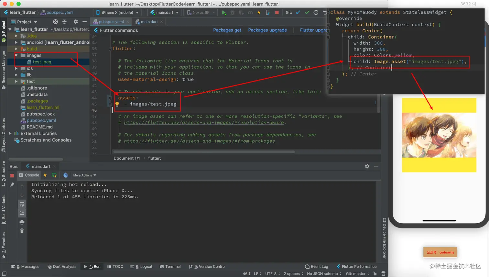

Image 组件有很多的构造函数，我们这里主要学习两个：

- `Image.assets`：加载本地资源图片；
- `Image.network`：加载网络中的图片；

## 1. 加载网络图片

相对来讲，Flutter 中加载网络图片会更加简单，直接传入 URL 并不需要什么配置，所以我们先来看一下 Flutter 中如何加载网络图片。

我们先来看看 Image 有哪些属性可以设置：

```js
const Image({
  ...
  this.width, //图片的宽
  this.height, //图片高度
  this.color, //图片的混合色值
  this.colorBlendMode, //混合模式
  this.fit,//缩放模式
  this.alignment = Alignment.center, //对齐方式
  this.repeat = ImageRepeat.noRepeat, //重复方式
  ...
})
```

- `width`、`height`：用于设置图片的宽、高，当不指定宽高时，图片会根据当前父容器的限制，尽可能的显示其原始大小，如果只设置`width`、`height`的其中一个，那么另一个属性默认会按比例缩放，但可以通过`fit`属性来指定适应规则。
- `fit`：该属性用于在图片的显示空间和图片本身大小不同时指定图片的适应模式。适应模式是在`BoxFit`中定义，它是一个枚举类型，有如下值：

  - `fill`：会拉伸填充满显示空间，图片本身长宽比会发生变化，图片会变形。
  - `cover`：会按图片的长宽比放大后居中填满显示空间，图片不会变形，超出显示空间部分会被剪裁。
  - `contain`：这是图片的默认适应规则，图片会在保证图片本身长宽比不变的情况下缩放以适应当前显示空间，图片不会变形。
  - `fitWidth`：图片的宽度会缩放到显示空间的宽度，高度会按比例缩放，然后居中显示，图片不会变形，超出显示空间部分会被剪裁。
  - `fitHeight`：图片的高度会缩放到显示空间的高度，宽度会按比例缩放，然后居中显示，图片不会变形，超出显示空间部分会被剪裁。
  - `none`：图片没有适应策略，会在显示空间内显示图片，如果图片比显示空间大，则显示空间只会显示图片中间部分。

- `color`和 `colorBlendMode`：在图片绘制时可以对每一个像素进行颜色混合处理，color 指定混合色，而 colorBlendMode 指定混合模式；
- `repeat`：当图片本身大小小于显示空间时，指定图片的重复规则。

我们对其中某些属性做一个演练：

注意，这里用了一个`Container`，大家可以把它理解成一个`UIView`或者`View`，就是一个容器；后面我会专门讲到这个组件的使用；

```js
class MyHomeBody extends StatelessWidget {
  @override
  Widget build(BuildContext context) {
    return Center(
      child: Container(
        child: Image.network(
          "http://img0.dili360.com/ga/M01/48/3C/wKgBy1kj49qAMVd7ADKmuZ9jug8377.tub.jpg",
          alignment: Alignment.topCenter,
          repeat: ImageRepeat.repeatY,
          color: Colors.red,
          colorBlendMode: BlendMode.colorDodge,
        ),
        width: 300,
        height: 300,
        color: Colors.yellow,
      ),
    );
  }
}
```

## 2. 加载本地图片

加载本地图片稍微麻烦一点，需要将图片引入，并且进行配置

```js
class MyHomeBody extends StatelessWidget {
  @override
  Widget build(BuildContext context) {
    return Center(
      child: Container(
        width: 300,
        height: 300,
        color: Colors.yellow,
        child: Image.asset("images/test.jpeg"),
      ),
    );
  }
}
```



## 3. 实现圆角图像

### 3.1. 实现圆角头像

#### 方式一：`CircleAvatar`

CircleAvatar 可以实现圆角头像，也可以添加一个子 Widget：

```js
const CircleAvatar({
  Key key,
  this.child, // 子Widget
  this.backgroundColor, // 背景颜色
  this.backgroundImage, // 背景图像
  this.foregroundColor, // 前景颜色
  this.radius, // 半径
  this.minRadius, // 最小半径
  this.maxRadius, // 最大半径
})
```

我们来实现一个圆形头像：

- 注意一：这里我们使用的是`NetworkImage`，因为 backgroundImage 要求我们传入一个 ImageProvider；

  - ImageProvider 是一个抽象类，事实上所有我们前面创建的 Image 对象都有包含 image 属性，该属性就是一个 ImageProvider

- 注意二：这里我还在里面添加了一个文字，但是我在文字外层包裹了一个 Container；

  - 这里 Container 的作用是为了可以控制文字在其中的位置调整；

```js
class HomeContent extends StatelessWidget {
  @override
  Widget build(BuildContext context) {
    return Center(
      child: CircleAvatar(
        radius: 100,
        backgroundImage: NetworkImage("https://tva1.sinaimg.cn/large/006y8mN6gy1g7aa03bmfpj3069069mx8.jpg"),
        child: Container(
          alignment: Alignment(0, .5),
          width: 200,
          height: 200,
          child: Text("兵长利威尔")
        ),
      ),
    );
  }
}
```

#### 方式二：`ClipOval`

ClipOval 也可以实现圆角头像，而且通常是在只有头像时使用

```js
class HomeContent extends StatelessWidget {
  @override
  Widget build(BuildContext context) {
    return Center(
      child: ClipOval(
        child: Image.network(
          "https://tva1.sinaimg.cn/large/006y8mN6gy1g7aa03bmfpj3069069mx8.jpg",
          width: 200,
          height: 200,
        ),
      ),
    );
  }
}
```

#### 实现方式三：`Container`+`BoxDecoration`

这种方式我们放在讲解 Container 时来讲这种方式

### 3.2. 实现圆角图片

#### 方式一：`ClipRRect`

`ClipRRect`用于实现圆角效果，可以设置圆角的大小。

实现代码如下，非常简单：

```js
class HomeContent extends StatelessWidget {
  @override
  Widget build(BuildContext context) {
    return Center(
      child: ClipRRect(
        borderRadius: BorderRadius.circular(10),
        child: Image.network(
          "https://tva1.sinaimg.cn/large/006y8mN6gy1g7aa03bmfpj3069069mx8.jpg",
          width: 200,
          height: 200,
        ),
      ),
    );
  }
}
```

#### 方式二：`Container`+`BoxDecoration`

这个也放到后面讲解 Container 时讲解
