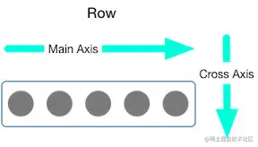
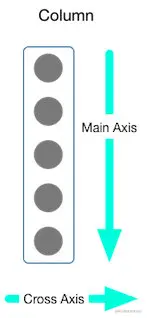
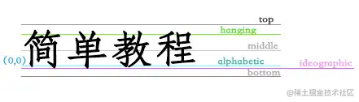
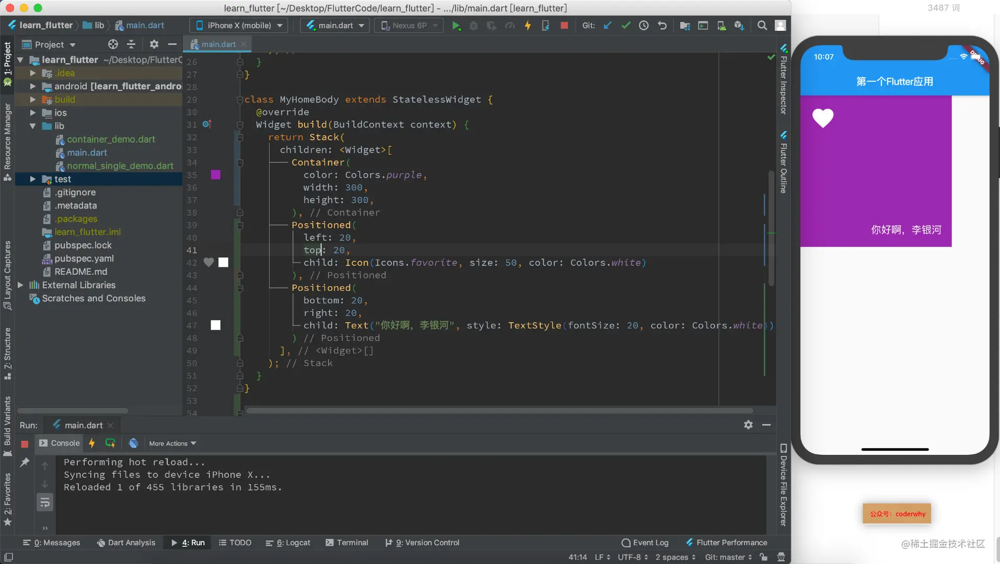

在开发中，我们经常需要将多个 Widget 放在一起进行布局，比如水平方向、垂直方向排列，甚至有时候需要他们进行层叠，比如图片上面放一段文字等；

这个时候我们需要使用多子布局组件（Multi-child layout widgets）。

比较常用的多子布局组件是 Row、Column、Stack

## 1. Flex 组件

事实上，我们即将学习的 Row 组件和 Column 组件都继承自 Flex 组件。

- Flex 组件和 Row、Column 属性主要的区别就是多一个 direction。
- 当 direction 的值为 Axis.horizontal 的时候，则是 Row。
- 当 direction 的值为 Axis.vertical 的时候，则是 Column。

在学习 Row 和 Column 之前，我们先学习主轴和交叉轴的概念。

因为`Row`是一行排布，`Column`是一列排布，那么它们都存在两个方向，并且两个 Widget 排列的方向应该是对立的。它们之中都有主轴（MainAxis）和交叉轴（CrossAxis）的概念：

对于 Row 来说，主轴（MainAxis）和交叉轴（CrossAxis）分别是下图



对于 Column 来说，主轴（MainAxis）和交叉轴（CrossAxis）分别是下图



## 2. Row 组件

### 2.1. Row 介绍

Row 组件用于将所有的子 Widget 排成一行，实际上这种布局应该是借鉴于 Web 的 Flex 布局。

如果熟悉 Flex 布局，会发现非常简单。

从源码中查看 Row 的属性：

```js
Row({
  Key key,
  MainAxisAlignment mainAxisAlignment = MainAxisAlignment.start, // 主轴对齐方式
  MainAxisSize mainAxisSize = MainAxisSize.max, // 水平方向尽可能大
  CrossAxisAlignment crossAxisAlignment = CrossAxisAlignment.center, // 交叉处对齐方式
  TextDirection textDirection, // 水平方向子widget的布局顺序（默认为系统当前Locale环境的文本方向(如中文、英语都是从左往右，而阿拉伯语是从右往左））
  VerticalDirection verticalDirection = VerticalDirection.down, // 表示Row纵轴（垂直）的对齐方向
  TextBaseline textBaseline, // 如果上面是baseline对齐方式，那么选择什么模式（有两种可选）
  List<Widget> children = const <Widget>[],
})

```

部分属性详细解析： `mainAxisSize`：

- 表示 Row 在主轴(水平)方向占用的空间，默认是`MainAxisSize.max`，表示尽可能多的占用水平方向的空间，此时无论子 widgets 实际占用多少水平空间，Row 的宽度始终等于水平方向的最大宽度
- 而`MainAxisSize.min`表示尽可能少的占用水平空间，当子 widgets 没有占满水平剩余空间，则 Row 的实际宽度等于所有子 widgets 占用的的水平空间；

`mainAxisAlignment`：表示子 Widgets 在 Row 所占用的水平空间内对齐方式

- 如果`mainAxisSize`值为`MainAxisSize.min`，则此属性无意义，因为子 widgets 的宽度等于 Row 的宽度
- 只有当`mainAxisSize`的值为`MainAxisSize.max`时，此属性才有意义
- `MainAxisAlignment.start`表示沿 textDirection 的初始方向对齐，
- 如`textDirection`取值为`TextDirection.ltr`时，则`MainAxisAlignment.start`表示左对齐，`textDirection`取值为`TextDirection.rtl`时表示从右对齐。
- 而 M`ainAxisAlignment.end`和`MainAxisAlignment.start`正好相反；
- `MainAxisAlignment.center`表示居中对齐。

`crossAxisAlignment`：表示子 Widgets 在纵轴方向的对齐方式

- Row 的高度等于子 Widgets 中最高的子元素高度
- 它的取值和 MainAxisAlignment 一样(包含`start`、`end`、 `center`三个值)
- 不同的是`crossAxisAlignment`的参考系是`verticalDirection`，即`verticalDirection`值为`VerticalDirection.down`时`crossAxisAlignment.start`指顶部对齐，`verticalDirection`值为`VerticalDirection.up`时，`crossAxisAlignment.start`指底部对齐；而`crossAxisAlignment.end`和`crossAxisAlignment.start`正好相反；

### 2.2. Row 演练

```js
class MyHomeBody extends StatelessWidget {
  @override
  Widget build(BuildContext context) {
    return Row(
      mainAxisAlignment: MainAxisAlignment.spaceEvenly,
      crossAxisAlignment: CrossAxisAlignment.end,
      mainAxisSize: MainAxisSize.max,
      children: <Widget>[
        Container(color: Colors.red, width: 60, height: 60),
        Container(color: Colors.blue, width: 80, height: 80),
        Container(color: Colors.green, width: 70, height: 70),
        Container(color: Colors.orange, width: 100, height: 100),
      ],
    );
  }
}

```


### 2.3. mainAxisSize

默认情况下，Row 会尽可能占据多的宽度，让子 Widget 在其中进行排布，这是因为`mainAxisSize`属性默认值是`MainAxisSize.max`。

我们来看一下，如果这个值被修改为`MainAxisSize.max`会什么变化： 

### 2.4. TextBaseline

关于 TextBaseline 的取值解析



### 2.5. Expanded

如果我们希望红色和黄色的 Container Widget 不要设置固定的宽度，而是占据剩余的部分，这个时候应该如何处理呢？这个时候我们可以使用 Expanded 来包裹 Container Widget，并且将它的宽度不设置值；

flex 属性，弹性系数，Row 会根据两个 Expanded 的弹性系数来决定它们占据剩下空间的比例

```js
class MyHomeBody extends StatelessWidget {
  @override
  Widget build(BuildContext context) {
    return Row(
      mainAxisAlignment: MainAxisAlignment.spaceEvenly,
      crossAxisAlignment: CrossAxisAlignment.end,
      mainAxisSize: MainAxisSize.min,
      children: <Widget>[
        Expanded(
          flex: 1,
          child: Container(color: Colors.red, height: 60),
        ),
        Container(color: Colors.blue, width: 80, height: 80),
        Container(color: Colors.green, width: 70, height: 70),
        Expanded(
          flex: 1,
          child: Container(color: Colors.orange, height: 100),
        )
      ],
    );
  }
}

```


## 3. Column 组件

Column 组件用于将所有的子 Widget 排成一列，学会了前面的 Row 后，Column 只是和 row 的方向不同而已。

### 3.1. Column 介绍

我们直接看它的源码：我们发现和 Row 属性是一致的，不再解释

```js
  Column({
    Key key,
    MainAxisAlignment mainAxisAlignment = MainAxisAlignment.start,
    MainAxisSize mainAxisSize = MainAxisSize.max,
    CrossAxisAlignment crossAxisAlignment = CrossAxisAlignment.center,
    TextDirection textDirection,
    VerticalDirection verticalDirection = VerticalDirection.down,
    TextBaseline textBaseline,
    List<Widget> children = const <Widget>[],
  })

```

### 3.2. Column 演练

我们直接将 Row 的代码中 Row 改为 Column，查看代码运行效果：

```js
class MyHomeBody extends StatelessWidget {
  @override
  Widget build(BuildContext context) {
    return Column(
      mainAxisAlignment: MainAxisAlignment.spaceEvenly,
      crossAxisAlignment: CrossAxisAlignment.end,
      mainAxisSize: MainAxisSize.min,
      children: <Widget>[
        Expanded(
          flex: 1,
          child: Container(color: Colors.red, width: 60),
        ),
        Container(color: Colors.blue, width: 80, height: 80),
        Container(color: Colors.green, width: 70, height: 70),
        Expanded(
          flex: 1,
          child: Container(color: Colors.orange, width: 100),
        )
      ],
    );
  }
}

```


## 4. Stack 组件

在开发中，我们多个组件很有可能需要重叠显示，比如在一张图片上显示文字或者一个按钮等。

在 Android 中可以使用 Frame 来实现，在 Web 端可以使用绝对定位，在 Flutter 中我们需要使用层叠布局 Stack。

源码

```js
Stack({
  Key key,
  this.alignment = AlignmentDirectional.topStart,
  this.textDirection,
  this.fit = StackFit.loose,
  this.overflow = Overflow.clip,
  List<Widget> children = const <Widget>[],
})

```

参数 j 解析：

- `alignment`：此参数决定如何去对齐没有定位（没有使用 Positioned）或部分定位的子 widget。所谓部分定位，在这里**特指没有在某一个轴上定位：**left、right 为横轴，top、bottom 为纵轴，只要包含某个轴上的一个定位属性就算在该轴上有定位。
- `textDirection`：和 Row、Wrap 的 textDirection 功能一样，都用于决定 alignment 对齐的参考系即：textDirection 的值为 TextDirection.ltr，则 alignment 的 start 代表左，end 代表右；`textDirection`的值为`TextDirection.rtl`，则`alignment`的`start`代表右，`end`代表左。
- `fit`：此参数用于决定没有定位的子 widget 如何去适应 Stack 的大小。`StackFit.loose`表示使用子 widget 的大小，`StackFit.expand`表示扩伸到`Stack`的大小。
- `overflow`：此属性决定如何显示超出 Stack 显示空间的子 widget，值为 Overflow.clip 时，超出部分会被剪裁（隐藏），值为`Overflow.visible` 时则不会。

### 4.1. Stack 演练

Stack 会经常和 Positioned 一起来使用，Positioned 可以决定组件在 Stack 中的位置，用于实现类似于 Web 中的绝对定位效果。

```js
class MyHomeBody extends StatelessWidget {
  @override
  Widget build(BuildContext context) {
    return Stack(
      children: <Widget>[
        Container(
          color: Colors.purple,
          width: 300,
          height: 300,
        ),
        Positioned(
          left: 20,
          top: 20,
          child: Icon(Icons.favorite, size: 50, color: Colors.white)
        ),
        Positioned(
          bottom: 20,
          right: 20,
          child: Text("你好啊，李银河", style: TextStyle(fontSize: 20, color: Colors.white)),
        )
      ],
    );
  }
}
```

**注意：**Positioned 组件只能在 Stack 中使用。


