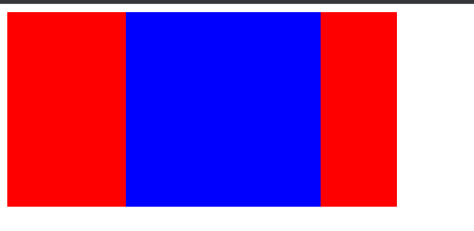

## 常见题

### 动画

<Alert type="info">子组件在父组件中来回平移的动画效果。</Alert> 

```html
<!DOCTYPE html>
<html lang="en">
  <head>
    <meta charset="UTF-8" />
    <meta http-equiv="X-UA-Compatible" content="IE=edge" />
    <meta name="viewport" content="width=device-width, initial-scale=1.0" />
    <title>Document</title>
  </head>
  <style>
    .f {
      width: 400px;
      height: 200px;
      background-color: red;
    }

    .s {
      width: 200px;
      height: 200px;
      background-color: blue;
      animation-name: run;
      /* 添加4个动画帧 */
      animation-duration: 4s, 4s, 4s, 4s;
      /* 动画循环次数 */
      animation-iteration-count: infinite;
    }

    @keyframes run {
      0% {
        transform: translateX(0px);
        /* 偏移坐标 */
      }
      25% {
        transform: translateX(200px);
        /* 偏移坐标 */
      }

      50% {
        transform: translateX(200px);
      }

      100% {
        transform: translateX(0px);
      }
    }
  </style>

  <body>
    <div class="f">
      <div class="s"></div>
    </div>
  </body>
</html>
```

## 冷门题
