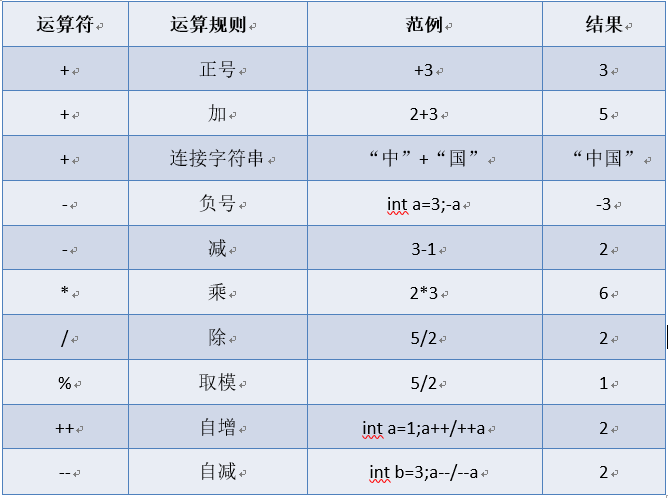
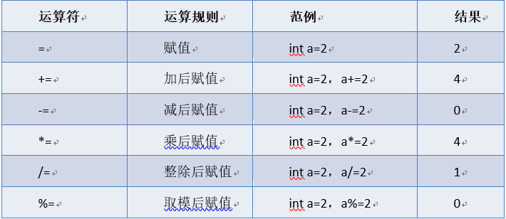

## 1. 标识符

### 标识符的命名规范

- 类名、接口名：首字母大写，后面每个单词首字母大写；
- 变量名、方法名：首字母小写，后面每个单词首字母大写；
- 常量名：全部大写

在 Java 程序中，除了关键字以外基本上都是标识符了。标识符就是名称的意思，所有的名称都统称为标识符。Java 中经常要定义类、方法、变量，在定义他们时总要给它们起名字，这些名字就是标识符。

## 2. 关键字

关键字是被 Java 语言赋予特殊含义，具有专门用途的单词，可以先把 Java 关键字理解为“命令”！Java 中关键字均为小写


## 3. 变量

### 变量命名规范

1. 只能够使用 `_`和 `$`这两个符号;
2. 只能使用 `英文字母`、`_ `、`$`三个开头，后面的可以使用 `数字`、`字母`和 `_ `、`美元符号` ;
3. 使用 java 语言中的关键字
4. 采用见文识意的方式命名，采用驼峰命名法 ageOfStudent,多个字母命名时，第一个字母的首字母小写，后面字母首字母大写

### 初始化变量

```java
public static void main(String[] args) {
    // 声明一个int类型的变量，起名i
    int i;
    // 编译报错：变量i没有初始化
    // System.out.println(i);

    // 给变量i赋值，内存开辟
    i = 100;
    System.out.println(i);

    // i再次重新赋值
    i = 200;
    System.out.println(i);
}
```

## 4. 数据类型

### 基本数据类型

#### 基本数据类型包括四大类八小种

- 第一类：整数型 `byte`, `short`, `int`, `long`
- 第二类：浮点型 `float`,`double`
- 第三类：布尔型 `boolean`
- 第四类：字符型 `char`

字符串 `"abc"`不属于基本数据类型，属于引用数据类型，字符属于基本数据类型： 字符串使用双引号 `"abc"`字符使用单引号 `'a'`

#### 八种基本数据类型占用空间大小

| 基本数据类型 | 占用空间大小—— 字节(byte） |
| :----------: | :------------------------: |
|    `byte`    |             1              |
|   `short`    |             2              |
|    `int`     |             4              |
|    `long`    |             8              |
|   `float`    |             4              |
|   `double`   |             8              |
|  `boolean`   |             1              |
|    `char`    |             2              |

1 `byte` = 8 `bit`(比特位) 1 个比特位表示一个二进制位：1/0

1 `KB` = 1024 `byte`

1 `MB` = 1024 `KB`

#### 取值范围

关于 ava 中的数字类型，数字都是有正负之分的，所以在数字的二进制当中有一个二进制位被称为"符号位"。并且这个"符号位"在所有二进制位的最左边，0 表示正数，1 表示负数。

`byte`类型最大值：01111111

`byte`类型最大值：2 的 7 次方-1，结果是：127

`byte`类型最小值：-128【具体的怎么用二进制表示，这个和原码、反码、补码有关】

`byte`类型取值范围：【-128~127】

`byte`类型可以表示 256 个不同的数字【256 个不同的二进制】

| 基本数据类型 |         取值范围          |
| :----------: | :-----------------------: |
|    `byte`    |        [-128, 127]        |
|   `short`    |      [-32768, 32767]      |
|    `int`     | [-2147483648, 2147483647] |
|    `long`    |                           |
|   `float`    |                           |
|   `double`   |                           |
|  `boolean`   |       [true, false]       |
|    `char`    |         [0,65535]         |

注意：`short`和 `char`所表示的种类总数是一样的，只不过 `char`可以表示更大的正整数因为 `char`没有负数


#### 字符编码

编码和解码的时候采用同一套字典/对照表，不会出现乱码当解码和编码的时候采用的不是同一套对照表，会出现乱码问题。

计算机最初只支持英文，最先出现的字符编码是：ASCII 码

`'a' ==> 97【01100001】`

`'A' ==> 65`

`'0' ==> 48`

\*随着计算机的发展，后来出现了一种编码方式，是国际化标准组织 ISO 制定的，这种编码方式支持西欧语言，向上兼容 ASCII 码，仍然不支持中文。这种编码方式是：ISO-8859-1，又被称为 latin-1

\*随着计算机向亚洲发展，计算机开始支持中文、日文、韩文等国家文字，其中支持简体中文的编码方式：

`GB2312/GBK/GB18030`

支持繁体中文：`大五码<big5>`

后来出现了一种编码方式统一了全球所有的文字，容量较大，这种编码方式叫做：`unicode`编码 `uncode`编码方式有多种具体的实现：

- UTF-8
- UTF-16
- UTF-32

java 语言源代码采用的是 unicode 编码方式，所以标识符可以写中文。

#### 基本数据类型的转换

八种基本数据类型当中除了布尔类型之外剩下的 7 种类型之间可以相互转换

**自动类型转换**：小容量向大容量转换

```java
byte < short < int < long < float < double
	 < chart <

// 任何浮点类型不管占用多少字符，都比整数型容量大
// chart 和 short 可表示的种类数量相同，但 chart 可以取更大的正整数
```

**强制类型转换**：大容量向小容量转换，需要加强制转换符，运行阶段可能会损失精度，所以谨慎使用。

`byte` 、`short`、`chart` 混合运算时，各自先转换成 `int`类型再做运算。

多种数据类型混合运算，先转换成容量最大的那种类型再做运算

```java
long x = 10L;
int y = 20;
y += x; 等同于：y = (int) (y + x);
```

重要结论：扩展类的赋值运算符不改变运算结果类型，假设最初这个变量的类型是 `byte`类型，无论怎么进行追加或追减，最终该变量的数据类型还是 `byte`类型。

### 运算符

#### 1.算术运算符



```apl
加法运算符在连接字符串时要注意，只有直接与字符串相加才会转成字符串。

除法“/”当两边为整数时，取整数部分，舍余数。当其中一边为浮点型时，按正常规则相除。

“%”为整除取余符号，小数取余没有意义。结果符号与被取余符号相同。

整数做被除数，0不能做除数，否则报错。

++，--运算符后置时，先使用变量a原有值参与运算操作，运算操作完成后，变量a的值自增1或者自减1；后置后自增。

++，--运算符前置时，先将变量a的值自增1或者自减1，然后使用更新后的新值参与运算操作。前置先自增
```

#### 2. 赋值运算符



```java
+=, -=, *=, /=, %= 运算符会将等号左右两边计算，将结果自动强转成等号左边的数据类型,再赋值给等号左边的变量。
如:
byte x = 10;x += 20;// 相当于 x = (byte)(x+20)
```

#### 3. 比较运算符(关系运算符)


#### 4. 逻辑运算符


#### 5. 三元运算符

```apl
元即参与运算的数据。

格式：

(条件表达式)？表达式1：表达式2；

三元运算符运算规则：先判断条件表达式的值，若为true，运算结果为表达式1；若false，运算结果为表达式2。
```

#### 6. 运算符的优先级


`算术运算符`>`关系运算符`>`逻辑运算符`>`赋值运算符`

### 引用数据类型

#### String 类型

## 5.其他

### 转义字符

- 使用 `\n`进行换行
- 使用 `\t`空格一个制表符的位置，也就是一个 tab 的位置，8 个英文字母的长度

### java 中的注释

```java
//注释内容 单行注释:表示对下一条语句进行一个解释
/* 注释内容 */ 多行注释：表示对下面一段语句进行一个解释
/**注释内容 */ 文档注释：表示对一段文本注释
```

### java 的编码规范

1. 遇到大括号 `{ `就进行一次缩进，缩进距离一个 `tab`键的长度
2. 每一个大括号 `} `单独占一行，表示一段语句的结束
3. `;`表示每行语句的结束，每一行只写一句代码

### 包

包在 windows 中以文件夹的方式存在

1. 将类分为几个类似于文件夹的单元
2. 防止命名冲突，在同一个包不允许重复命名，不同包可以重复
3. 可以对类中数据中进行一个保护作用

   声明包，语法：`package 包名; `必须为 java 源文件中第一条非注释语句包名：

   1、通常由小写的英文字母组成，不能以圆点开头或结尾 2、开头一般是一个顶级域名 cn,com,org,net 3、后续部分一般由公司名称、部门名称、小组名称、项目名称

   导入包：语法：import 包名; 导入包，可以将在这个包中的所有类导入到我们这个类中，导入后才能使用该包中的类通过 ctrl+鼠标左键点击进入定义方法的位置
