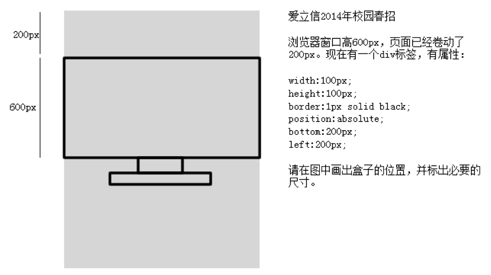
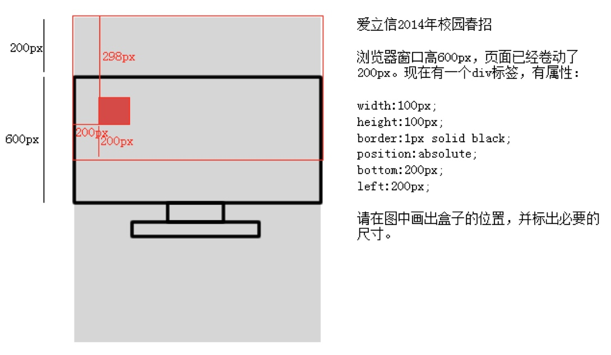

# 定位

## CSS 定位

CSS 定位使你能够将元素放置在页面上的任何位置。

### 静态定位 `static`

静态定位是每个元素的默认定位类型，即没有定位，就是我们的标准流。

- 在标准流里面，块级元素独占一行，内嵌元素共享一行。

```css
.static {
  position: static;
}
```

### 相对定位 `relative`

就是相对自己原来的位置进行定位。

- 相对定位的最大特点就是不脱离标准流，相对于自己原来的位置上进行一定的偏移。

```css
.relative {
  position: relative;
  left: 20px;
}
```

使用相对定位的作用主要有两个：

- 微调元素
- 做绝对定位的参考，子绝父相

### 绝对定位 `absolute`

绝对定位会相对于其最接近的一个具有定位属性的父元素进行移动。

- 会脱离标准流，如果设置了 `margin` 的值为 `auto`，则会失效。
- 绝对定位后的盒子，其 `display` 属性会变为 `block`
- 当我们对一个元素设置绝对定位的时候，往往会将它的父级元素设置为相对定位(子绝父相)
- 当父级元素出现有定位时，绝对定位的参考点永远都是离自己最近的，并且定了位的祖先元素的左上角
- 绝对定位的参考点(这种情况一般使用得非常的少):
  - 默认情况下，绝对定位的参考点，如果用 `top` 来进行描述，那么定位参考点就是页面的左上角，而不是浏览器的左上角;
  - 如果是使用 `bottom` 来进行描述，那么就是浏览器首屏窗口尺寸，对应的页面左下角

```css
.absolute {
  position: absolute;
  left: 20px;
}
```

**例题**




#### 什么时候使用绝对定位

下面三个条件满足任何一个时，使用绝对定位：

- 元素出现在一个天马行空的位置
- 元素是否存在，不影响其他元素的排列
- 单个元素在某个区域内水平垂直居中

### 固定定位 `fixed`

固定定位是相对于浏览器窗口进行定位。

可以看作是一种特殊的绝对定位，所以自然而然固定定位也是会脱离标准流的。

换句话说，对一个盒子进行固定定位以后，无论页面如何滚动，这个盒子的显示位置都是不会变化的

```css
.fixed {
  position: fixed;
  left: 20px;
}
```

### 粘性定位 `sticky`

粘性定位是相对定位和固定定位的混合。

- 父元素的 `overflow` 必须是 `visible`，不能是 `hidden` 或者 `auto`，因为父节点定位设置为 `overflow:hidden` 则父容器无法进行滚动
- 父元素的高度不能低于 `sticky` 元素的高度
- 如果父元素没有设置定位（position:relative | absolute | fixed），则相对于 `viewprot` 进行定位，否则以定位的父元素为参考点
- 设置阀值：
  - 需要指定 `top、right、bottom` 或 `left` 四个阈值其中之一，才可使粘性定位生效。否则其行为与相对定位相同。
  - 并且 `top` 和 bottom 同时设置时，top 生效的优先级高；left 和 right 同时设置时，left 的优先级高

```css
.sticky {
  position: sticky;
  top: 20px;
}
```

## fixed 和 absolute 的区别

`fixed`是绝对定位的一种特殊情况，它们的参考系不一样

`absolute`参考有定位的父元素 `fixed`参考视口(viewport)
