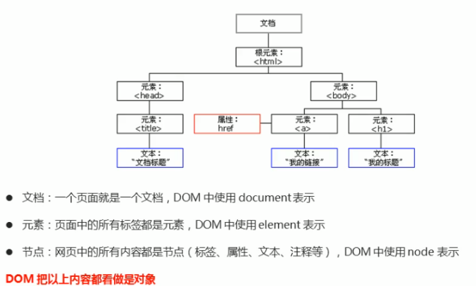

DOM（文档对象模型）是针对 HTML 和 XML 文档的一个 API（应用程序编程接口）。DOM 描绘了一个层次化的节点树，允许开发人员添加、移除和修改页面的某一部分。

> 注意，IE 中的所有 DOM 对象都是以 COM 对象的形式实现的。这意味着 IE 中的 DOM 对象与原生 JavaScript 对象的行为或活动特点并不一致。

## 1. 节点层次



文档节点是每个文档的根节点。在这个例子中，文档节点只有一个子节点，即 `<html>`元素，我们称之为文档元素。文档元素是文档的最外层元素，文档中的其他所有元素都包含在文档元素中。每个文档只能有一个文档元素。在 HTML 页面中，文档元素始终都是 `<html>`元素。在 XML 中，没有预定义的元素，因此任何元素都可能成为文档元素。

每一段标记都可以通过树中的一个节点来表示：HTML 元素通过元素节点表示，特性（attribute）通过特性节点表示，文档类型通过文档类型节点表示，而注释则通过注释节点表示。总共有 12 种节点类型，这些类型都继承自一个基类型。

### 1.1 Node 类型

DOM1 级定义了一个 Node 接口，该接口将由 DOM 中的所有节点类型实现。这个 Node 接口在 JavaScript 中是作为 Node 类型实现的；除了 IE 之外，在其他所有浏览器中都可以访问到这个类型。JavaScript 中的所有节点类型都继承自 Node 类型，因此所有节点类型都共享着相同的基本属性和方法。

每个节点都有一个 nodeType 属性，用于表明节点的类型。节点类型由在 Node 类型中定义的下列 12 个数值常量来表示，任何节点类型必居其一：

- `Node.ELEMENT_NODE(1)`；
- `Node.ATTRIBUTE_NODE(2)`；
- `Node.TEXT_NODE(3)`；
- Node.CDATA_SECTION_NODE(4)；
- Node.ENTITY_REFERENCE_NODE(5)；
- Node.ENTITY_NODE(6)；
- Node.PROCESSING_INSTRUCTION_NODE(7)；
- Node.COMMENT_NODE(8)；
- Node.DOCUMENT_NODE(9)；
- Node.DOCUMENT_TYPE_NODE(10)；
- Node.DOCUMENT_FRAGMENT_NODE(11)；
- Node.NOTATION_NODE(12)。

通过比较上面这些常量，可以很容易地确定节点的类型

```js
if (someNode.nodeType == Node.ELEMENT_NODE){   //在IE中无效
    alert("Node is an element.");
}

// 这个例子比较了someNode.nodeType与Node.ELEMENT_NODE常量。如果二者相等，则意味着someNode确实是一个元素。然而，由于IE没有公开Node类型的构造函数，因此上面的代码在IE中会导致错误。为了确保跨浏览器兼容，最好还是将nodeType属性与数字值进行比较，如下所示：

if (someNode.nodeType == 1){    //适用于所有浏览器
    alert("Node is an element.");
}
并不是所有节点类型都受到Web浏览器的支持。开发人员最常用的就是元素和文本节点。
```

#### (1) `nodeName`和 `nodeValue`属性

要了解节点的具体信息，可以使用 nodeName 和 nodeValue 这两个属性。这两个属性的值完全取决于节点的类型。在使用这两个值以前，最好是像下面这样先检测一下节点的类型。

```js
if (someNode.nodeType == 1) {
  value = someNode.nodeName; //nodeName的值是元素的标签名
}

// 在这个例子中，首先检查节点类型，看它是不是一个元素。如果是，则取得并保存nodeName的值。对于元素节点，nodeName中保存的始终都是元素的标签名，而nodeValue的值则始终为null。
```

#### (2) 节点关系

##### `childNodes`

每个节点都有一个 `childNodes`属性，其中保存着一个 NodeList 对象。NodeList 是一种类数组对象，用于保存一组有序的节点，可以通过位置来访问这些节点。请注意，虽然可以通过方括号语法来访问 NodeList 的值，而且这个对象也有 length 属性，但它并不是 Array 的实例。NodeList 对象的独特之处在于，它实际上是基于 DOM 结构动态执行查询的结果，因此 DOM 结构的变化能够自动反映在 NodeList 对象中。我们常说，NodeList 是有生命、有呼吸的对象，而不是在我们第一次访问它们的某个瞬间拍摄下来的一张快照。

```js
如何访问保存在NodeList中的节点——可以通过方括号，也可以使用item()方法

var firstChild = someNode.childNodes[0];
var secondChild = someNode.childNodes.item(1);
var count = someNode.childNodes.length;
```

对 arguments 对象使用 `Array.prototype.slice()`方法可以将其转换为数组。而采用同样的方法，也可以将 NodeList 对象转换为数组。

```js
//在IE8及之前版本中无效
var arrayOfNodes = Array.prototype.slice.call(someNode.childNodes, 0);
```

除 IE8 及更早版本之外，这行代码能在任何浏览器中运行。由于 IE8 及更早版本将 NodeList 实现为一个 COM 对象，而我们不能像使用 JScript 对象那样使用这种对象，因此上面的代码会导致错误。要想在 IE 中将 NodeList 转换为数组，必须手动枚举所有成员。下列代码在所有浏览器中都可以运行：

```js
function convertToArray(nodes) {
  var array = null;
  try {
    array = Array.prototype.slice.call(nodes, 0); //针对非IE浏览器
  } catch (ex) {
    array = new Array();
    for (var i = 0, len = nodes.length; i < len; i++) {
      array.push(nodes[i]);
    }
  }
  return array;
}

// 这个convertToArray()函数首先尝试了创建数组的最简单方式。如果导致了错误（说明是在IE8及更早版本中），则通过try-catch块来捕获错误，然后手动创建数组。这是另一种检测怪癖的形式。
```

##### `parentNode`

每个节点都有一个 `parentNode`属性，该属性指向文档树中的父节点。包含在 childNodes 列表中的所有节点都具有相同的父节点，因此它们的 parentNode 属性都指向同一个节点。此外，包含在 `childNodes`列表中的每个节点相互之间都是同胞节点。通过使用列表中每个节点的 `previousSibling`和 `nextSibling`属性，可以访问同一列表中的其他节点。列表中第一个节点的 `previousSibling`属性值为 null，而列表中最后一个节点的 `nextSibling`属性的值同样也为 null。

```js
if (someNode.nextSibling === null) {
  alert('Last node in the parent’s childNodes list.');
} else if (someNode.previousSibling === null) {
  alert('First node in the parent’s childNodes list.');
}
```

如果列表中只有一个节点，那么该节点的 `nextSibling`和 `previousSibling`都为 null。

父节点与其第一个和最后一个子节点之间也存在特殊关系。父节点的 `firstChild`和 `lastChild`属性分别指向其 `childNodes`列表中的第一个和最后一个节点。其中，`someNode.firstChild`的值始终等于 `someNode.childNodes[0]`，而 `someNode.lastChild`的值始终等于 `someNode.childNodes [someNode.childNodes.length-1]`。在只有一个子节点的情况下，`firstChild`和 `lastChild`指向同一个节点。如果没有子节点，那么 `firstChild`和 `lastChild`的值均为 null。


在反映这些关系的所有属性当中，childNodes 属性与其他属性相比更方便一些，因为只须使用简单的关系指针，就可以通过它访问文档树中的任何节点。另外，`hasChildNodes()`也是一个非常有用的方法，这个方法在节点包含一或多个子节点的情况下返回 true；应该说，这是比查询 childNodes 列表的 length 属性更简单的方法。

所有节点都有的最后一个属性是 ownerDocument，该属性指向表示整个文档的文档节点。这种关系表示的是任何节点都属于它所在的文档，任何节点都不能同时存在于两个或更多个文档中。通过这个属性，我们可以不必在节点层次中通过层层回溯到达顶端，而是可以直接访问文档节点。

虽然所有节点类型都继承自 Node，但并不是每种节点都有子节点。

#### (3) 操作节点

##### 更新 DOM

可以直接修改节点的文本，方法有两种：

- 一种是修改 `innerHTML`属性，这个方式非常强大，不但可以修改一个 DOM 节点的文本内容，还可以直接通过 HTML 片段修改 DOM 节点内部的子树：

```js
// 获取<p id="p-id">...</p>
var p = document.getElementById('p-id');
// 设置文本为abc:
p.innerHTML = 'ABC'; // <p id="p-id">ABC</p>
// 设置HTML:
p.innerHTML = 'ABC <span style="color:red">RED</span> XYZ';
// <p>...</p>的内部结构已修改
```

用 `innerHTML`时要注意，是否需要写入 HTML。如果写入的字符串是通过网络拿到的，要注意对字符编码来避免 XSS 攻击。

- 第二种是修改 `innerText`或 `textContent`属性，这样可以自动对字符串进行 HTML 编码，保证无法设置任何 HTML 标签：

```js
// 获取<p id="p-id">...</p>
var p = document.getElementById('p-id');
// 设置文本:
p.innerText = '<script>alert("Hi")</script>';
// HTML被自动编码，无法设置一个<script>节点:
// <p id="p-id"><script>alert("Hi")</script></p>
```

两者的区别在于读取属性时，`innerText`不返回隐藏元素的文本，而 `textContent`返回所有文本。另外注意 IE<9 不支持 `textContent`。

修改 CSS 也是经常需要的操作。DOM 节点的 `style`属性对应所有的 CSS，可以直接获取或设置。因为 CSS 允许 `font-size`这样的名称，但它并非 JavaScript 有效的属性名，所以需要在 JavaScript 中改写为驼峰式命名 `fontSize`：

```js
// 获取<p id="p-id">...</p>
var p = document.getElementById('p-id');
// 设置CSS:
p.style.color = '#ff0000';
p.style.fontSize = '20px';
p.style.paddingTop = '2em';
```

##### 插入 DOM

当我们获得了某个 DOM 节点，想在这个 DOM 节点内插入新的 DOM，应该如何做？

如果这个 DOM 节点是空的，例如，`<div></div>`，那么，直接使用 `innerHTML = '<span>child</span>'`就可以修改 DOM 节点的内容，相当于“插入”了新的 DOM 节点。

如果这个 DOM 节点不是空的，那就不能这么做，因为 `innerHTML`会直接替换掉原来的所有子节点。

- `appendChild`

有两个办法可以插入新的节点。一个是使用 `appendChild`，把一个子节点添加到父节点的最后一个子节点。

```html
<!-- HTML结构 -->
<p id="js">JavaScript</p>
<div id="list">
  <p id="java">Java</p>
  <p id="python">Python</p>
  <p id="scheme">Scheme</p>
</div>
```

把 `<p id="js">JavaScript</p>`添加到 `<div id="list">`的最后一项：

```js
var js = document.getElementById('js'),
  list = document.getElementById('list');
list.appendChild(js);
```

现在，HTML 结构变成了这样：

```html
<!-- HTML结构 -->
<div id="list">
  <p id="java">Java</p>
  <p id="python">Python</p>
  <p id="scheme">Scheme</p>
  <p id="js">JavaScript</p>
</div>
```

因为我们插入的 `js`节点已经存在于当前的文档树，因此这个节点首先会从原先的位置删除，再插入到新的位置。

更多的时候我们会从零创建一个新的节点，然后插入到指定位置：

```js
var list = document.getElementById('list'),
  haskell = document.createElement('p');
haskell.id = 'haskell';
haskell.innerText = 'Haskell';
list.appendChild(haskell);
```

这样我们就动态添加了一个新的节点：

```html
<!-- HTML结构 -->
<div id="list">
  <p id="java">Java</p>
  <p id="python">Python</p>
  <p id="scheme">Scheme</p>
  <p id="haskell">Haskell</p>
</div>
```

动态创建一个节点然后添加到 DOM 树中，可以实现很多功能。举个例子，下面的代码动态创建了一个 `<style>`节点，然后把它添加到 `<head>`节点的末尾，这样就动态地给文档添加了新的 CSS 定义：

```js
var d = document.createElement('style');
d.setAttribute('type', 'text/css');
d.innerHTML = 'p { color: red }';
document.getElementsByTagName('head')[0].appendChild(d);

// 可以在Chrome的控制台执行上述代码，观察页面样式的变化。
```

- `insertBefore`

如果我们要把子节点插入到指定的位置怎么办？可以使用 `parentElement.insertBefore(newElement, referenceElement);`，子节点会插入到 `referenceElement`之前。

还是以上面的 HTML 为例，假定我们要把 `Haskell`插入到 `Python`之前：

```html
<!-- HTML结构 -->
<div id="list">
  <p id="java">Java</p>
  <p id="python">Python</p>
  <p id="scheme">Scheme</p>
</div>
```

可以这么写：

```js
var list = document.getElementById('list'),
  ref = document.getElementById('python'),
  haskell = document.createElement('p');
haskell.id = 'haskell';
haskell.innerText = 'Haskell';
list.insertBefore(haskell, ref);
```

新的 HTML 结构如下：

```html
<!-- HTML结构 -->
<div id="list">
  <p id="java">Java</p>
  <p id="haskell">Haskell</p>
  <p id="python">Python</p>
  <p id="scheme">Scheme</p>
</div>
```

可见，使用 `insertBefore`重点是要拿到一个“参考子节点”的引用。很多时候，需要循环一个父节点的所有子节点，可以通过迭代 `children`属性实现：

```js
var i,
  c,
  list = document.getElementById('list');
for (i = 0; i < list.children.length; i++) {
  c = list.children[i]; // 拿到第i个子节点
}
```

使用 `insertBefore`插入后成为最后一个子节点的方法：将第二个参数 `referenceElement`改成 `null`。

##### 替换 DOM

`replaceChild()`方法接受的两个参数是：要插入的节点和要替换的节点。要替换的节点将由这个方法返回并从文档树中被移除，同时由要插入的节点占据其位置。

```js
//替换第一个子节点
var returnedNode = someNode.replaceChild(newNode, someNode.firstChild);

//替换最后一个子节点
returnedNode = someNode.replaceChild(newNode, someNode.lastChild);
```

在使用 `replaceChild()`插入一个节点时，该节点的所有关系指针都会从被它替换的节点复制过来。尽管从技术上讲，被替换的节点仍然还在文档中，但它在文档中已经没有了自己的位置。

##### 删除 DOM

要删除一个节点，首先要获得该节点本身以及它的父节点，然后，调用父节点的 `removeChild`把自己删掉：

```js
// 拿到待删除节点:
var self = document.getElementById('to-be-removed');
// 拿到父节点:
var parent = self.parentElement;
// 删除:
var removed = parent.removeChild(self);
removed === self; // true
```

注意到删除后的节点虽然不在文档树中了，但其实它还在内存中，可以随时再次被添加到别的位置。

当你遍历一个父节点的子节点并进行删除操作时，要注意，`children`属性是一个只读属性，并且它在子节点变化时会实时更新。

例如，对于如下 HTML 结构：

```html
<div id="parent">
  <p>First</p>
  <p>Second</p>
</div>
```

当我们用如下代码删除子节点时：

```js
var parent = document.getElementById('parent');
parent.removeChild(parent.children[0]);
parent.removeChild(parent.children[1]); // <-- 浏览器报错
```

浏览器报错：`parent.children[1]`不是一个有效的节点。原因就在于，当 `<p>First</p>`节点被删除后，`parent.children`的节点数量已经从 2 变为了 1，索引 `[1]`已经不存在了。

因此，删除多个节点时，要注意 `children`属性时刻都在变化。

##### 克隆 DOM

`cloneNode()`用于创建调用这个方法的节点的一个完全相同的副本。`cloneNode()`方法接受一个布尔值参数，表示是否执行深复制。在参数为 true 的情况下，执行深复制，也就是复制节点及其整个子节点树；在参数为 false 的情况下，执行浅复制，即只复制节点本身。复制后返回的节点副本属于文档所有，但并没有为它指定父节点。因此，这个节点副本就成为了一个“孤儿”，除非通过 `appendChild()`、`insertBefore()`或 `replaceChild()`将它添加到文档中。

```html
假设有下面的HTML代码。
<ul>
  <li>item 1</li>
  <li>item 2</li>
  <li>item 3</li>
</ul>
```

```js
如果我们已经将<ul>元素的引用保存在了变量myList中，那么通常下列代码就可以看出使用cloneNode()方法的两种模式。

var deepList = myList.cloneNode(true);
alert(deepList.childNodes.length);      // 3（IE < 9）或7（其他浏览器）

var shallowList = myList.cloneNode(false);
alert(shallowList.childNodes.length);   // 0

// 在这个例子中，deepList中保存着一个对myList执行深复制得到的副本。因此，deepList中包含3个列表项，每个列表项中都包含文本。而变量shallowList中保存着对myList执行浅复制得到的副本，因此它不包含子节点。deepList.childNodes.length中的差异主要是因为IE8及更早版本与其他浏览器处理空白字符的方式不一样。IE9之前的版本不会为空白符创建节点。
```

`cloneNode()`方法不会复制添加到 DOM 节点中的 JavaScript 属性，例如事件处理程序等。这个方法只复制特性、（在明确指定的情况下也复制）子节点，其他一切都不会复制。IE 在此存在一个 bug，即它会复制事件处理程序，所以我们建议在复制之前最好先移除事件处理程序。

##### 文本 DOM

`normalize()`这个方法唯一的作用就是处理文档树中的文本节点。由于解析器的实现或 DOM 操作等原因，可能会出现文本节点不包含文本，或者接连出现两个文本节点的情况。当在某个节点上调用这个方法时，就会在该节点的后代节点中查找上述两种情况。如果找到了空文本节点，则删除它；如果找到相邻的文本节点，则将它们合并为一个文本节点。

### 1.2 Document 类型

JavaScript 通过 Document 类型表示文档。在浏览器中，document 对象是 HTMLDocument（继承自 Document 类型）的一个实例，表示整个 HTML 页面。而且，document 对象是 window 对象的一个属性，因此可以将其作为全局对象来访问。Document 节点具有下列特征：

- nodeType 的值为 9；
- nodeName 的值为"#document"；
- nodeValue 的值为 null；
- parentNode 的值为 null；
- ownerDocument 的值为 null；
- 其子节点可能是一个 DocumentType（最多一个）、Element（最多一个）、ProcessingInstruction 或 Comment。

Document 类型可以表示 HTML 页面或者其他基于 XML 的文档。不过，最常见的应用还是作为 HTMLDocument 实例的 document 对象。通过这个文档对象，不仅可以取得与页面有关的信息，而且还能操作页面的外观及其底层结构。

#### (1) 文档的子节点

虽然 DOM 标准规定 Document 节点的子节点可以是 DocumentType、Element、ProcessingInstruction 或 Comment，但还有两个内置的访问其子节点的快捷方式。第一个就是 documentElement 属性，该属性始终指向 HTML 页面中的 `<html>`元素。另一个就是通过 childNodes 列表访问文档元素，但通过 documentElement 属性则能更快捷、更直接地访问该元素。

```javascript
以下面这个简单的页面为例。

<html>
    <body>

    </body>
</html>
这个页面在经过浏览器解析后，其文档中只包含一个子节点，即<html>元素。可以通过documentElement或childNodes列表来访问这个元素，如下所示。

var html = document.documentElement;        //取得对<html>的引用
alert(html === document.childNodes[0]);     //true
alert(html === document.firstChild);        //true
这个例子说明，documentElement、firstChild和childNodes[0]的值相同，都指向<html>元素。
```

作为 HTMLDocument 的实例，document 对象还有一个 body 属性，直接指向 `<body>`元素。因为开发人员经常要使用这个元素，所以 `document.body`在 JavaScript 代码中出现的频率非常高

```js
var body = document.body; //取得对<body>的引用
```

所有浏览器都支持 document.documentElement 和 document.body 属性。

Document 另一个可能的子节点是 DocumentType。通常将<!DOCTYPE>标签看成一个与文档其他部分不同的实体，可以通过 doctype 属性（在浏览器中是 `document.doctype`）来访问它的信息。

```js
var doctype = document.doctype; //取得对<!DOCTYPE>的引用
```

浏览器对 document.doctype 的支持差别很大，可以给出如下总结。

- IE8 及之前版本：如果存在文档类型声明，会将其错误地解释为一个注释并把它当作 Comment 节点；而 document.doctype 的值始终为 null。
- IE9+及 Firefox：如果存在文档类型声明，则将其作为文档的第一个子节点；document.doctype 是一个 DocumentType 节点，也可以通过 document.firstChild 或 document.childNodes[0]访问同一个节点。
- Safari、Chrome 和 Opera：如果存在文档类型声明，则将其解析，但不作为文档的子节点。document.doctype 是一个 DocumentType 节点，但该节点不会出现在 document.childNodes 中。

由于浏览器对 document.doctype 的支持不一致，因此这个属性的用处很有限。

从技术上说，出现在 `<html>`元素外部的注释应该算是文档的子节点。然而，不同的浏览器在是否解析这些注释以及能否正确处理它们等方面，也存在很大差异。

```html
<!--第一条注释 -->
<html>
  <body></body>
</html>
<!--第二条注释 -->
看起来这个页面应该有3个子节点：注释、
<html>
  元素、注释。从逻辑上讲，我们会认为document.childNodes中应该包含与这3个节点对应的3项。但是，现实中的浏览器在处理位于
  <html>
    外部的注释方面存在如下差异。
  </html>
</html>
```

- IE8 及之前版本、Safari 3.1 及更高版本、Opera 和 Chrome 只为第一条注释创建节点，不为第二条注释创建节点。结果，第一条注释就会成为 document.childNodes 中的第一个子节点。
- IE9 及更高版本会将第一条注释创建为 document.childNodes 中的一个注释节点，也会将第二条注释创建为 document.childNodes 中的注释子节点。
- Firefox 以及 Safari 3.1 之前的版本会完全忽略这两条注释。

同样，浏览器间的这种不一致性也导致了位于 `<html>`元素外部的注释没有什么用处。

多数情况下，我们都用不着在 document 对象上调用 `appendChild()`、`removeChild()`和 `replaceChild()`方法，因为文档类型（如果存在的话）是只读的，而且它只能有一个元素子节点（该节点通常早就已经存在了）。

#### (2) 文档信息

作为 HTMLDocument 的一个实例，document 对象还有一些标准的 Document 对象所没有的属性。这些属性提供了 document 对象所表现的网页的一些信息。其中第一个属性就是 `title`，包含着 `<title>`元素中的文本——显示在浏览器窗口的标题栏或标签页上。通过这个属性可以取得当前页面的标题，也可以修改当前页面的标题并反映在浏览器的标题栏中。修改 `title`属性的值不会改变 `<title>`元素。

```js
//取得文档标题
var originalTitle = document.title;

//设置文档标题
document.title = 'New page title';
```

接下来的 3 个属性都与对网页的请求有关，它们是 `URL`、`domain`和 `referrer`。`URL`属性中包含页面完整的 `URL`（即地址栏中显示的 URL），`domain`属性中只包含页面的域名，而 `referrer`属性中则保存着链接到当前页面的那个页面的 `URL`。在没有来源页面的情况下，`referrer`属性中可能会包含空字符串。所有这些信息都存在于请求的 HTTP 头部，只不过是通过这些属性让我们能够在 JavaScrip 中访问它们而已

```js
//取得完整的URL
var url = document.URL;

//取得域名
var domain = document.domain;

//取得来源页面的URL
var referrer = document.referrer;
```

`URL`与 `domain`属性是相互关联的。例如，如果 document.URL 等于http://www.wrox.com/WileyCDA/， 那么 document.domain 就等于www.wrox.com。

在这 3 个属性中，只有 `domain`是可以设置的。但由于安全方面的限制，也并非可以给 `domain`设置任何值。如果 URL 中包含一个子域名，例如 p2p.wrox.com，那么就只能将 domain 设置为"wrox.com"（URL 中包含"www"，如www.wrox.com时，也是如此）。不能将这个属性设置为URL中不包含的域

```js
//假设页面来自p2p.wrox.com域

document.domain = 'wrox.com'; // 成功

document.domain = 'nczonline.net'; // 出错！
```

当页面中包含来自其他子域的框架或内嵌框架时，能够设置 `document.domain`就非常方便了。由于跨域安全限制，来自不同子域的页面无法通过 JavaScript 通信。而通过将每个页面的 `document.domain`设置为相同的值，这些页面就可以互相访问对方包含的 JavaScript 对象了。例如，假设有一个页面加载自www.wrox.com，其中包含一个内嵌框架，框架内的页面加载自p2p.wrox.com。由于 `document.domain`字符串不一样，内外两个页面之间无法相互访问对方的 JavaScript 对象。但如果将这两个页面的 `document.domain`值都设置为"wrox.com"，它们之间就可以通信了。

浏览器对 `domain`属性还有一个限制，即如果域名一开始是“松散的”（loose），那么不能将它再设置为“紧绷的”（tight）。换句话说，在将 `document.domain`设置为 `"wrox.com"`之后，就不能再将其设置回 `"p2p.wrox.com"`，否则将会导致错误

```js
//假设页面来自于p2p.wrox.com域

document.domain = 'wrox.com'; //松散的（成功）

document.domain = 'p2p.wrox.com'; //紧绷的（出错！）
```

所有浏览器中都存在这个限制，但 IE8 是实现这一限制的最早的 IE 版本。

#### (3) 查找元素

##### `getElementById()`

接收一个参数：要取得的元素的 ID。如果找到相应的元素则返回该元素，如果不存在带有相应 ID 的元素，则返回 null。注意，这里的 ID 必须与页面中元素的 id 特性（attribute）严格匹配，包括大小写。

```js
以下面的元素为例。
<div id="myDiv">Some text</div>
可以使用下面的代码取得这个元素：

var div = document.getElementById("myDiv");        //取得<div>元素的引用

但是，下面的代码在除IE7及更早版本之外的所有浏览器中都将返回null。

var div = document.getElementById("mydiv");        //无效的ID（在IE7及更早版本中可以）
IE8及较低版本不区分ID的大小写，因此"myDiv"和"mydiv"会被当作相同的元素ID。
```

如果页面中多个元素的 ID 值相同，`getElementById()`只返回文档中第一次出现的元素。

IE7 及较低版本还为此方法添加了一个有意思的“怪癖”：name 特性与给定 ID 匹配的表单元素（`<input>`、`<textarea>`、`<button>`及 `<select>`）也会被该方法返回。如果有哪个表单元素的 name 特性等于指定的 ID，而且该元素在文档中位于带有给定 ID 的元素前面，那么 IE 就会返回那个表单元素。

```html
<input type="text" name="myElement" value="Text field" />
<div id="myElement">A div</div>
基于这段HTML代码，在IE7中调用document.getElementById("myElement ")，结果会返回<input />元素；而在其他所有浏览器中，都会返回对
<div>
  元素的引用。为了避免IE中存在的这个问题，最好的办法是不让表单字段的name特性与其他元素的ID相同。
</div>
```

##### `getElementsByTagName()`

这个方法接受一个参数，即要取得元素的标签名，而返回的是包含零或多个元素的 NodeList。在 HTML 文档中，这个方法会返回一个 HTMLCollection 对象，作为一个“动态”集合，该对象与 NodeList 非常类似。

```js
列代码会取得页面中所有的元素，并返回一个HTMLCollection
var images = document.getElementsByTagName("img");
这行代码会将一个HTMLCollection对象保存在images变量中。与NodeList对象类似，可以使用方括号语法或item()方法来访问HTMLCollection对象中的项。而这个对象中元素的数量则可以通过其length属性取得，如下面的例子所示。

alert(images.length);          //输出图像的数量
alert(images[0].src);          //输出第一个图像元素的src特性
alert(images.item(0).src);     //输出第一个图像元素的src特性
```

HTMLCollection 对象还有一个方法，叫做 `namedItem()`，使用这个方法可以通过元素的 name 特性取得集合中的项。

```js
例如，假设上面提到的页面中包含如下元素：


那么就可以通过如下方式从images变量中取得这个元素：

var myImage = images.namedItem("myImage");
```

在提供按索引访问项的基础上，HTMLCollection 还支持按名称访问项，这就为我们取得实际想要的元素提供了便利。而且，对命名的项也可以使用方括号语法来访问

```js
var myImage = images["myImage"];
对HTMLCollection而言，我们可以向方括号中传入数值或字符串形式的索引值。在后台，对数值索引就会调用item()，而对字符串索引就会调用namedItem()。
```

要想取得文档中的所有元素，可以向 getElementsByTagName()中传入 `"*"`

```js
var allElements = document.getElementsByTagName('*');
```

> 虽然标准规定标签名需要区分大小写，但为了最大限度地与既有 HTML 页面兼容，传给 getElementsByTagName()的标签名是不需要区分大小写的。但对于 XML 页面而言（包括 XHTML），getElementsByTagName()方法就会区分大小写。

##### `getElementsByName()`

这个方法会返回带有给定 name 特性的所有元素。最常使用 `getElementsByName()`方法的情况是取得单选按钮；为了确保发送给浏览器的值正确无误，所有单选按钮必须具有相同的 name 特性。

```js
<fieldset>
    <legend>Which color do you prefer?</legend>
    <ul>
        <li><input type="radio" value="red" name="color" id="colorRed">
            <label for="colorRed">Red</label></li>
        <li><input type="radio" value="green" name="color" id="colorGreen">
            <label for="colorGreen">Green</label></li>
        <li><input type="radio" value="blue" name="color" id="colorBlue">
            <label for="colorBlue">Blue</label></li>
    </ul>
</fieldset>

    如这个例子所示，其中所有单选按钮的name特性值都是"color"，但它们的ID可以不同。ID的作用在于将<label>元素应用到每个单选按钮，而name特性则用以确保三个值中只有一个被发送给浏览器。这样，我们就可以使用如下代码取得所有单选按钮：

var radios = document.getElementsByName("color");
```

与 `getElementsByTagName()`类似，`getElementsByName()`方法也会返回一个 HTMLCollectioin。但是，对于这里的单选按钮来说，`namedItem()`方法则只会取得第一项（因为每一项的 name 特性都相同）。

#### (4) 特殊集合

除了属性和方法，document 对象还有一些特殊的集合。这些集合都是 HTMLCollection 对象，为访问文档常用的部分提供了快捷方式，包括：

- `document.anchors`，包含文档中所有带 name 特性的 `<a>`元素；
- `document.applets`，包含文档中所有的 `<applet>`元素，因为不再推荐使用 `<applet>`元素，所以这个集合已经不建议使用了；
- `document.forms`，包含文档中所有的 `<form>`元素，与 document.getElementsByTagName("form")得到的结果相同；
- `document.images`，包含文档中所有的 ``元素，与 document.getElementsByTagName("img")得到的结果相同；
- `document.links`，包含文档中所有带 href 特性的 `<a>`元素。

这个特殊集合始终都可以通过 HTMLDocument 对象访问到，而且，与 HTMLCollection 对象类似，集合中的项也会随着当前文档内容的更新而更新。

#### (5) DOM 一致性检测

于 DOM 分为多个级别，也包含多个部分，因此检测浏览器实现了 DOM 的哪些部分就十分必要了。document.implementation 属性就是为此提供相应信息和功能的对象，与浏览器对 DOM 的实现直接对应。DOM1 级只为 document.implementation 规定了一个方法，即 hasFeature()。这个方法接受两个参数：要检测的 DOM 功能的名称及版本号。如果浏览器支持给定名称和版本的功能，则该方法返回 true

```js
var hasXmlDom = document.implementation.hasFeature('XML', '1.0');
```

尽管使用 `hasFeature()`确实方便，但也有缺点。因为实现者可以自行决定是否与 DOM 规范的不同部分保持一致。事实上，要想让 `hasFearture()`方法针对所有值都返回 true 很容易，但返回 true 有时候也不意味着实现与规范一致。例如，Safari 2.x 及更早版本会在没有完全实现某些 DOM 功能的情况下也返回 true。为此，我们建议多数情况下，在使用 DOM 的某些特殊的功能之前，最好除了检测 hasFeature()之外，还同时使用能力检测。

#### (6) 文档写入

有一个 document 对象的功能已经存在很多年了，那就是将输出流写入到网页中的能力。这个能力体现在下列 4 个方法中：`write()`、`writeln()`、`open()`和 `close()`。其中，`write()`和 `writeln()`方法都接受一个字符串参数，即要写入到输出流中的文本。`write()`会原样写入，而 `writeln()`则会在字符串的末尾添加一个换行符（\n）。在页面被加载的过程中，可以使用这两个方法向页面中动态地加入内容

```html
<html>
  <head>
    <title>document.write() Example</title>
  </head>
  <body>
    <p>
      The current date and time is:
      <script type="text/javascript">
        document.write('<strong>' + new Date().toString() + '</strong>');
      </script>
    </p>
  </body>
</html>

这个例子展示了在页面加载过程中输出当前日期和时间的代码。其中，日期被包含在一个<strong
  >元素中，就像在HTML页面中包含普通的文本一样。这样做会创建一个DOM元素，而且可以在将来访问该元素。通过write()和writeln()输出的任何HTML代码都将如此处理。</strong
>
```

还可以使用 write()和 writeln()方法动态地包含外部资源，例如 JavaScript 文件等。在包含 JavaScript 文件时，必须注意不能像下面的例子那样直接包含字符串 `"</script>"`，因为这会导致该字符串被解释为脚本块的结束，它后面的代码将无法执行。

```html
<html>
<head>
    <title>document.write() Example 2</title>
</head>
<body>
    <script type="text/javascript">
        document.write("<script type=\"text/javascript\" src=\"file.js\">" +
            "</script>");
    </script>
</body>
</html>

<!--即使这个文件看起来没错，但字符串"</script>"将被解释为与外部的<script>标签匹配，结果文本")；将会出现在页面中。为避免这个问题，只需把这个字符串分开写即可；-->

<html>
<head>
    <title>document.write() Example 3</title>
</head>
<body>
    <script type="text/javascript">
        document.write("<script type=\"text/javascript\" src=\"file.js\">" +
            "<\/script>");
    </script>
</body>
</html>

<!-- 字符串"<\/script>"不会被当作外部<script>标签的关闭标签，因而页面中也就不会出现多余的内容了。 -->
```

前面的例子使用 document.write()在页面被呈现的过程中直接向其中输出了内容。如果在文档加载结束后再调用 `document.write()`，那么输出的内容将会重写整个页面

```html
<html>
  <head>
    <title>document.write() Example 4</title>
  </head>
  <body>
    <p>This is some content that you won't get to see because it will be overwritten.</p>
    <script type="text/javascript">
      window.onload = function () {
        document.write('Hello world!');
      };
    </script>
  </body>
</html>

在这个例子中，我们使用了window.onload事件处理程序，等到页面完全加载之后延迟执行函数。函数执行之后，字符串"Hello
world!"会重写整个页面内容。
```

方法 `open()`和 `close()`分别用于打开和关闭网页的输出流。如果是在页面加载期间使用 `write()`或 `writeln()`方法，则不需要用到这两个方法。严格型 XHTML 文档不支持文档写入。对于那些按照 application/xml+xhtml 内容类型提供的页面，这两个方法也同样无效。

### 1.3 Element 类型

除了 Document 类型之外，Element 类型就要算是 Web 编程中最常用的类型了。Element 类型用于表现 XML 或 HTML 元素，提供了对元素标签名、子节点及特性的访问。Element 节点具有以下特征：

- nodeType 的值为 1；
- nodeName 的值为元素的标签名；
- nodeValue 的值为 null；
- parentNode 可能是 Document 或 Element；
- 其子节点可能是 Element、Text、Comment、ProcessingInstruction、CDATASection 或 EntityReference。

要访问元素的标签名，可以使用 nodeName 属性，也可以使用 tagName 属性；这两个属性会返回相同的值（使用后者主要是为了清晰起见）。

以下面的元素为例：

```html
<div id="myDiv"></div>
```

可以像下面这样取得这个元素及其标签名：

```js
var div = document.getElementById("myDiv");
alert(div.tagName);     //"DIV"
alert(div.tagName == div.nodeName); //true

这里的元素标签名是div，它拥有一个值为"myDiv"的ID。可是，div.tagName实际上输出的是"DIV"而非"div"。在HTML中，标签名始终都以全部大写表示；而在XML（有时候也包括XHTML）中，标签名则始终会与源代码中的保持一致。假如你不确定自己的脚本将会在HTML还是XML文档中执行，最好是在比较之前将标签名转换为相同的大小写形式

if (element.tagName == "div"){ //不能这样比较，很容易出错！
    //在此执行某些操作
}
if (element.tagName.toLowerCase() == "div"){ //这样最好（适用于任何文档）
    //在此执行某些操作
}

这个例子展示了围绕tagName属性的两次比较操作。第一次比较非常容易出错，因为其代码在HTML文档中不管用。第二次比较将标签名转换成了全部小写，是我们推荐的做法，因为这种做法适用于HTML文档，也适用于XML文档。
```

#### (1) HTML 元素

所有 HTML 元素都由 HTMLElement 类型表示，不是直接通过这个类型，也是通过它的子类型来表示。HTMLElement 类型直接继承自 Element 并添加了一些属性。添加的这些属性分别对应于每个 HTML 元素中都存在的下列标准特性。

- `id`，元素在文档中的唯一标识符。
- `title`，有关元素的附加说明信息，一般通过工具提示条显示出来。
- `lang`，元素内容的语言代码，很少使用。
- `dir`，语言的方向，值为"ltr"（left-to-right，从左至右）或"rtl"（right-to-left，从右至左），也很少使用。
- `className`，与元素的 class 特性对应，即为元素指定的 CSS 类。没有将这个属性命名为 class，是因为 class 是 ECMAScript 的保留字（有关保留字的信息，请参见第 1 章）。

上述这些属性都可以用来取得或修改相应的特性值。

```html
<div id="myDiv" class="bd" title="Body text" lang="en" dir="ltr"></div>
```

```js
元素中指定的所有信息，都可以通过下列JavaScript代码取得：

var div = document.getElementById("myDiv");
alert(div.id);             //"myDiv""
alert(div.className);      //"bd"
alert(div.title);          //"Body text"
alert(div.lang);           //"en"
alert(div.dir);            //"ltr"
```

```js
当然，像下面这样通过为每个属性赋予新的值，也可以修改对应的每个特性：

div.id = "someOtherId";
div.className = "ft";
div.title = "Some other text";
div.lang = "fr";
div.dir ="rtl";
```

并不是对所有属性的修改都会在页面中直观地表现出来。对 id 或 lang 的修改对用户而言是透明不可见的（假设没有基于它们的值设置的 CSS 样式），而对 title 的修改则只会在鼠标移动到这个元素之上时才会显示出来。对 dir 的修改会在属性被重写的那一刻，立即影响页面中文本的左、右对齐方式。修改 className 时，如果新类关联了与此前不同的 CSS 样式，那么就会立即应用新的样式。

#### (2) 操作特性

每个元素都有一或多个特性，这些特性的用途是给出相应元素或其内容的附加信息。操作特性的 DOM 方法主要有三个，分别是 `getAttribute()`、`setAttribute()`和 `removeAttribute()`。这三个方法可以针对任何特性使用，包括那些以 HTMLElement 类型属性的形式定义的特性。

##### 取得特性 `getAttribute()`

```js
var div = document.getElementById('myDiv');
alert(div.getAttribute('id')); //"myDiv"
alert(div.getAttribute('class')); //"bd"
alert(div.getAttribute('title')); //"Body text"
alert(div.getAttribute('lang')); //"en"
alert(div.getAttribute('dir')); //"ltr"
```

注意，传递给 getAttribute()的特性名与实际的特性名相同。因此要想得到 class 特性值，应该传入"class"而不是"className"，后者只有在通过对象属性访问特性时才用。如果给定名称的特性不存在，`getAttribute()`返回 null。

通过 `getAttribute()`方法也可以取得自定义特性（即标准 HTML 语言中没有的特性）的值

```html
<div id="myDiv" my_special_attribute="hello!"></div>

这个元素包含一个名为my_special_attribute的自定义特性，它的值是"hello!"。可以像取得其他特性一样取得这个值
```

```js
var value = div.getAttribute('my_special_attribute');
```

不过，特性的名称是不区分大小写的，即"ID"和"id"代表的都是同一个特性。另外也要注意，根据 HTML5 规范，自定义特性应该加上 `data-`前缀以便验证。

任何元素的所有特性，也都可以通过 DOM 元素本身的属性来访问。当然，HTMLElement 也会有 5 个属性与相应的特性一一对应。不过，只有公认的（非自定义的）特性才会以属性的形式添加到 DOM 对象中。

```html
<div id="myDiv" align="left" my_special_attribute="hello!"></div>

因为id和align在HTML中是
<div>
  的公认特性，因此该元素的DOM对象中也将存在对应的属性。不过，自定义特性my_special_attribute在Safari、Opera、Chrome及Firefox中是不存在的；但IE却会为自定义特性也创建属性
</div>
```

```js
alert(div.id); //"myDiv"
alert(div.my_special_attribute); //undefined（IE除外）
alert(div.align); //"left"
```

有两类特殊的特性，它们虽然有对应的属性名，但属性的值与通过 `getAttribute()`返回的值并不相同。第一类特性就是 `style`，用于通过 CSS 为元素指定样式。在通过 `getAttribute()`访问时，返回的 `style`特性值中包含的是 CSS 文本，而通过属性来访问它则会返回一个对象。由于 style 属性是用于以编程方式访问元素样式的，因此并没有直接映射到 `style`特性。

第二类与众不同的特性是 `onclick`这样的事件处理程序。当在元素上使用时，`onclick`特性中包含的是 JavaScript 代码，如果通过 `getAttribute()`访问，则会返回相应代码的字符串。而在访问 `onclick`属性时，则会返回一个 JavaScript 函数（如果未在元素中指定相应特性，则返回 null）。这是因为 `onclick`及其他事件处理程序属性本身就应该被赋予函数值。

由于存在这些差别，在通过 JavaScript 以编程方式操作 DOM 时，开发人员经常不使用 `getAttribute()`，而是只使用对象的属性。只有在取得自定义特性值的情况下，才会使用 `getAttribute()`方法。

> 在 IE7 及以前版本中，通过 getAttribute()方法访问 style 特性或 onclick 这样的事件处理特性时，返回的值与属性的值相同。换句话说，getAttribute("style")返回一个对象，而 getAttribute("onclick")返回一个函数。虽然 IE8 已经修复了这个 bug，但不同 IE 版本间的不一致性，也是导致开发人员不使用 getAttribute()访问 HTML 特性的一个原因。

##### 设置特性 `setAttribute()`

这个方法接受两个参数：要设置的特性名和值。如果特性已经存在，`setAttribute()`会以指定的值替换现有的值；如果特性不存在，`setAttribute()`则创建该属性并设置相应的值。

```js
div.setAttribute('id', 'someOtherId');
div.setAttribute('class', 'ft');
div.setAttribute('title', 'Some other text');
div.setAttribute('lang', 'fr');
div.setAttribute('dir', 'rtl');
```

通过 `setAttribute()`方法既可以操作 HTML 特性也可以操作自定义特性。通过这个方法设置的特性名会被统一转换为小写形式，即"ID"最终会变成"id"。

因为所有特性都是属性，所以直接给属性赋值可以设置特性的值

```js
div.id = 'someOtherId';
div.align = 'left';
```

```js
不过，像下面这样为DOM元素添加一个自定义的属性，该属性不会自动成为元素的特性。

div.mycolor = "red";
alert(div.getAttribute("mycolor")); // null（IE除外）
这个例子添加了一个名为mycolor的属性并将它的值设置为"red"。在大多数浏览器中，这个属性都不会自动变成元素的特性，因此想通过getAttribute()取得同名特性的值，结果会返回null。可是，自定义属性在IE中会被当作元素的特性，反之亦然。
```

> 在 IE7 及以前版本中，setAttribute()存在一些异常行为。通过这个方法设置 class 和 style 特性，没有任何效果，而使用这个方法设置事件处理程序特性时也一样。尽管到了 IE8 才解决这些问题，但我们还是推荐通过属性来设置特性。

##### 删除特性 `removeAttribute()`

这个方法用于彻底删除元素的特性。调用这个方法不仅会清除特性的值，而且也会从元素中完全删除特性

```js
div.removeAttribute('class');
```

这个方法并不常用，但在序列化 DOM 元素时，可以通过它来确切地指定要包含哪些特性。

#### (3) attributes 属性

Element 类型是使用 attributes 属性的唯一一个 DOM 节点类型。attributes 属性中包含一个 NamedNodeMap，与 NodeList 类似，也是一个“动态”的集合。元素的每一个特性都由一个 Attr 节点表示，每个节点都保存在 NamedNodeMap 对象中。NamedNodeMap 对象拥有下列方法。

- `getNamedItem_(name)_`：返回 nodeName 属性等于 name 的节点；
- `removeNamedItem_(name)_`：从列表中移除 nodeName 属性等于 name 的节点；
- `setNamedItem_(node)_`：向列表中添加节点，以节点的 nodeName 属性为索引；
- `item_(pos)_`：返回位于数字 pos 位置处的节点。

attributes 属性中包含一系列节点，每个节点的 nodeName 就是特性的名称，而节点的 nodeValue 就是特性的值。要取得元素的 id 特性，可以使用以下代码。

```js
var id = element.attributes.getNamedItem('id').nodeValue;
```

以下是使用方括号语法通过特性名称访问节点的简写方式。

```js
var id = element.attributes['id'].nodeValue;
```

也可以使用这种语法来设置特性的值，即先取得特性节点，然后再将其 nodeValue 设置为新值

```js
element.attributes['id'].nodeValue = 'someOtherId';
```

调用 `removeNamedItem()`方法与在元素上调用 `removeAttribute()`方法的效果相同——直接删除具有给定名称的特性。下面的例子展示了两个方法间唯一的区别，即 `removeNamedItem()`返回表示被删除特性的 Attr 节点。

```js
var oldAttr = element.attributes.removeNamedItem('id');
```

`setNamedItem()`是一个很不常用的方法，通过这个方法可以为元素添加一个新特性，为此需要为它传入一个特性节点

```js
element.attributes.setNamedItem(newAttr);
```

如果想要遍历元素的特性，attributes 属性倒是可以派上用场。在需要将 DOM 结构序列化为 XML 或 HTML 字符串时，多数都会涉及遍历元素特性。以下代码展示了如何迭代元素的每一个特性，然后将它们构造成 name="value" name="value"这样的字符串格式。

```js
function outputAttributes(element){
    var pairs = new Array(),
        attrName,
        attrValue,
        i,
        len;

    for (i=0, len=element.attributes.length; i < len; i++){
        attrName = element.attributes[i].nodeName;
        attrValue = element.attributes[i].nodeValue;
        pairs.push(attrName + "=\"" + attrValue + "\"");
    }
    return pairs.join(" ");
}

// 这个函数使用了一个数组来保存名值对，最后再以空格为分隔符将它们拼接起来（这是序列化长字符串时的一种常用技巧）。通过attributes.length属性，for循环会遍历每个特性，将特性的名称和值输出为字符串。
关于以上代码的运行结果，以下是两点必要的说明。

1. 针对attributes对象中的特性，不同浏览器返回的顺序不同。这些特性在XML或HTML代码中出现的先后顺序，不一定与它们出现在attributes对象中的顺序一致。

2. IE7及更早的版本会返回HTML元素中所有可能的特性，包括没有指定的特性。换句话说，返回100多个特性的情况会很常见。
```

针对 IE7 及更早版本中存在的问题，可以对上面的函数加以改进，让它只返回指定的特性。每个特性节点都有一个名为 specified 的属性，这个属性的值如果为 true，则意味着要么是在 HTML 中指定了相应特性，要么是通过 setAttribute()方法设置了该特性。在 IE 中，所有未设置过的特性的该属性值都为 false，而在其他浏览器中根本不会为这类特性生成对应的特性节点（因此，在这些浏览器中，任何特性节点的 specified 值始终为 true）。改进后的代码如下所示。

```js
function outputAttributes(element) {
  var pairs = new Array(),
    attrName,
    attrValue,
    i,
    len;

  for (i = 0, len = element.attributes.length; i < len; i++) {
    attrName = element.attributes[i].nodeName;
    attrValue = element.attributes[i].nodeValue;
    if (element.attributes[i].specified) {
      pairs.push(attrName + '="' + attrValue + '"');
    }
  }
  return pairs.join(' ');
}

// 这个经过改进的函数可以确保即使在IE7及更早的版本中，也会只返回指定的特性。
```

#### (4) 创建元素

`document.createElement()`方法可以创建新元素。这个方法只接受一个参数，即要创建元素的标签名。这个标签名在 HTML 文档中不区分大小写，而在 XML（包括 XHTML）文档中，则是区分大小写的。

```js
使用下面的代码可以创建一个<div>元素。

var div = document.createElement("div");
```

在使用 `createElement()`方法创建新元素的同时，也为新元素设置了 `ownerDocuemnt`属性。此时，还可以操作元素的特性，为它添加更多子节点，以及执行其他操作。

```js
div.id = 'myNewDiv';
div.className = 'box';
```

新元素上设置这些特性只是给它们赋予了相应的信息。由于新元素尚未被添加到文档树中，因此设置这些特性不会影响浏览器的显示。要把新元素添加到文档树，可以使用 `appendChild()`、`insertBefore()`或 `replaceChild()`方法。下面的代码会把新创建的元素添加到文档的 `<body>`元素中。

```js
document.body.appendChild(div);
```

一旦将元素添加到文档树中，浏览器就会立即呈现该元素。此后，对这个元素所作的任何修改都会实时反映在浏览器中。

在 IE 中可以以另一种方式使用 createElement()，即为这个方法传入完整的元素标签，也可以包含属性

```js
var div = document.createElement('<div id="myNewDiv" class="box"></div >');
```

这种方式有助于避开在 IE7 及更早版本中动态创建元素的某些问题。下面是已知的一些这类问题。

- 不能设置动态创建的 `<iframe>`元素的 name 特性。
- 不能通过表单的 `reset()`方法重设动态创建的 `<input>`元素（第 13 章将讨论 reset()方法）。
- 动态创建的 `type`特性值为"reset"的 `<buttou>`元素重设不了表单。
- 动态创建的一批 name 相同的单选按钮彼此毫无关系。name 值相同的一组单选按钮本来应该用于表示同一选项的不同值，但动态创建的一批这种单选按钮之间却没有这种关系。

上述所有问题都可以通过在 `createElement()`中指定完整的 HTML 标签来解决，如下面的例子所示。

```js
if (client.browser.ie && client.browser.ie <=7){

    //创建一个带name特性的iframe元素
    var iframe = document.createElement("<iframe name=\"myframe\"></iframe>");

    //创建input元素
    var input = document.createElement("<input type=\"checkbox\">");

    //创建button元素
    var button = document.createElement("<button type=\"reset\"></button>");

    //创建单选按钮
    var radio1 = document.createElement("<input type=\"radio\" name=\"choice\" "＋
        "value=\"1\">");
    var radio2 = document.createElement("<input type=\"radio\" name=\"choice\" "＋
        "value=\"2\">");
}
```

使用 `createElement()`的惯常方式一样，这样的用法也会返回一个 DOM 元素的引用。可以将这个引用添加到文档中，也可以对其加以增强。但是，由于这样的用法要求使用浏览器检测，因此我们建议只在需要避开 IE 及更早版本中上述某个问题的情况下使用。其他浏览器都不支持这种用法。

#### (5) 元素的子节点

元素可以有任意数目的子节点和后代节点，因为元素可以是其他元素的子节点。元素的 childNodes 属性中包含了它的所有子节点，这些子节点有可能是元素、文本节点、注释或处理指令。

```HTML
<ul id="myList">
    <li>Item 1</li>
    <li>Item 2</li>
    <li>Item 3</li>
</ul>

果是IE来解析这些代码，那么<ul>元素会有3个子节点，分别是3个<li>元素。但如果是在其他浏览器中，<ul>元素都会有7个元素，包括3个<li>元素和4个文本节点（表示<li>元素之间的空白符）。

如果像下面这样将元素间的空白符删除，那么所有浏览器都会返回相同数目的子节点。

<ul id="myList"><li>Item 1</li><li>Item 2</li><li>Item 3</li></ul>

对于这段代码，<ul>元素在任何浏览器中都会包含3个子节点。
```

如果需要通过 `childNodes`属性遍历子节点，那么一定不要忘记浏览器间的这一差别。这意味着在执行某项操作以前，通常都要先检查一下 nodeTpye 属性

```js
for (var i=0, len=element.childNodes.length; i < len; i++){
    if (element.childNodes[i].nodeType == 1){
        //执行某些操作
    }
}

这个例子会循环遍历特定元素的每一个子节点，然后只在子节点的nodeType等于1（表示是元素节点）的情况下，才会执行某些操作
```

如果想通过某个特定的标签名取得子节点或后代节点该怎么办呢？实际上，元素也支持 `getElementsByTagName()`方法。在通过元素调用这个方法时，除了搜索起点是当前元素之外，其他方面都跟通过 `document`调用这个方法相同，因此结果只会返回当前元素的后代。

例如，要想取得前面 `<ul>`元素中包含的所有 `<li>`元素，可以使用下列代码

```js
var ul = document.getElementById('myList');
var items = ul.getElementsByTagName('li');

// 这里<ul>的后代中只包含直接子元素。如果它包含更多层次的后代元素，那么各个层次中包含的<li>元素也都会返回
```

### 1.4 Text 类型

文本节点由 Text 类型表示，包含的是可以照字面解释的纯文本内容。纯文本中可以包含转义后的 HTML 字符，但不能包含 HTML 代码。Text 节点具有以下特征：

- nodeType 的值为 3；
- nodeName 的值为"#text"；
- nodeValue 的值为节点所包含的文本；
- parentNode 是一个 Element；
- 不支持（没有）子节点。

可以通过 nodeValue 属性或 data 属性访问 Text 节点中包含的文本，这两个属性中包含的值相同。对 nodeValue 的修改也会通过 data 反映出来，反之亦然。使用下列方法可以操作节点中的文本。

- appendData(text)：将 text 添加到节点的末尾。
- deleteData(offset, count)：从 offset 指定的位置开始删除 count 个字符。
- insertData(offset, text)：在 offset 指定的位置插入 text。
- replaceData(offset, count, text)：用 text 替换从 offset 指定的位置开始到 offset+ count 为止处的文本。
- splitText(offset)：从 offset 指定的位置将当前文本节点分成两个文本节点。
- substringData(offset, count)：提取从 offset 指定的位置开始到 offset+count 为止处的字符串。

除了这些方法之外，文本节点还有一个 `length`属性，保存着节点中字符的数目。而且，`nodeValue.length`和 `data.length`中也保存着同样的值。

在默认情况下，每个可以包含内容的元素最多只能有一个文本节点，而且必须确实有内容存在。

```html
<!-- 没有内容，也就没有文本节点 -->
<div></div>

<!-- 有空格，因而有一个文本节点 -->
<div></div>

<!-- 有内容，因而有一个文本节点 -->
<div>Hello World!</div>
上面代码给出的第一个
<div>
  元素没有内容，因此也就不存在文本节点。开始与结束标签之间只要存在内容，就会创建一个文本节点。因此，第二个
  <div>
    元素中虽然只包含一个空格，但仍然有一个文本子节点；文本节点的nodeValue值是一个空格。第三个
    <div>
      也有一个文本节点，其nodeValue的值为"Hello World!"。可以使用以下代码来访问这些文本子节点。
    </div>
  </div>
</div>
```

```js
var textNode = div.firstChild;     //或者div.childNodes[0]
在取得了文本节点的引用后，就可以像下面这样来修改它了。

div.firstChild.nodeValue = "Some other message";
```

如果这个文本节点当前存在于文档树中，那么修改文本节点的结果就会立即得到反映。另外，在修改文本节点时还要注意，此时的字符串会经过 HTML（或 XML，取决于文档类型）编码。换句话说，小于号、大于号或引号都会像下面的例子一样被转义。

```js
//输出结果是"Some strongother/strong message"
div.firstChild.nodeValue = 'Some other message';
```

#### (1) 创建文本节点

`document.createTextNode()`

这个方法接受一个参数——要插入节点中的文本。与设置已有文本节点的值一样，作为参数的文本也将按照 HTML 或 XML 的格式进行编码。

```js
var textNode = document.createTextNode('<strong>Hello</strong> world!');
```

在创建新文本节点的同时，也会为其设置 ownerDocument 属性。不过，除非把新节点添加到文档树中已经存在的节点中，否则我们不会在浏览器窗口中看到新节点。

```js
下面的代码会创建一个<div>元素并向其中添加一条消息。

var element = document.createElement("div");
element.className = "message";

var textNode = document.createTextNode("Hello world!");
element.appendChild(textNode);

document.body.appendChild(element);

// 这个例子创建了一个新<div>元素并为它指定了值为"message"的class特性。然后，又创建了一个文本节点，并将其添加到前面创建的元素中。最后一步，就是将这个元素添加到了文档的<body>元素中，这样就可以在浏览器中看到新创建的元素和文本节点了。

一般情况下，每个元素只有一个文本子节点。不过，在某些情况下也可能包含多个文本子节点
var element = document.createElement("div");
element.className = "message";

var textNode = document.createTextNode("Hello world!");
element.appendChild(textNode);

var anotherTextNode = document.createTextNode("Yippee!");
element.appendChild(anotherTextNode);

document.body.appendChild(element);

如果两个文本节点是相邻的同胞节点，那么这两个节点中的文本就会连起来显示，中间不会有空格。
```

#### (2) 规范化文本节点

DOM 文档中存在相邻的同胞文本节点很容易导致混乱，因为分不清哪个文本节点表示哪个字符串。另外，DOM 文档中出现相邻文本节点的情况也不在少数，于是就催生了一个能够将相邻文本节点合并的方法。这个方法是由 Node 类型定义的（因而在所有节点类型中都存在），名叫 `normalize()`。如果在一个包含两个或多个文本节点的父元素上调用 `normalize()`方法，则会将所有文本节点合并成一个节点，结果节点的 nodeValue 等于将合并前每个文本节点的 nodeValue 值拼接起来的值。

```js
var element = document.createElement('div');
element.className = 'message';

var textNode = document.createTextNode('Hello world!');
element.appendChild(textNode);

var anotherTextNode = document.createTextNode('Yippee!');
element.appendChild(anotherTextNode);

document.body.appendChild(element);

alert(element.childNodes.length); //2

element.normalize();
alert(element.childNodes.length); //1
alert(element.firstChild.nodeValue); // "Hello world!Yippee!"
```

浏览器在解析文档时永远不会创建相邻的文本节点。这种情况只会作为执行 DOM 操作的结果出现

#### (3) 分割文本节点

Text 类型提供了一个作用与 normalize()相反的方法：splitText()。这个方法会将一个文本节点分成两个文本节点，即按照指定的位置分割 nodeValue 值。原来的文本节点将包含从开始到指定位置之前的内容，新文本节点将包含剩下的文本。这个方法会返回一个新文本节点，该节点与原节点的 parentNode 相同。

```js
var element = document.createElement("div");
element.className = "message";

var textNode = document.createTextNode("Hello world!");
element.appendChild(textNode);

document.body.appendChild(element);

var newNode = element.firstChild.splitText(5);
alert(element.firstChild.nodeValue);    //"Hello"
alert(newNode.nodeValue);               //" world!"
alert(element.childNodes.length);       //2

// 在这个例子中，包含"Hello world!"的文本节点被分割为两个文本节点，从位置5开始。位置5是"Hello"和"world!"之间的空格，因此原来的文本节点将包含字符串"Hello"，而新文本节点将包含文本"world!"（包含空格）。

分割文本节点是从文本节点中提取数据的一种常用DOM解析技术。
```

### 1.5 Comment 类型

注释在 DOM 中是通过 Comment 类型来表示的。Comment 节点具有下列特征：

- `nodeType`的值为 8；
- `nodeName`的值为"#comment"；
- `nodeValue`的值是注释的内容；
- `parentNode`可能是 Document 或 Element；

不支持（没有）子节点。

`Comment`类型与 `Text`类型继承自相同的基类，因此它拥有除 `splitText()`之外的所有字符串操作方法。与 Text 类型相似，也可以通过 nodeValue 或 data 属性来取得注释的内容。

注释节点可以通过其父节点来访问

```html
<div id="myDiv"><!--A comment --></div>
在此，注释节点是
<div>元素的一个子节点</div>
```

```js
可以通过下面的代码来访问它。
var div = document.getElementById("myDiv");
var comment = div.firstChild;
alert(comment.data);    //"A comment"
```

另外，使用 `document.createComment()`并为其传递注释文本也可以创建注释节点

```js
var comment = document.createComment('A comment ');
```

显然，开发人员很少会创建和访问注释节点，因为注释节点对算法鲜有影响。此外，浏览器也不会识别位于 `</html>`标签后面的注释。如果要访问注释节点，一定要保证它们是 `<html>`元素的后代（即位于 `<html>`和 `</html>`之间）。

> 在 Firefox、Safari、Chrome 和 Opera 中，可以访问 Comment 类型的构造函数和原型。在 IE8 中，注释节点被视作标签名为"!"的元素。也就是说，使用 getElementsByTagName()可以取得注释节点。尽管 IE9 没有把注释当成元素，但它仍然通过一个名为 HTMLCommentElement 的构造函数来表示注释。

### 1.6 CDATASection 类型

CDATASection 类型只针对基于 XML 的文档，表示的是 CDATA 区域。与 Comment 类似，CDATASection 类型继承自 Text 类型，因此拥有除 splitText()之外的所有字符串操作方法。CDATASection 节点具有下列特征：

- `nodeType`的值为 4；
- `nodeName`的值为"#cdata-section"；
- `nodeValue`的值是 CDATA 区域中的内容；
- `parentNode`可能是 Document 或 Element；
- 不支持（没有）子节点。

CDATA 区域只会出现在 XML 文档中，因此多数浏览器都会把 CDATA 区域错误地解析为 Comment 或 Element。

```html
<div id="myDiv"><![CDATA[This is some content.]]></div>

这个例子中的
<div>
  元素应该包含一个CDATASection节点。可是，四大主流浏览器无一能够这样解析它。即使对于有效的XHTML页面，浏览器也没有正确地支持嵌入的CDATA区域。
</div>
```

在真正的 XML 文档中，可以使用 document.createCDataSection()来创建 CDATA 区域，只需为其传入节点的内容即可

> 在 Firefox、Safari、Chrome 和 Opera 中，可以访问 CDATASection 类型的构造函数和原型。IE9 及之前版本不支持这个类型。

### 1.7 DocumentType 类型

DocumentType 类型在 Web 浏览器中并不常用，仅有 Firefox、Safari 和 Opera 支持它 1。DocumentType 包含着与文档的 doctype 有关的所有信息，它具有下列特征：

- `nodeType`的值为 10；
- `nodeName`的值为 `doctype`的名称；
- `nodeValue`的值为 `null`；
- `parentNode`是 `Document`；
- 不支持（没有）子节点。

在 DOM1 级中，DocumentType 对象不能动态创建，而只能通过解析文档代码的方式来创建。支持它的浏览器会把 DocumentType 对象保存在 document.doctype 中。DOM1 级描述了 DocumentType 对象的 3 个属性：name、entities 和 notations。其中，name 表示文档类型的名称；entities 是由文档类型描述的实体的 NamedNodeMap 对象；notations 是由文档类型描述的符号的 NamedNodeMap 对象。通常，浏览器中的文档使用的都是 HTML 或 XHTML 文档类型，因而 entities 和 notations 都是空列表（列表中的项来自行内文档类型声明）。但不管怎样，只有 name 属性是有用的。这个属性中保存的是文档类型的名称，也就是出现在<!DOCTYPE 之后的文本。以下面严格型 HTML 4.01 的文档类型声明为例：

```html
<!DOCTYPE html PUBLIC "-//W3C//DTD HTML 4.01//EN" "http://www.w3.org/TR/html4/strict.dtd">
```

DocumentType 的 name 属性中保存的就是"HTML"：

```js
alert(document.doctype.name); //"HTML"
```

E 及更早版本不支持 DocumentType，因此 document.doctype 的值始终都等于 null。可是，这些浏览器会把文档类型声明错误地解释为注释，并且为它创建一个注释节点。IE9 会给 document.doctype 赋正确的对象，但仍然不支持访问 DocumentType 类型。

### 1.8 DocumentFragment 类型

在所有节点类型中，只有 DocumentFragment 在文档中没有对应的标记。DOM 规定文档片段（document fragment）是一种“轻量级”的文档，可以包含和控制节点，但不会像完整的文档那样占用额外的资源。DocumentFragment 节点具有下列特征：

- nodeType 的值为 11；
- nodeName 的值为"#document-fragment"；
- nodeValue 的值为 null；
- parentNode 的值为 null；
- 子节点可以是 Element、ProcessingInstruction、Comment、Text、CDATASection 或 EntityReference。

虽然不能把文档片段直接添加到文档中，但可以将它作为一个“仓库”来使用，即可以在里面保存将来可能会添加到文档中的节点。要创建文档片段，可以使用 document.createDocumentFragment()方法

```js
var fragment = document.createDocumentFragment();
```

文档片段继承了 Node 的所有方法，通常用于执行那些针对文档的 DOM 操作。如果将文档中的节点添加到文档片段中，就会从文档树中移除该节点，也不会从浏览器中再看到该节点。添加到文档片段中的新节点同样也不属于文档树。可以通过 appendChild()或 insertBefore()将文档片段中内容添加到文档中。在将文档片段作为参数传递给这两个方法时，实际上只会将文档片段的所有子节点添加到相应位置上；文档片段本身永远不会成为文档树的一部分。

```html
<ul id="myList"></ul>
```

假设我们想为这个 `<ul>`元素添加 3 个列表项。如果逐个地添加列表项，将会导致浏览器反复渲染（呈现）新信息。为避免这个问题，可以像下面这样使用一个文档片段来保存创建的列表项，然后再一次性将它们添加到文档中。

```js
var fragment = document.createDocumentFragment();
var ul = document.getElementById('myList');
var li = null;

for (var i = 0; i < 3; i++) {
  li = document.createElement('li');
  li.appendChild(document.createTextNode('Item ' + (i + 1)));
  fragment.appendChild(li);
}

ul.appendChild(fragment);
```

在这个例子中，我们先创建一个文档片段并取得了对 `<ul>`元素的引用。然后，通过 for 循环创建 3 个列表项，并通过文本表示它们的顺序。为此，需要分别创建 `<li>`元素、创建文本节点，再把文本节点添加到 `<li>`元素。接着使用 `appendChild()`将 `<li>`元素添加到文档片段中。循环结束后，再调用 `appendChild()`并传入文档片段，将所有列表项添加到 `<ul>`元素中。此时，文档片段的所有子节点都被删除并转移到了 `<ul>`元素中。

### 1.9 Attr 类型

元素的特性在 DOM 中以 Attr 类型来表示。在所有浏览器中（包括 IE8），都可以访问 Attr 类型的构造函数和原型。从技术角度讲，特性就是存在于元素的 attributes 属性中的节点。特性节点具有下列特征：

- nodeType 的值为 11；
- nodeName 的值是特性的名称；
- nodeValue 的值是特性的值；
- parentNode 的值为 null；
- 在 HTML 中不支持（没有）子节点；
- 在 XML 中子节点可以是 Text 或 EntityReference。

尽管它们也是节点，但特性却不被认为是 DOM 文档树的一部分。开发人员最常使用的是 getAttribute()、setAttribute()和 remveAttribute()方法，很少直接引用特性节点。

Attr 对象有 3 个属性：name、value 和 specified。其中，name 是特性名称（与 nodeName 的值相同），value 是特性的值（与 nodeValue 的值相同），而 specified 是一个布尔值，用以区别特性是在代码中指定的，还是默认的。

使用 document.createAttribute()并传入特性的名称可以创建新的特性节点。例如，要为元素添加 align 特性，可以使用下列代码：

```js
var attr = document.createAttribute('align');
attr.value = 'left';
element.setAttributeNode(attr);
alert(element.attributes['align'].value); //"left"
alert(element.getAttributeNode('align').value); //"left"
alert(element.getAttribute('align')); //"left"
```

这个例子创建了一个新的特性节点。由于在调用 createAttribute()时已经为 name 属性赋了值，所以后面就不必给它赋值了。之后，又把 value 属性的值设置为"left"。为了将新创建的特性添加到元素中，必须使用元素的 setAttributeNode()方法。添加特性之后，可以通过下列任何方式访问该特性：attributes 属性、getAttributeNode()方法以及 getAttribute()方法。其中，attributes 和 getAttributeNode()都会返回对应特性的 Attr 节点，而 getAttribute()则只返回特性的值。

并不建议直接访问特性节点。实际上，使用 getAttribute()、setAttribute()和 removeAttribute()方法远比操作特性节点更为方便。

## 2. DOM 操作技术

### 2.1 动态脚本

使用 `<script>`元素可以向页面中插入 JavaScript 代码，一种方式是通过其 src 特性包含外部文件，另一种方式就是用这个元素本身来包含代码。

而动态脚本，指的是在页面加载时不存在，但将来的某一时刻通过修改 DOM 动态添加的脚本。跟操作 HTML 元素一样，创建动态脚本也有两种方式：插入外部文件和直接插入 JavaScript 代码。

动态加载的外部 JavaScript 文件能够立即运行

```html
<script type="text/javascript" src="client.js"></script>
```

创建这个节点的 DOM 代码如下所示：

```js
var script = document.createElement("script");
script.type = "text/javascript";
script.src = "client.js";
document.body.appendChild(script);

显然，这里的DOM代码如实反映了相应的HTML代码。不过，在执行最后一行代码把<script>元素添加到页面中之前，是不会下载外部文件的。也可以把这个元素添加到<head>元素中，效果相同。整个过程可以使用下面的函数来封装：

function loadScript(url){
    var script = document.createElement("script");
    script.type = "text/javascript";
    script.src = url;
    document.body.appendChild(script);
}
然后，就可以通过调用这个函数来加载外部的JavaScript文件了：

loadScript("client.js");
加载完成后，就可以在页面中的其他地方使用这个脚本了。问题只有一个：怎么知道脚本加载完成呢？遗憾的是，并没有什么标准方式来探知这一点。不过，与此相关的一些事件倒是可以派上用场，但要取决于所用的浏览器
```

另一种指定 JavaScript 代码的方式是行内方式

```html
<script type="text/javascript">
  function sayHi() {
    alert('hi');
  }
</script>
```

从逻辑上讲，下面的 DOM 代码是有效的：

```js
var script = document.createElement('script');
script.type = 'text/javascript';
script.appendChild(document.createTextNode("function sayHi(){alert('hi');}"));
document.body.appendChild(script);
```

在 Firefox、Safari、Chrome 和 Opera 中，这些 DOM 代码可以正常运行。但在 IE 中，则会导致错误。IE 将 `<script>`视为一个特殊的元素，不允许 DOM 访问其子节点。不过，可以使用 `<script>`元素的 text 属性来指定 JavaScript 代码

```js
var script = document.createElement('script');
script.type = 'text/javascript';
script.text = "function sayHi(){alert('hi');}";
document.body.appendChild(script);
```

经过这样修改之后的代码可以在 IE、Firefox、Opera 和 Safari 3 及之后版本中运行。Safari 3.0 之前的版本虽然不能正确地支持 text 属性，但却允许使用文本节点技术来指定代码。如果需要兼容早期版本的 Safari，可以使用下列代码：

```js
var script = document.createElement('script');
script.type = 'text/javascript';
var code = "function sayHi(){alert('hi');}";
try {
  script.appendChild(document.createTextNode('code'));
} catch (ex) {
  script.text = code;
}
document.body.appendChild(script);
```

这里，首先尝试标准的 DOM 文本节点方法，因为除了 IE（在 IE 中会导致抛出错误），所有浏览器都支持这种方式。如果这行代码抛出了错误，那么说明是 IE，于是就必须使用 text 属性了。整个过程可以用以下函数来表示：

```js
function loadScriptString(code){
    var script = document.createElement("script");
    script.type = "text/javascript";
    try {
        script.appendChild(document.createTextNode(code));
    } catch (ex){
        script.text = code;
    }
    document.body.appendChild(script);
}
下面是调用这个函数的示例：

loadScriptString("function sayHi(){alert('hi');}");
```

以这种方式加载的代码会在全局作用域中执行，而且当脚本执行后将立即可用。实际上，这样执行代码与在全局作用域中把相同的字符串传递给 eval()是一样的。

### 2.2 动态样式

能够把 CSS 样式包含到 HTML 页面中的元素有两个。其中，`<link>`元素用于包含来自外部的文件，而 `<style>`元素用于指定嵌入的样式。与动态脚本类似，所谓动态样式是指在页面刚加载时不存在的样式；动态样式是在页面加载完成后动态添加到页面中的。

```html
<link rel="stylesheet" type="text/css" href="styles.css" />
```

使用 DOM 代码可以很容易地动态创建出这个元素：

```js
var link = document.createElement("link");
link.rel = "stylesheet";
link.type = "text/css";
link.href = "style.css";
var head = document.getElementsByTagName("head")[0];
head.appendChild(link);
以上代码在所有主流浏览器中都可以正常运行。需要注意的是，必须将<link>元素添加到<head>而不是<body>元素，才能保证在所有浏览器中的行为一致。整个过程可以用以下函数来表示：

function loadStyles(url){
    var link = document.createElement("link");
    link.rel = "stylesheet";
    link.type = "text/css";
    link.href = url;
    var head = document.getElementsByTagName("head")[0];
    head.appendChild(link);
}
调用loadStyles()函数的代码如下所示：

loadStyles("styles.css");
```

加载外部样式文件的过程是异步的，也就是加载样式与执行 JavaScript 代码的过程没有固定的次序。一般来说，知不知道样式已经加载完成并不重要；不过，也存在几种利用事件来检测这个过程是否完成的技术

另一种定义样式的方式是使用 `<style>`元素来包含嵌入式 CSS

```html
<style type="text/css">
  body {
    background-color: red;
  }
</style>
```

按照相同的逻辑，下列 DOM 代码应该是有效的：

```js
var style = document.createElement('style');
style.type = 'text/css';
style.appendChild(document.createTextNode('body{background-color:red}'));
var head = document.getElementsByTagName('head')[0];
head.appendChild(style);
```

以上代码可以在 Firefox、Safari、Chrome 和 Opera 中运行，在 IE 中则会报错。IE 将 `<style>`视为一个特殊的、与 `<script>`类似的节点，不允许访问其子节点。事实上，IE 此时抛出的错误与向 `<script>`元素添加子节点时抛出的错误相同。解决 IE 中这个问题的办法，就是访问元素的 styleSheet 属性，该属性又有一个 cssText 属性，可以接受 CSS 代码

```js
var style = document.createElement('style');
style.type = 'text/css';
try {
  style.appendChild(document.createTextNode('body{background-color:red}'));
} catch (ex) {
  style.styleSheet.cssText = 'body{background-color:red}';
}
var head = document.getElementsByTagName('head')[0];
head.appendChild(style);
```

与动态添加嵌入式脚本类似，重写后的代码使用了 try-catch 语句来捕获 IE 抛出的错误，然后再使用针对 IE 的特殊方式来设置样式。因此，通用的解决方案如下。

```js
function loadStyleString(css){
    var style = document.createElement("style");
    style.type = "text/css";
    try{
        style.appendChild(document.createTextNode(css));
    } catch (ex){
        style.styleSheet.cssText = css;
    }
    var head = document.getElementsByTagName("head")[0];
    head.appendChild(style);
}

调用这个函数的示例如下：

loadStyleString("body{background-color:red}");
```

这种方式会实时地向页面中添加样式，因此能够马上看到变化。

> 如果专门针对 IE 编写代码，务必小心使用 styleSheet.cssText 属性。在重用同一个 `<style>`元素并再次设置这个属性时，有可能会导致浏览器崩溃。同样，将 cssText 属性设置为空字符串也可能导致浏览器崩溃。我们希望 IE 中的这个 bug 能够在将来被修复。

### 2.3 操作表格

<table>元素是HTML中最复杂的结构之一。要想创建表格，一般都必须涉及表示表格行、单元格、表头等方面的标签。由于涉及的标签多，因而使用核心DOM方法创建和修改表格往往都免不了要编写大量的代码。
