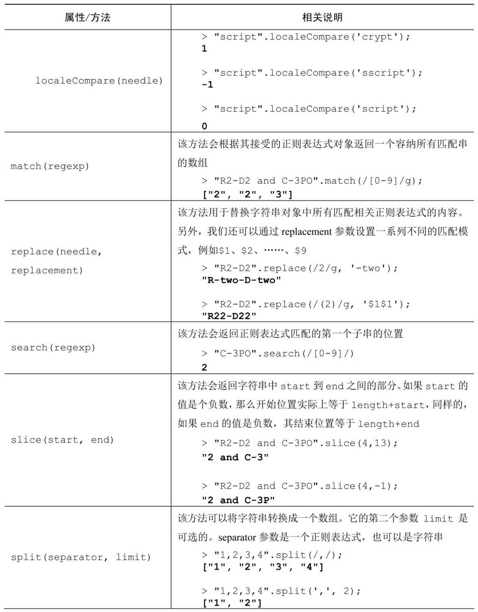
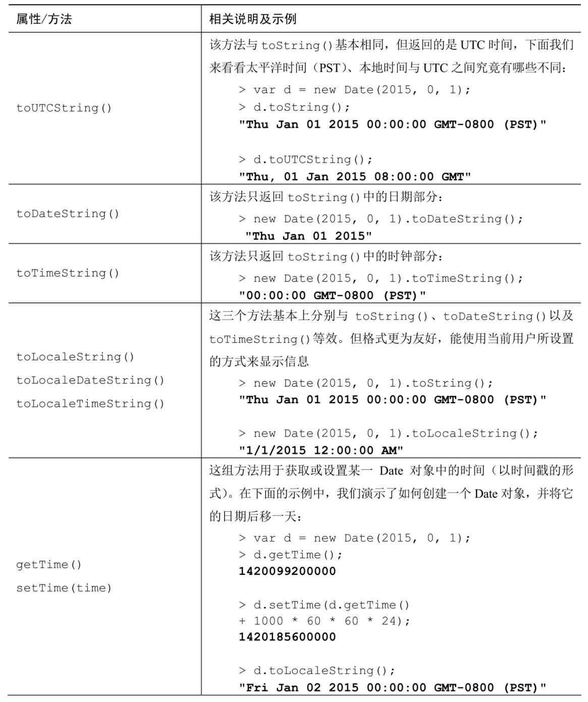
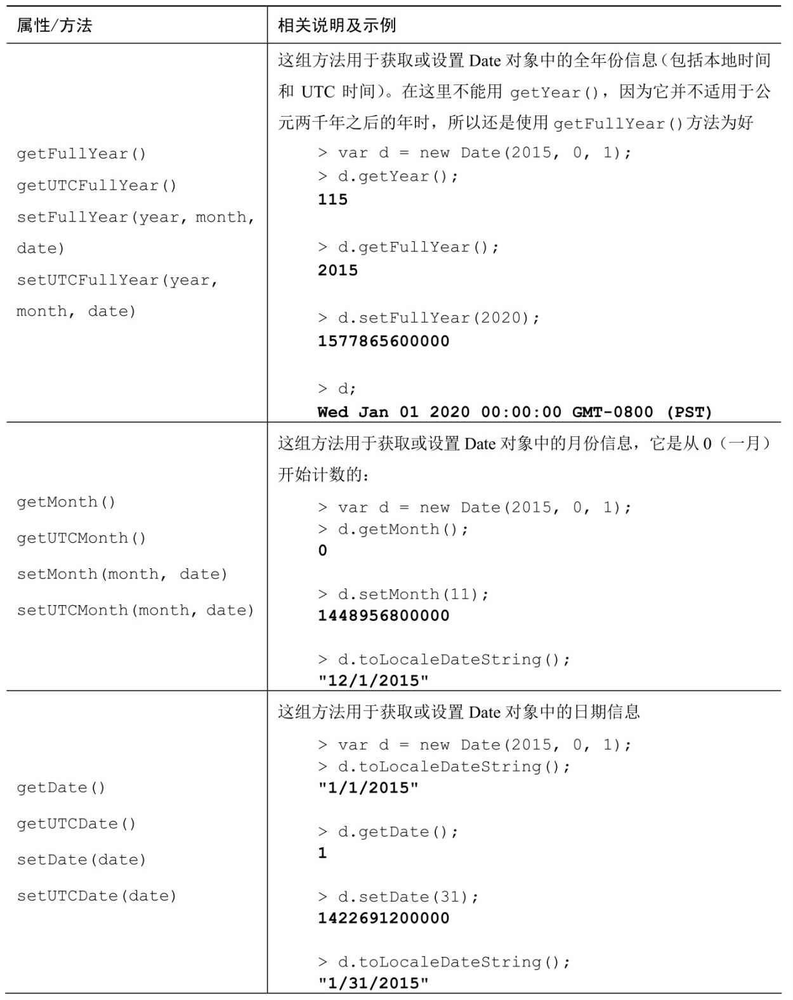

## 1. 对象

### 1.1 对象的概念

JavaScript 的对象是一种无序的集合数据类型，它由若干键值对组成

```js
var xiaoming = {
  name: '小明',
  birth: 1990,
  height: 1.7,
  weight: 65,
  score: null,
};
```

JavaScript 用一个 {...} 表示一个对象，键值对以 xxx: xxx 形式申明，用 `,`隔开。注意，最后一个键值对不需要在末尾加 ` ,` ，如果加了，有的浏览器（如低版 本的 IE）将报错。

### 1.2 对象的属性

#### 访问对象的属性

上述对象申明了一个 `name` 属性，值是 `小明` ， `birth` 属性，值是 `1990` ，以及其他一些属性。最后，把这个对象赋值给变量 `xiaoming` 后，就可以通过变量 `xiaoming` 来获取小明的属性了：

```js
xiaoming.name; // '小明'
xiaoming.birth; // 1990
```

- 通过 `. `操作符访问属性----但这要求属性名必须是一个有效的变量名。如果属性名包含特殊字符，就必须用 `''`括起来：

```js
var xiaohong = {
  name: '小红',
  'middle-school': 'No.1 Middle School',
};
```

- 使用中括号来调用属性----访问非有效变量的属性 或 属性名是在运行时定义的 ，无法使用 `.`操作符，必须用 `['xxx']`来访问，例如 xiaohong 的属性名 `middle-school` 不是一个有效的变量，就需要用 `'' `括起来（在使用方括号语法时，应该将要访问的属性以字符串的形式放在方括号中）：

```js
xiaohong['middle-school']; // 'No.1 Middle School'
xiaohong['name']; // '小红'
xiaohong.name; // '小红'

使用中括号来调用方法在实践中并不常见，除非属性名是在运行时定义的：
var method = 'say';
hero[method]();

如果属性名中包含会导致语法错误的字符，或者属性名使用的是关键字或保留字，也可以使用方括号表示法。
person["first name"] = "Nicholas";
由于"first name"中包含一个空格，所以不能使用点表示法来访问它。然而，属性名中是可以包含非字母非数字的，这时候就可以使用方括号表示法来访问它们。

最佳实践提示：尽量别使用引号（除非别无他法）
尽量使用点号表示法来访问对象的方法与属性。不要在对象中使用带引号的属性标识。
```

如果访问一个不存在的属性会返回什么呢？JavaScript 规定，访问不存在的属性不报错，而是返回 `undefined`.

**枚举属性**

如果想获得某个对象所有属性的列表，我们可以使用 for-in 循环。for 更适合数组而 for-in 更适合对象。

```js
我们以构造 URL字符串为例：

var params = {
    productid: 666,
	section: 'products'
};
var url = 'http://example.org/page.php?',
    i, query = [];

for (i in params) {
	query.push(i + '=' + params[i]);
}
url += query.join('&');

最后我们得到的变量url为：

"http://example.org/page.php?productid=666&section=products"

在这里，有些细节需要留意。

并不是所有的属性都会在 for-in 循环中显示。例如（数组的）length 属性和constructor 属性就不会被显示。那些会显示的属性被称为是可枚举的，
我们可以通过各个对象所提供的 `propertyIsEnumerable()`方法来判断对象的某个属性是否可枚举。
params.propertyIsEnumerable("section") // true
在ES5中，我们可以具体指定哪些属性可枚举，而在ES3中没有这个功能。

原型链中的各个原型属性也会被显示出来，当然前提是它们是可枚举的。我们可以通过对象的 hasOwnProperty()方法来判断一个属性是对象自身属性还是原型属性。

对于所有的原型属性，propertyIsEnumerable()都会返回false，包括那些在for-in循环中可枚举的属性。
```

#### 修改对象的属性

JavaScript 的对象是动态类型，可以自由地给一个对象添加或删除属性：

```js
var xiaoming = {
  name: '小明',
};

xiaoming.age; // undefined
xiaoming.age = 18; // 新增一个age属性
xiaoming.age; // 18
delete xiaoming.age; // 删除age属性
xiaoming.age; // undefined
delete xiaoming['name']; // 删除name属性
xiaoming.name; // undefined
delete xiaoming.school; // 删除一个不存在的school属性也不会报错
```

如果我们要检测 xiaoming 是否拥有某一属性，可以用 `in `操作符：

```js
var xiaoming = {
    name: '小明',
    birth: 1990,
    school: 'No.1 Middle School',
    height: 1.70,
    weight: 65,
    score: null
};
'name' in xiaoming; // true
'grade' in xiaoming; // false

/ 如果 in 判断一个属性存在，这个属性不一定是 xiaoming 的，它可能是 xiaoming 继承得到的：
'toString' in xiaoming; // true
因为toString定义在object 对象中，而所有对象最终都会在原型链上指向 object ，所以 xiaoming 也拥有 toString 属性。

要判断一个属性是否是 xiaoming 自身拥有的，而不是继承得到的，可以用 hasOwnProperty() 方法：
var xiaoming = {
    name: '小明'
};
xiaoming.hasOwnProperty('name'); // true
xiaoming.hasOwnProperty('toString'); // false
```

#### 调用对象的方法

由于对象方法实际上只是一个函数类型的属性，因此它们的访问方式与属性完全相同，即用点号表示法或中括号表示法均可。其调用（请求）方式也与其他函数相同，在指定的方法名后加一对括号即可。如果调用方法时需要传递一些参数，做法也和一般函数一样

### 1.3 对象属性配置

#### 1.3.1 属性标志和属性描述符

我们知道，对象可以存储属性。

到目前为止，属性对我们来说只是一个简单的“键值”对。但对象属性实际上是更灵活且更强大的东西。

##### (1)、属性标志

对象属性（properties），除 `value` 外，还有三个特殊的特性（attributes），也就是所谓的“标志”：

- `writable` — 如果为 true，则值可以被修改，否则它是只可读的。
- `enumerable` — 如果为 true，则会被在循环中列出，否则不会被列出。
- `configurable` — 如果为 true，则此属性可以被删除，这些特性也可以被修改，否则不可以。我们到现在还没看到它们，是因为它们通常不会出现。当我们用“常用的方式”创建一个属性时，它们都为 `true`。但我们也可以随时更改它们。当`configurable: false`, 则不可修改描述符本身，即再使用`Object.defineProperty`来修改属性描述符时会报错。

首先，让我们来看看如何获得这些标志。

`Object.getOwnPropertyDescriptor` 方法允许查询有关属性的 **完整** 信息。

语法是：

```js
let descriptor = Object.getOwnPropertyDescriptor(obj, propertyName);

// obj 需要从中获取信息的对象。
// propertyName 属性的名称。
```

返回值是一个所谓的“属性描述符”对象：它包含值和所有的标志。例如：

```js
let user = {
  name: 'John',
};

let descriptor = Object.getOwnPropertyDescriptor(user, 'name');

alert(JSON.stringify(descriptor, null, 2));
/* 属性描述符：
{
  "value": "John",
  "writable": true,
  "enumerable": true,
  "configurable": true
}
*/
```

为了修改标志，我们可以使用 `Object.defineProperty`。语法是：

```js
Object.defineProperty(obj, propertyName, descriptor);

// obj，propertyName 要应用描述符的对象及其属性。
// descriptor 要应用的属性描述符对象。
```

如果该属性存在，defineProperty 会更新其标志。否则，它会使用给定的值和标志创建属性；在这种情况下，如果没有提供标志，则会假定它是 false。

例如，这里创建了一个属性 name，该属性的所有标志都为 false：

```js
let user = {};

Object.defineProperty(user, 'name', {
  value: 'John',
});

let descriptor = Object.getOwnPropertyDescriptor(user, 'name');

alert(JSON.stringify(descriptor, null, 2));
/*
{
  "value": "John",
  "writable": false,
  "enumerable": false,
  "configurable": false
}
 */
```

将它与上面的“以常用方式创建的” `user.name` 进行比较：现在所有标志都为 `false`。如果这不是我们想要的，那么我们最好在 `descriptor` 中将它们设置为 `true`。

现在让我们通过示例来看看标志的影响。

##### (2)、只读

通过更改 `writable` 标志来把 `user.name` 设置为只读（user.name 不能被重新赋值）：

```js
let user = {
  name: 'John',
};

Object.defineProperty(user, 'name', {
  writable: false,
});

user.name = 'Pete'; // Error: Cannot assign to read only property 'name'
```

现在没有人可以改变我们 `user` 的 `name`，除非它们应用自己的 `defineProperty` 来覆盖我们的 `user` 的 `name`。

> **只在严格模式下会出现 Errors**
>
> 在非严格模式下，在对不可写的属性等进行写入操作时，不会出现错误。但是操作仍然不会成功。
>
> 在非严格模式下，违反标志的行为（flag-violating action）只会被默默地忽略掉。

这是相同的示例，但针对的是属性不存在的情况：

```js
let user = {};

Object.defineProperty(user, 'name', {
  value: 'John',
  // 对于新属性，我们需要明确地列出哪些是 true
  enumerable: true,
  configurable: true,
});

alert(user.name); // John
user.name = 'Pete'; // Error
```

##### (3)、不可枚举

现在让我们向 `user` 添加一个自定义的 `toString`。

通常，对象中内建的 `toString` 是不可枚举的，它不会显示在 `for..in` 中。但是如果我们添加我们自己的 `toString`，那么默认情况下它将显示在 `for..in` 中，如下所示：

```js
let user = {
  name: 'John',
  toString() {
    return this.name;
  },
};

// 默认情况下，我们的两个属性都会被列出：
for (let key in user) alert(key); // name, toString
```

如果我们不喜欢它，那么我们可以设置 `enumerable:false`。之后它就不会出现在 `for..in` 循环中了，就像内建的 `toString` 一样：

```js
let user = {
  name: 'John',
  toString() {
    return this.name;
  },
};

Object.defineProperty(user, 'toString', {
  enumerable: false,
});

// 现在我们的 toString 消失了：
for (let key in user) alert(key); // name
```

不可枚举的属性也会被 `Object.keys` 排除：

```js
alert(Object.keys(user)); // name
```

##### (4)、不可配置

不可配置标志（configurable:false）有时会预设在内建对象和属性中。

不可配置的属性不能被删除，它的特性（attribute）不能被修改。

例如，`Math.PI` 是只读的、不可枚举和不可配置的：

```js
let descriptor = Object.getOwnPropertyDescriptor(Math, 'PI');

alert(JSON.stringify(descriptor, null, 2));
/*
{
  "value": 3.141592653589793,
  "writable": false,
  "enumerable": false,
  "configurable": false
}
*/
```

因此，开发人员无法修改 `Math.PI` 的值或覆盖它。

```js
Math.PI = 3; // Error，因为其 writable: false

// 删除 Math.PI 也不会起作用
```

我们也无法将 `Math.PI` 改为 `writable`：

```js
// Error，因为 configurable: false
Object.defineProperty(Math, 'PI', { writable: true });
```

我们对 Math.PI 什么也做不了。

使属性变成不可配置是一条单行道。我们无法通过 `defineProperty` 再把它改回来。

请注意：`configurable: false` **防止更改和删除属性标志，但是允许更改对象的值**。

这里的 `user.name` 是不可配置的，但是我们仍然可以更改它，因为它是可写的：

```js
let user = {
  name: 'John',
};

Object.defineProperty(user, 'name', {
  configurable: false,
});

user.name = 'Pete'; // 正常工作
delete user.name; // Error
```

现在，我们将 `user.name` 设置为一个“永不可改”的常量，就像内建的 `Math.PI`：

```js
let user = {
  name: 'John',
};

Object.defineProperty(user, 'name', {
  writable: false,
  configurable: false,
});

// 不能修改 user.name 或它的标志
// 下面的所有操作都不起作用：
user.name = 'Pete';
delete user.name;
Object.defineProperty(user, 'name', { value: 'Pete' });
```

> **唯一可行的特性更改：writable true → false**
>
> 对于更改标志，有一个小例外。
>
> 对于不可配置的属性，我们可以将 writable: true 更改为 false，从而防止其值被修改（以添加另一层保护）。但无法反向行之。

##### (5)、Object.defineProperties

有一个方法 `Object.defineProperties(obj, descriptors)`，允许一次定义多个属性。

语法是：

```js
Object.defineProperties(obj, {
  prop1: descriptor1,
  prop2: descriptor2,
  // ...
});
```

例如：

```js
Object.defineProperties(user, {
  name: { value: 'John', writable: false },
  surname: { value: 'Smith', writable: false },
  // ...
});
```

所以，我们可以一次性设置多个属性。

##### (6)、Object.getOwnPropertyDescriptors

要一次获取所有属性描述符，我们可以使用 `Object.getOwnPropertyDescriptors(obj)` 方法。

它与 `Object.defineProperties` 一起可以用作克隆对象的“标志感知”方式：

```js
let clone = Object.defineProperties({}, Object.getOwnPropertyDescriptors(obj));
```

通常，当我们克隆一个对象时，我们使用赋值的方式来复制属性，像这样：

```js
for (let key in user) {
  clone[key] = user[key];
}
```

……但是，这并不能复制标志。所以如果我们想要一个“更好”的克隆，那么 `Object.defineProperties` 是首选。

另一个区别是 `for..in` 会忽略 `symbol` 类型的和不可枚举的属性，但是 `Object.getOwnPropertyDescriptors` 返回包含 `symbol` 类型的和不可枚举的属性在内的 **所有** 属性描述符。

##### (7)、设定一个全局的密封对象

属性描述符在单个属性的级别上工作。

还有一些限制访问 **整个** 对象的方法：

- `Object.preventExtensions(obj)` 禁止向对象添加新属性。
- `Object.seal(obj)` 禁止添加/删除属性。为所有现有的属性设置 `configurable: false`。
- `Object.freeze(obj)` 禁止添加/删除/更改属性。为所有现有的属性设置 `configurable: false, writable: false`。

还有针对它们的测试：

- `Object.isExtensible(obj)` 如果添加属性被禁止，则返回 `false`，否则返回 `true`。
- `Object.isSealed(obj)` 如果添加/删除属性被禁止，并且所有现有的属性都具有 `configurable: false`则返回 `true`。
- `Object.isFrozen(obj)` 如果添加/删除/更改属性被禁止，并且所有当前属性都是 `configurable: false, writable: false`，则返回 `true`。

这些方法在实际中很少使用。

#### 1.3.2 属性的 `getter` 和 `setter`

有两种类型的对象属性。

第一种是 数据属性。我们已经知道如何使用它们了。到目前为止，我们使用过的所有属性都是数据属性。

第二种类型的属性是新东西。它是 访问器属性（accessor property）。它们本质上是用于获取和设置值的函数，但从外部代码来看就像常规属性。

##### (1)、 getter 和 setter

访问器属性由 “getter” 和 “setter” 方法表示。在对象字面量中，它们用 `get` 和 `set` 表示：

```js
let obj = {
  get propName() {
    // 当读取 obj.propName 时，getter 起作用
  },

  set propName(value) {
    // 当执行 obj.propName = value 操作时，setter 起作用
  },
};
```

当读取 `obj.propName` 时，`getter` 起作用，当 `obj.propName` 被赋值时，`setter` 起作用。

例如，我们有一个具有 `name` 和 `surname` 属性的对象 `user`：

```js
let user = {
  name: 'John',
  surname: 'Smith',
};
```

现在我们想添加一个 `fullName` 属性，该属性值应该为 "John Smith"。当然，我们不想复制粘贴已有的信息，因此我们可以使用访问器来实现：

```js
let user = {
  name: 'John',
  surname: 'Smith',

  get fullName() {
    return `${this.name} ${this.surname}`;
  },
};

alert(user.fullName); // John Smith
```

从外表看，访问器属性看起来就像一个普通属性。这就是访问器属性的设计思想。我们不以函数的方式 调用 `user.fullName`，我们正常 读取 它：getter 在幕后运行。

截至目前，`fullName` 只有一个 `getter`。如果我们尝试赋值操作 `user.fullName=`，将会出现错误：

```js
let user = {
  get fullName() {
    return `...`;
  },
};

user.fullName = 'Test'; // Error（属性只有一个 getter）
```

让我们通过为 `user.fullName` 添加一个 `setter` 来修复它：

```js
let user = {
  name: 'John',
  surname: 'Smith',

  get fullName() {
    return `${this.name} ${this.surname}`;
  },

  set fullName(value) {
    [this.name, this.surname] = value.split(' ');
  },
};

// set fullName 将以给定值执行
user.fullName = 'Alice Cooper';

alert(user.name); // Alice
alert(user.surname); // Cooper
```

现在，我们就有一个“虚拟”属性。它是可读且可写的。

##### (2)、访问器描述符

访问器属性的描述符与数据属性的不同。

对于访问器属性，没有 `value` 和 `writable`，但是有 `get` 和 `set` 函数。

所以访问器描述符可能有：

- `get` —— 一个没有参数的函数，在读取属性时工作，
- `set` —— 带有一个参数的函数，当属性被设置时调用，
- `enumerable` —— 与数据属性的相同，
- `configurable` —— 与数据属性的相同。例如，要使用 `defineProperty` 创建一个 `fullName` 访问器，我们可以使用 `get` 和 `set` 来传递描述符：

```js
let user = {
  name: 'John',
  surname: 'Smith',
};

Object.defineProperty(user, 'fullName', {
  get() {
    return `${this.name} ${this.surname}`;
  },

  set(value) {
    [this.name, this.surname] = value.split(' ');
  },
});

alert(user.fullName); // John Smith

for (let key in user) alert(key); // name, surname
```

请注意，一个属性要么是访问器（具有 get/set 方法），要么是数据属性（具有 value），但不能两者都是。

如果我们试图在同一个描述符中同时提供 `get` 和 `value`，则会出现错误：

```js
// Error: Invalid property descriptor.
Object.defineProperty({}, 'prop', {
  get() {
    return 1;
  },

  value: 2,
});
```

##### (3)、更聪明的 getter/setter

getter/setter 可以用作“真实”属性值的包装器，以便对它们进行更多的控制。

例如，如果我们想禁止太短的 user 的 name，我们可以创建一个 setter name，并将值存储在一个单独的属性 \_name 中：

```js
let user = {
  get name() {
    return this._name;
  },

  set name(value) {
    if (value.length < 4) {
      alert('Name is too short, need at least 4 characters');
      return;
    }
    this._name = value;
  },
};

user.name = 'Pete';
alert(user.name); // Pete

user.name = ''; // Name 太短了……
```

所以，`name` 被存储在 `_name` 属性中，并通过 `getter` 和 `setter` 进行访问。

从技术上讲，外部代码可以使用 `user._name` 直接访问 `name`。但是，这儿有一个众所周知的约定，即以下划线` "_"` 开头的属性是内部属性，不应该从对象外部进行访问。

##### (4)、兼容性

访问器的一大用途是，它们允许随时通过使用 `getter` 和 `setter` 替换“正常的”数据属性，来控制和调整这些属性的行为。

想象一下，我们开始使用数据属性 `name` 和 `age` 来实现 `user` 对象：

```js
function User(name, age) {
  this.name = name;
  this.age = age;
}

let john = new User('John', 25);

alert(john.age); // 25
```

……但迟早，情况可能会发生变化。我们可能会决定存储 `birthday`，而不是 `age`，因为它更精确，更方便：

```js
function User(name, birthday) {
  this.name = name;
  this.birthday = birthday;
}

let john = new User('John', new Date(1992, 6, 1));
```

现在应该如何处理仍使用 `age` 属性的旧代码呢？

我们可以尝试找到所有这些地方并修改它们，但这会花费很多时间，而且如果其他很多人都在使用该代码，那么可能很难完成所有修改。而且，`user` 中有 `age` 是一件好事，对吧？

那我们就把它保留下来吧。

为 `age` 添加一个 `getter` 来解决这个问题：

```js
function User(name, birthday) {
  this.name = name;
  this.birthday = birthday;

  // 年龄是根据当前日期和生日计算得出的
  Object.defineProperty(this, 'age', {
    get() {
      let todayYear = new Date().getFullYear();
      return todayYear - this.birthday.getFullYear();
    },
  });
}

let john = new User('John', new Date(1992, 6, 1));

alert(john.birthday); // birthday 是可访问的
alert(john.age); // ……age 也是可访问的
```

现在旧的代码也可以工作，而且我们还拥有了一个不错的附加属性。

## 2. this

### 全局作用域中的 this

在全局作用域下，this 指向全局对象（浏览器中为 window 对象）。

```js
console.log(this === window); // true
```

### 函数中的 this

在严格模式下，如果函数中 this 没有被执行环境（execution context）定义，那它指向 undefined

非严格模式下: 谁调用指向谁

#### 独立函数调用

什么叫独立函数调用，就是没有任何对象调用他，该函数的 this 就指向全局对象（浏览器中为 window 对象）。

```js
function fn () {
  console.log(this === window) // true
  function f1 () {
    console.log(this === window) // true
  }
  f1()
}
fn()


上面的例子，我们独立调用了函数 fn 和 f1，他们this都指向window。现在我们改变一下fn中this的指向，看看 f1 是否受影响：

function fn () {
  console.log(this === o) // true
  function f1 () {
    console.log(this === window) // true
  }
  f1()
}
var o = {}
fn.call(o)

现在我们改变了fn 中 this 的指向，但是f1 并没有受影响。/ /所以 独立调用函数的this指向全局对象，跟调用环境的 this 指向无关。
```

#### 对象函数的调用

```js
function sayHello() {
  console.log('你好，我是' + this.name);
}
var obj = {
  name: '李白',
  sayHello: sayHello,
};
obj.sayHello(); // 你好，我是李白
```

我们使用 `obj.sayHello()` 的形式，让 obj 调用 sayHello 函数，所以 sayHello 中的 this 指向 obj。我们把上面的例子稍微做一下改变：

```js
function sayHello() {
  console.log('你好，我是' + this.name);
}
var obj = {
  name: '李白',
  sayHello: sayHello,
};
var name = '杜甫';
var bar = obj.sayHello;
obj.sayHello(); // 你好，我是李白
bar(); // 你好，我是杜甫
```

看完这个例子之后可能会很疑惑，这跟上面的有什么区别？这个例子我们用一个**变量 bar 保存了 obj.sayHello 的引用**，然后独立调用 `bar()`，实际上就是独立调用 `sayHello()`,而我们知道独立调用函数，函数的 this 指向全局对象，此时 sayHello 的 this 指向 window。

### 函数的 `call`，`apply`和 `bind`方法

如果想要强行改变 this 的指向，可以使用 `Function.prototype` 提供的 `call`，`apply`和 `bind`方法。

```js
function add(b, c) {
  console.log(this.a + b + c);
}
var a = 1;
add(1, 1); // 3
var obj = {
  a: 2,
};
add.call(obj, 1, 1); // 4
add.apply(obj, [1, 1]); // 4
```

我们使用 `call`和 `apply`方法，让 `add()`的 this 指向了 `obj`对象，所以输出的结果为 4。这里 `call`和 `apply`方法的本质相同，只是传参不同。而 `bind`方法和他俩有一个明显的区别：使用 `bind`方法绑定 this 指向返回一个新函数，并且这个新函数的 this 会永久指向绑定的对象，无法改变。

```js
function sayName() {
  console.log(this.name);
}
var name = '杜甫';
var obj = {
  name: '李白',
};
var obj2 = {
  name: '王维',
};
var say = sayName.bind(obj);
say(); // 李白
say.call(obj2); // 李白
say.bind(obj2)(); // 李白
```

这个例子中我们使用 bind 方法让 say 函数的 this 绑定了 obj，使用 call 和 bind 都无法改变 say 函数中 this 的指向。

### 构造函数中的 this

当一个函数用作构造函数时（使用 new 关键字），它的 this 指向 new 的新对象。

```js
function Person(name) {
  this.name = name;
}
var p1 = new Person('李白');
console.log(p1.name); // 李白
```

我们使用 new 关键字，构造一个对象 p1，构造过程中 this 指向了这个新对象 p1，所以 `p1.name`就是所传入的 name `'李白'`。

但是在使用构造函数时需要注意一点：如果构造函数没有返回值，会默认返回构造出来的对象，但是如果函数有返回值，那么就返回这个值。

```js
function Person(name) {
  this.name = name;
  return { name: '杜甫' };
}
var p1 = new Person('李白');
console.log(p1.name); // 杜甫
```

### 箭头函数的 this

上面我们说过绝大多数情况 this 是动态绑定的，而箭头函数就是那个例外。 箭头函数的 this 和所在词法环境的 this 一致。

```js
var obj = {
  name: '李白',
  sayName: function say() {
    return () => {
      console.log(this.name);
    };
  },
};
var name = '杜甫';
obj.sayName()(); // 李白
```

看这个例子，当前箭头函数的在 say 函数内，即所在词法环境是 say 函数，他的 this 与 say() 中 this 一致。当 obj 调用 sayName()时（调用 say()），say 的指向为 obj，所以箭头函数指向 obj，`obj.sayName()()` 输出 `李白`。 我们来看换成普通函数会是什么结果：

```js
var obj = {
  name: '李白',
  sayName: function say() {
    return function () {
      console.log(this.name);
    };
  },
};
var name = '杜甫';
obj.sayName()(); // 杜甫
```

我们可以把 `obj.sayName()()`分成两部分看:

- 第一部分：`obj.sayName()`拿到了 `function(){console.log(this.name)}`
- 第二部分：`(obj.sayName())()`在全局独立调用得到的函数

因此，`function(){console.log(this.name)}`这个函数的 this 指向全局对象(window),输出 `杜甫`。

## 3. 创建对象

1.字面量

```js
let obj = { name: '张三' };
```

2.Object 构造函数创建

```js
let Obj = new Object();
Obj.name = '张三';
```

3.使用工厂模式创建对象

```js
function createPerson(name) {
  var o = new Object();
  o.name = name;
  return o;
}
var person1 = createPerson('张三');
```

4.使用构造函数创建对象

```js
function Person(name) {
  this.name = name;
}
var person1 = new Person('张三');
```

## 4. 传递对象

当我们拷贝某个对象或者将它传递给某个函数时，往往传递的都是该对象的引用。因此我们在引用上所做的任何改动，实际上都会影响它所引用的原对象。

在下面的示例中，我们将会看到对象是如何赋值给另一个变量的，并且，如果我们对该变量做一些改变操作的话，原对象也会跟着被改变

```js
var original = {howmany: 1};
var mycopy = original;
mycopy.howmany; // 1
mycopy.howmany = 100; // 赋值
original.howmany; // 100

/ 浅拷贝
```

### 拷贝

## 5. 比较对象

当我们对对象进行比较操作时，当且仅当两个引用指向同一个对象时，结果为 true。而如果是不同的对象，即使它们碰巧拥有相同的属性和方法，比较操作也会返回 false。

```js
var fido = {breed: 'dog'};
var benji = {breed: 'dog'};

benji === fido; // 然后，对它们进行比较，操作将会返回false

我们可以新建一个变量 mydog，并将其中一个对象赋值给它。这样一来 mydog 实际上就指向了这个变量。
var mydog = benji; // 在这种情况下，mydog与benji所指向的对象是相同的（也就是说，改变mydog的属性就等同于改变benji）
mydog === benji; // true

mydog === fido; // 由于 fido 是一个与 mydog 不同的对象，所以它与 mydog 的比较结果仍为false
```

## 6. 内置对象

### 6.1 `Object`

Object 是 JavaScript 中所有对象的父级对象，这意味着我们创建的所有对象都继承于此。为了新建一个空对象，我们既可以用对象文本标识法也可以调用 Object()构造器函数。

#### Object 构造器的成员

| 属 性 / 方 法 | 说 明 |
| :-: | :-: |
| Object.prototype | 该属性是所有对象的原型（包括 Object 对象本身），语言中的其他对象正是通过在该属性上添加东西来实现它们之间的继承关系的。所以请小心使用 |
|  |  |

#### Object.prototype 的成员

| 属 性 / 方 法 |                        说 明                        |
| :-----------: | :-------------------------------------------------: |
|  constructor  | 该属性指向用来构造该对象的构造器，在这里为 Object() |
|               |                                                     |


#### 属性描述符

在 ECMAScript 3 中，除了一些内置属性（例如，Math.PI），对象所有的属性在任何时候都可以被修改、插入、删除。在 ES5 中，我们可以设置属性是否可以被改变或是删除——在这之前，它是内置属性的特权。ES5 引入了属性描述符的概念，我们可以通过它对所定义的属性有更大的控制权。

我们可以把属性描述符想象成一个对象，我们用该对象来描述某个属性所具有的各种特征。描述这些特征所使用的语法与一般的对象标识法无异，所以属性描述符也会有自己的属性与方法。在这里，为了避免歧义，我们将属性描述符的属性称为特性（attributes）。这些特性包括：

```js
value——当试图获取属性时所返回的值。

writable——该属性是否可写。

enumerable——该属性在for-in 循环中是否会被枚举。

configurable——该属性是否可删除。

set()——该属性的更新操作所调用的函数。

get()——获取属性值时所调用的函数。

另外，数据描述符（其中属性为：enumerable，configurable，value，writable）与存取描述符（其中属性为：enumerable，configurable，set()，get()）之间是有互斥关系的。在定义了set()和get()之后，描述符会认为存取操作已被定义过了，其后再定义value和writable会引起错误。
```

以下是 ES3 风格的属性定义方式：

```js
var persion = {};
person.legs = 2;
```

以下是等价的 ES5 通过数据描述符定义属性的方式：

```js
var persion = {};

Object.defineProperty(person, "legs",{
	value: 2,
	writable: true,
	configurable: true,
	enumerable: true
});

其中，除了value的默认值为undefined以外，其他的默认值都为false。这也就意味着，如果我们想要通过这一方式定义一个可写的属性，必须显式将它们设为true。
```

或者，我们也可以通过 ES5 的存取描述符来定义：

```js
var person = {};
Object.defineProperty(person, 'legs', {
  set: function (v) {
    this.value = v;
  },
  get: function (v) {
    return this.value;
  },
  configurable: true,
  enumerable: true,
});

person.legs = 2;
```

另外，我们还可以（通过定义 nonmalleable 属性）在具体行为中运用这些描述符：

```js
var person = {};
Object.defineProperty(person, 'heads', { value: 1 });
person.heads = 0; // 0
person.heads; // 1
delete person.heads; // false
person.heads; // 1
```

#### ES5 中所有的附加 Object 属性


### 6.2 `Array`

尽管数组也是一种对象，但还是有一些特殊之处，因为：

    数组的属性名是从0 开始递增，并自动生成数值；

    数组拥有一个用于记录元素数量的 length属性；

    数组在父级对象的基础上扩展了更多额外的内建方法。

#### Array.prototype 的成员


ECMAScript 5 中增加的 Array 属性


### 6.3 `Function`

请尽量避免使用 Function()构造器。因为它与 eval()和 setTimeout() 一样，始终会以字符串的形式通过 JavaScript 的代码检查。

与其他对象相同的是，函数对象中也含有名为 constructor 的属性，其引用的就是 Function()这个构造器函数。

另外，函数对象中也有一个 length 属性，用于记录该函数声明时所决定的参数数量。

```js
function myfunc(a, b, c) {
  return true;
}

myfunc.length; // 3
```

prototype 属性是 JavaScript 中使用得最为广泛的函数属性。每个函数的 prototype 属性中都指向了一个对象

所有的函数对象都是继承自顶级父对象 Object 的，因此它也拥有 Object 对象的方法。

```js
例如toString()。当我们对一个函数调用toString()方法时，所得到的就是该函数的源代码。

function myfunc(a, b, c) {
	return a + b + c;
}

myfunc.toString();
/*
"function myfunc(a, b, c) {

"return a + b + c;

}"
*/

但如果我们想用这种方法来查看那些内建函数的源码的话，就只会得到一个毫无用处的字符串[native code]。

parseInt.toString();
/*
"function parseInt() {[native code]}"
*/

我们可以用toString()函数来区分本地方法和自定义方法。

toString()方法的行为与运行环境有关，浏览器之间也会有差异，比如空格和空行的多少。
```

#### Function.prototype 的成员


ECMAScript 5 对 Function 的附加支持


### 6.4 `Boolean`

Boolean()可以将一些非布尔值转换为布尔值（其效果相当于进行两次取反操作：!!value）

在 JavaScript 中，除了那六种 falsy 值外(""；null；undefined；0；NaN；false)，其他所有的都属于 truthy 值 ，其中也包括所有的对象。这就意味着所有由 new Boolean()语句创建的布尔对象都等于 true，因为它们都是对象。

```js
Boolean(new Boolean(false)); // true
```

### 6.5 `Number`

◆ 在被当做构造器函数时（即用于 new 操作符），它会创建一个对象；

◆ 在被当做一般函数时，它会试图将任何值转换为数字，这与 parseInt()或 parseFloat()起到的作用基本相同。

需要注意的是，你可以在事先未创建 Number 对象的情况下使用这些方法。在这些例子中，Number 对象均在后台完成创建和销毁

与所有的对象一样，Number 对象也提供了自己的 toString()方法。但值得注意的是，该对象的 toString()方法有一个可选的 radix 参数（它的默认值是 10）。

#### Number 构造器的成员


###### Number 对象的成员


#### ES6 `Number`的扩展

##### （1）`Number.isFinite()`, `Number.isNaN()`

ES6 在 `Number`对象上，新提供了 `Number.isFinite()`和 `Number.isNaN()`两个方法。

`Number.isFinite()`用来检查一个数值是否为有限的（finite），即不是 `Infinity`。

```js
Number.isFinite(15); // true
Number.isFinite(0.8); // true
Number.isFinite(NaN); // false
Number.isFinite(Infinity); // false
Number.isFinite(-Infinity); // false
Number.isFinite('foo'); // false
Number.isFinite('15'); // false
Number.isFinite(true); // false
```

注意，如果参数类型不是数值，`Number.isFinite`一律返回 `false`。

`Number.isNaN()`用来检查一个值是否为 `NaN`。

```js
Number.isNaN(NaN); // true
Number.isNaN(15); // false
Number.isNaN('15'); // false
Number.isNaN(true); // false
Number.isNaN(9 / NaN); // true
Number.isNaN('true' / 0); // true
Number.isNaN('true' / 'true'); // true
```

如果参数类型不是 `NaN`，`Number.isNaN`一律返回 `false`。

它们与传统的全局方法 `isFinite()`和 `isNaN()`的区别在于，传统方法先调用 `Number()`将非数值的值转为数值，再进行判断，而这两个新方法只对数值有效，`Number.isFinite()`对于非数值一律返回 `false`, `Number.isNaN()`只有对于 `NaN`才返回 `true`，非 `NaN`一律返回 `false`。

```js
isFinite(25); // true
isFinite('25'); // true
Number.isFinite(25); // true
Number.isFinite('25'); // false
isNaN(NaN); // true
isNaN('NaN'); // true
Number.isNaN(NaN); // true
Number.isNaN('NaN'); // false
Number.isNaN(1); // false
```

##### （2）`Number.parseInt()`, `Number.parseFloat()`

ES6 将全局方法 `parseInt()`和 `parseFloat()`，移植到 `Number`对象上面，行为完全保持不变。

```js
// ES5的写法
parseInt('12.34'); // 12
parseFloat('123.45#'); // 123.45
// ES6的写法
Number.parseInt('12.34'); // 12
Number.parseFloat('123.45#'); // 123.45
```

这样做的目的，是逐步减少全局性方法，使得语言逐步模块化。

```js
Number.parseInt === parseInt; // true
Number.parseFloat === parseFloat; // true
```

##### （3）`Number.isInteger()`

`Number.isInteger()`用来判断一个数值是否为整数。

```js
Number.isInteger(25); // true
Number.isInteger(25.1); // false
```

JavaScript 内部，整数和浮点数采用的是同样的储存方法，所以 25 和 25.0 被视为同一个值。

```js
Number.isInteger(25); // true
Number.isInteger(25.0); // true
```

如果参数不是数值，`Number.isInteger`返回 `false`。

```js
Number.isInteger(); // false
Number.isInteger(null); // false
Number.isInteger('15'); // false
Number.isInteger(true); // false
```

注意，由于 JavaScript 采用 IEEE 754 标准，数值存储为 64 位双精度格式，数值精度最多可以达到 53 个二进制位（1 个隐藏位与 52 个有效位）。如果数值的精度超过这个限度，第 54 位及后面的位就会被丢弃，这种情况下，`Number.isInteger`可能会误判。

```js
Number.isInteger(3.0000000000000002); // true
```

上面代码中，`Number.isInteger`的参数明明不是整数，但是会返回 `true`。原因就是这个小数的精度达到了小数点后 16 个十进制位，转成二进制位超过了 53 个二进制位，导致最后的那个 `2`被丢弃了。

类似的情况还有，如果一个数值的绝对值小于 `Number.MIN_VALUE`（5E-324），即小于 JavaScript 能够分辨的最小值，会被自动转为 0。这时，`Number.isInteger`也会误判。

```js
Number.isInteger(5e-324); // false
Number.isInteger(5e-325); // true
// 上面代码中，`5E-325`由于值太小，会被自动转为0，因此返回 `true`。
```

总之，如果对数据精度的要求较高，不建议使用 `Number.isInteger()`判断一个数值是否为整数。

### 6.6 `String`

在很多场景中，String 对象都会被自动转换为基本类型的字符串,而基本类型的字符串就不是对象了，因此它们不含有任何属性和方法。

```js
最后我们再来看一个说明基本字符串与String对象之间区别的例子：当它们被转换成布尔值时，尽管空字符串属于falsy值，但所有的String对象都是truthy值（因为所有的对象都是truthy值）。

Boolean(""); // false

Boolean(new String("")); // true
```

#### String()构造器的成员


#### String.prototype 的成员





ECMAScript5 对 String 的补充


### 6.7 `Math`

Math 与我们之前所见过的其他全局内建对象是有些区别的。Math 对象不是函数对象，所以我们不能对它调用 new 操作符，以创建别的对象。实际上，Math 只是一个包含一系列方法和属性、用于数学计算的全局内建对象。

#### 1. Math 对象的属性

Math 的属性都是一些不可修改的常数，因此它们都以名字大写的方式来表示自己与一般属性变量的不同（这类似于 Number()构造器的常数属性）。

|   属　　性   |              说　　明               |
| :----------: | :---------------------------------: |
|    Math.E    |    自然对数的底数，即常量 e 的值    |
|  Math.LN10   |            10 的自然对数            |
| Math.LOG10E  |         以 10 为底 e 的对数         |
|   Math.PI    |               π 的值                |
| Math.SQRT1_2 | 1/2 的平方根（即 2 的平方根的倒数） |
|  Math.SQRT2  |             2 的平方根              |
|              |                                     |
|              |                                     |
|              |                                     |

#### 2. `min()`和 `max()`方法

min()和 max()方法用于确定一组数值中的最小值和最大值。这两个方法都可以接收任意多个数值参数

```js
var max = Math.max(3, 54, 32, 16);
alert(max); //54

var min = Math.min(3, 54, 32, 16);
alert(min); //3
```

要找到数组中的最大或最小值，可以像下面这样使用 `apply()`方法

```js
var values = [1, 2, 3, 4, 5, 6, 7, 8];
var max = Math.max.apply(Math, values);
这个技巧的关键是把Math对象作为apply()的第一个参数，从而正确地设置this值。然后，可以将任何数组作为第二个参数。
```

#### 3. 舍入方法

- `Math.ceil()`执行向上舍入，即它总是将数值向上舍入为最接近的整数；
- `Math.floor()`执行向下舍入，即它总是将数值向下舍入为最接近的整数；
- `Math.round()`执行标准舍入，即它总是将数值四舍五入为最接近的整数（这也是我们在数学课上学到的舍入规则）。

#### 4. `random()`方法

Math.random()方法返回介于 0 和 1 之间一个随机数，不包括 0 和 1。对于某些站点来说，这个方法非常实用，因为可以利用它来随机显示一些名人名言和新闻事件。套用下面的公式，就可以利用 Math.random()从某个整数范围内随机选择一个值。

```js
值 = Math.floor(Math.random() * 可能值的总数 + 第一个可能的值)

//式中用到了Math.floor()方法，这是因为Math.random()总返回一个小数值。而用这个小数值乘以一个整数，然后再加上一个整数，最终结果仍然还是一个小数。
举例来说，如果你想选择一个1到10之间的数值，可以像下面这样编写代码：

var num = Math.floor(Math.random() * 10 + 1);
// 总共有10个可能的值（1到10），而第一个可能的值是1。

而如果想要选择一个介于2到10之间的值，就应该将上面的代码改成这样：
var num = Math.floor(Math.random() * 9 + 2);


从2数到10要数9个数，因此可能值的总数就是9，而第一个可能的值就是2。多数情况下，其实都可以通过一个函数来计算可能值的总数和第一个可能的值
function selectFrom(lowerValue, upperValue) {
    var choices = upperValue - lowerValue + 1;
    return Math.floor(Math.random() * choices + lowerValue);
}

var num = selectFrom(2, 10);
alert(num);   // 介于2和10之间（包括2和10）的一个数值

// 函数selectFrom()接受两个参数：应该返回的最小值和最大值。而用最大值减最小值再加1得到了可能值的总数，然后它又把这些数值套用到了前面的公式中。这样，通过调用selectFrom(2,10)就可以得到一个介于2和10之间（包括2和10）的数值了。利用这个函数，可以方便地从数组中随机取出一项，例如：

var colors = ["red", "green", "blue", "yellow", "black", "purple", "brown"];
var color = colors[selectFrom(0, colors.length-1)];
alert(color);  // 可能是数组中包含的任何一个字符串

// 在这个例子中，传递给selectFrom()的第二个参数是数组的长度减1，也就是数组中最后一项的位置。
```

#### 5. 其他方法

|       方　　法        |        说　　明         |
| :-------------------: | :---------------------: |
|    `Math.abs(num)`    |    返回 num 的绝对值    |
|    `Math.exp(num)`    | 返回 Math.E 的 num 次幂 |
|    `Math.log(num)`    |   返回 num 的自然对数   |
| `Math.pow(num,power)` | 返回 num 的 power 次幂  |
|   `Math.sqrt(num)`    |    返回 num 的平方根    |
|    `Math.acos(x)`     |    返回 x 的反余弦值    |
|    `Math.asin(x)`     |    返回 x 的反正弦值    |
|    `Math.atan(x)`     |    返回 x 的反正切值    |
|   `Math.atan2(y,x)`   |   返回 y/x 的反正切值   |
|     `Math.cos(x)`     |     返回 x 的余弦值     |
|     `Math.sin(x)`     |     返回 x 的正弦值     |
|     `Math.tan(x)`     |     返回 x 的正切值     |

### 6.8 `Date`

ECMAScript 中的 Date 类型是在早期 Java 中的 java.util.Date 类基础上构建的。为此，Date 类型使用自 UTC（Coordinated Universal Time，国际协调时间）1970 年 1 月 1 日午夜（零时）开始经过的毫秒数来保存日期。在使用这种数据存储格式的条件下，Date 类型保存的日期能够精确到 1970 年 1 月 1 日之前或之后的 285 616 年。

`Date()`是用于创建 Date 对象的构造器函数，我们在用它创建对象时可以传递以下几种参数:

- 无参数（默认为当天的日期）。
- 一个用于表现日期的字符串。
- 分开传递的日、月、时间等值。
- 一个 timestamp 值。

Date 构造器可以接受各种不同格式的字符串日期输入表示法，但如要定义一个精确的日期，例如将用户输入直接传递给 Date 构造器，这样做显然不够可靠。更好的选择是向 Date()构造器传递一些具体的数值，其中包括：

- 年份；
- 月份：从 0（1 月）到 11（12 月）；
- 日期：从 1 到 31；
- 时数：从 0 到 23；
- 分钟：从 0 到 59；
- 秒钟：从 0 到 59；
- 毫秒数：从 0 到 999。

#### 时间获取：

```javascript
var myDate = new Date();
myDate.getYear(); //获取当前年份(2位)
myDate.getFullYear(); //获取完整的年份(4位,1970-????)
myDate.getMonth(); //获取当前月份(0-11,0代表1月)         // 所以获取当前月份是myDate.getMonth()+1;
myDate.getDate(); //获取当前日(1-31)
myDate.getDay(); //获取当前星期X(0-6,0代表星期天)
myDate.getTime(); //获取当前时间(从1970.1.1开始的毫秒数);与valueOf()方法返回的值相同
myDate.getHours(); //获取当前小时数(0-23)
myDate.getMinutes(); //获取当前分钟数(0-59)
myDate.getSeconds(); //获取当前秒数(0-59)
myDate.getMilliseconds(); //获取当前毫秒数(0-999)
myDate.toLocaleDateString(); //获取当前日期

var mytime=myDate.toLocaleTimeString(); //获取当前时间
myDate.toLocaleString( ); //获取日期与时间

/获取当前时间戳的(当前毫秒)
var timestamp =Date.parse(new Date());    结果：1280977330000       //不推荐; 毫秒改成了000显示
var timestamp =(new Date()).valueOf();       结果：1280977330748       //推荐;
var timestamp=new Date().getTime();         结果：1280977330748        //推荐;
注：js中单独调用new Date(); 显示这种格式 Mar 31 10:10:43 UTC+0800 2012；但是用new Date() 参与计算会自动转换为从1970.1.1开始的毫秒数
```

#### 将字符串形式的日期转换成日期对象

```javascript
var strTime = '2011-04-16'; //字符串日期格式
var date = new Date(Date.parse(strTime.replace(/-/g, '/'))); //转换成Data();
```

#### `new Date ()`

```js
new Date() ;   //参数可以为整数; 也可以为字符串; 但格式必须正确

  new Date(2009,1,1);   //正确

  new Date("2009/1/1");  //正确

  new Date("2009-1-1");  //错误

  new Date( year, month, date, hrs, min, sec) 按给定的参数创建一日期对象
// 参数说明：
　　year的值为：需设定的年份-1900。例如需设定的年份是1997则year的值应为97，即1997-1900的结果。所以Date中可设定     的年份最小为1900；
　　month的值域为0～11，0代表1月，11表代表12月；
　　date的值域在1～31之间；
　　hrs的值域在0～23之间。从午夜到次日凌晨1点间hrs=0，从中午到下午1点间hrs=12；
　　min和sec的值域在0～59之间。
　　例 Date day=new Date(11,3,4);
　　//day中的时间为：04-Apr-11 12:00:00 AM

    另外，还可以给出不正确的参数。
　　例　设定时间为1910年2月30日，它将被解释成3月2日。
　　Date day=new Date(10,1,30,10,12,34);
　　System.out.println("Day's date is:"+day);
　　//打印结果为：Day's date is:Web Mar 02 10:13:34 GMT+08:00 1910

```

##### 1. 日期格式转为日期标准字符串：2015-03-19

```javascript
var formatDate = function (date) {
  var y = date.getFullYear();
  var m = date.getMonth() + 1;
  m = m < 10 ? '0' + m : m;
  var d = date.getDate();
  d = d < 10 ? '0' + d : d;
  return y + '-' + m + '-' + d;
};
```

##### 2. js 方法返回值：2015-03-19 12:00：00

```javascript
var formatDateTime = function (date) {
  var y = date.getFullYear();
  var m = date.getMonth() + 1;
  m = m < 10 ? '0' + m : m;
  var d = date.getDate();
  d = d < 10 ? '0' + d : d;
  var h = date.getHours();
  h = h < 10 ? '0' + h : h;
  var minute = date.getMinutes();
  minute = minute < 10 ? '0' + minute : minute;
  var second = date.getSeconds();
  second = second < 10 ? '0' + second : second;
  return y + '-' + m + '-' + d + ' ' + h + ':' + minute + ':' + second;
};
```

调用：formatDate(Date()) formatDate(Date())

##### 3. 时间戳转为日期格式

```javascript
//时间戳转日期格式
var formatDateTime3 = function (time, format) {
  var t = new Date(time);
  var tf = function (i) {
    return (i < 10 ? '0' : '') + i;
  };
  return format.replace(/yyyy|MM|dd|HH|mm|ss/g, function (a) {
    switch (a) {
      case 'yyyy':
        return tf(t.getFullYear());
        break;
      case 'MM':
        return tf(t.getMonth() + 1);
        break;
      case 'mm':
        return tf(t.getMinutes());
        break;
      case 'dd':
        return tf(t.getDate());
        break;
      case 'HH':
        return tf(t.getHours());
        break;
      case 'ss':
        return tf(t.getSeconds());
        break;
    }
  });
};
```

##### 4. 时间格式字符串转为时间戳（毫秒）

```javascript
var time1=‘2016-01-01 17:22:37’；
var date=new Date(time1.replace(/-/g, '/'));  //开始时间
var time2=date.getTime();
```

如何将 2015-03-12 12:00 转换成标准时间（）?

```js
Thu Mar 19 2015 12:00:00 GMT+0800 (中国标准时间)
var parserDate = function (date) {
    var t = Date.parse(date);
    if (!isNaN(t)) {
        return new Date(Date.parse(date.replace(/-/g, "/")));
    } else {
        return new Date();
    }
};
```

js 方法返回值：Thu Mar 19 2015 12:00:00 GMT+0800 (中国标准时间)

##### 5. 判断时间间隔不超过 24 个小时

```javascript
var date1 = new Date('2004/09/16 20:08:00');
var date2 = new Date('2004/09/17 20:08:00');
var date3 = (date2.getTime() - date1.getTime()) / 1000; //相差秒数
if (date3 > 60 * 60 * 24 * 1000) {
  alert('开始时间与结束时间间隔大于24小时！');
  return false;
}
```

##### Date()构造器的成员


##### Date.prototype 的成员






##### ECMAScript5 对 Date 的补充


##### 汇总

| 方法 | 说明 |
| :-: | :-: |
| getTime() | 返回表示日期的毫秒数；与 valueOf()方法返回的值相同 |
| setTime(毫秒) | 以毫秒数设置日期，会改变整个日期 |
| getFullYear() / getUTCFullYear() | 取得 4 位数的年份（如 2007 而非仅 07）/返回 UTC 日期的 4 位数年份 |
| setFullYear(年) | 设置日期的年份。传入的年份值必须是 4 位数字（如 2007 而非仅 07） |
| getMonth() | 返回日期中的月份，其中 0 表示一月，11 表示十二月 |
| setMonth(月) | 设置日期的月份。传入的月份值必须大于 0，超过 11 则增加年份 |
| getDate() | 返回日期月份中的天数（1 到 31） |
| setDate(日) | 设置日期月份中的天数。如果传入的值超过了该月中应有的天数，则增加月份 |
| getDay() | 返回日期中星期的星期几（其中 0 表示星期日，6 表示星期六） |
| getHours() | 返回日期中的小时数（0 到 23） |
| setHours(时) | 设置日期中的小时数。传入的值超过了 23 则增加月份中的天数 |
| getMinutes() | 返回日期中的分钟数（0 到 59） |
| setMinutes(分) | 设置日期中的分钟数。传入的值超过 59 则增加小时数 |
| getSeconds() | 返回日期中的秒数（0 到 59） |
| setSeconds(秒) | 设置日期中的秒数。传入的值超过了 59 会增加分钟数 |
| getMilliseconds() | 返回日期中的毫秒数 |
| setMilliseconds(毫秒) | 设置日期中的毫秒数 |
| getTimezoneOffset() | 返回本地时间与 UTC 时间相差的分钟数。例如，美国东部标准时间返回 300。在某地进入夏令时的情况下，这个值会有所变化 |
|  |  |

### 6.9 `RegExp`

一个正则表达式通常由以下部分组成:

- 一个用于匹配的模式文本。
- 用 0 个或多个修饰符（也叫做标志）描述的匹配模式细节。

#### RegExp 对象的成员


### 6.10 `Error`

```js
1. 错误的类型
    Error: 所有错误的父类型
    ReferenceError: 引用的变量不存在 // x is not defined
    TypeError: 数据类型不正确的错误 // Cannot read property 'xxx' of undefined / xxx is not a function
    RangeError: 数据值不在其所允许的范围内 // Maximum call stack size exceeded
    SyntaxError: 语法错误 // Unexpected string

2. 错误处理
  2.1 捕获错误: try ... catch
    try {
            let d
            console.log(d.xxx)
          } catch (error) {
            console.log(error)
            console.log(error.message) // 提示文本
            console.log(error.stack) // 打印结果同error
          }
          console.log('catch处理错误之后会打印我')
  2.2抛出错误: throw error
    function something(){
            if (Date.now()%2 === 1){
              console.log('当前时间为奇数，可以执行任务')
            } else { // 如果时间是偶数，抛出异常，由调用来处理
              throw new Error('当前时间为偶数，无法执行任务')
            }
          }
          // 捕获处理异常
          try {
            something()
          } catch(error) {
            alert(error.message)
          }
3. 错误对象
    message属性: 错误相关信息
    stack属性: 函数调用栈记录信息
```

#### Error.prototype 的成员


### 6.11 JSON

JSON 对象

JSON 对象是 ES5 的新对象。它并非构造器（这点与 Math 对象很像），并且它仅有两个方法：parse()及 stringify()。对于不原生支持 JSON 对象的 ES3 浏览器而言，我们可以使用外部代码来使其达到同样效果，详见http://json.org。

JSON 是 JavaScript Object Notation（JavaScript 对象标记法）的简称。它是一个轻量级的数据交换格式。JSON 数据是 JavaScript 的子集，仅支持基本数据类型，对象以及数组字面量。

#### JSON 对象的成员


