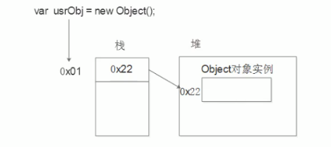

## 1. 数据类型简介

#### 为什么需要数据类型

在计算机中，不同的数据所需占用的存储空间是不同的，为了便于把数据分成所需内存大小不同的数据，充分利用存储空间，于是定义了不同的数据类型简单来说，数据类型就是数据的类别型号。比如姓名“张三”，年龄 18，这些数据的类型是不一样的。

#### 变量的数据类型

变量是用来存储值的所在处，它们有名字和数据类型。变量的数据类型决定了如何将代表这些值的位存储到箅机的内存中。 JavaScript 是一种弱类型或者说动态语言。这意味着不用提前声明变量的类型，在程序运行过程中被自动确定。

在代码运行时，变量的数据类型是由 JS 引擎 **根据 `=` 右边变量值的数据类型来判断的**，运行完毕之后，变量就确定了数据类型 JavaScript 拥有动态类型，同时也意味看相同的变量可用作不同的类型

```js
var x=6; ∥ x为数字
var x="Bill"; ∥x为字符串
```

## 2. 数据类型的分类

JS 把数据类型分为两类：

- 简单数据类型（基本数据类型）（ Number, string, Boolean, Undefined,Null）
- 复杂数据类型（引用类型）（ object）

基本类型值指的是简单的数据段，而引用类型值指那些可能由多个值构成的对象。


### 2.1 简单数据类型（基本数据类型）

| 简单数据类型 | 说明                                               | 默认值    |
| ------------ | -------------------------------------------------- | --------- |
| Number       | 数字型，包含整型值和浮点型值，如 21、0.21          | 0         |
| Boolean      | 布尔值类型，如 tue、 false，等价于 1 和 0          | false     |
| String       | 字符串类型，如"张三" js 里字符串都带引号           | " "       |
| Undefined    | var a 声明了变量 a 但是没有给值，此时 a= undefined | undefined |
| Null         | var a=null 声明了变量 a 为空值                     | null      |

#### 1、数字型

##### （1）数字型进制

常见：二进制、八进制（以 8 为基数）、十进制、十六进制（以 16 为基数）

```js
八进制字面值的第一位必须是零（0），然后是八进制数字序列（0～7）。如果字面值中的数值超出了范围，那么前导零将被忽略，后面的数值将被当作十进制数值解析。
var octalNum1 = 070;            // 八进制的56
var octalNum2 = 079;            // 无效的八进制数值——解析为79
var octalNum3 = 08;             // 无效的八进制数值——解析为8

八进制字面量在严格模式下是无效的，会导致支持的JavaScript引擎抛出错误。
```

```js
十六进制字面值的前两位必须是0x，后跟任何十六进制数字（0～9及A～F）。其中，字母A～F可以大写，也可以小写。
var hexNum1 = 0xA;              // 十六进制的10
var hexNum2 = 0x1f;             // 十六进制的31
```

在进行算术计算时，所有以八进制和十六进制表示的数值最终都将被转换成十进制数值。

##### （2）浮点数值

所谓浮点数值，就是该数值中必须包含一个小数点，并且小数点后面必须至少有一位数字。虽然小数点前面可以没有整数，但我们不推荐这种写法。

```js
var floatNum1 = 1.1;
var floatNum2 = 0.1;
var floatNum3 = 0.1; // 有效，但不推荐
```

由于保存浮点数值需要的内存空间是保存整数值的两倍，因此 ECMAScript 会不失时机地将浮点数值转换为整数值。显然，如果小数点后面没有跟任何数字，那么这个数值就可以作为整数值来保存。同样地，如果浮点数值本身表示的就是一个整数（如 1.0），那么该值也会被转换为整数

对于那些极大或极小的数值，可以用 `e表示法`（即科学计数法）表示的浮点数值表示。用 e 表示法表示的数值等于 e 前面的数值乘以 10 的指数次幂。ECMAScript 中 e 表示法的格式也是如此，即前面是一个数值（可以是整数也可以是浮点数），中间是一个大写或小写的字母 E，后面是 10 的幂中的指数，该幂值将用来与前面的数相乘。

```js
var floatNum = 3.125e7;         // 等于31250000
在这个例子中，使用e表示法表示的变量floatNum的形式虽然简洁，但它的实际值则是31250000。在此，e表示法的实际含义就是“3.125乘以10^7”。
```

也可以使用 e 表示法表示极小的数值，如 0.00000000000000003，这个数值可以使用更简洁的 3e-17 表示。在默认情况下，ECMASctipt 会将那些小数点后面带有 6 个零以上的浮点数值转换为以 e 表示法表示的数值（例如，0.0000003 会被转换成 3e-7）。

浮点数值的最高精度是 17 位小数，但在进行算术计算时其精确度远远不如整数。例如，0.1 加 0.2 的结果不是 0.3，而是 0.30000000000000004。这个小小的舍入误差会导致无法测试特定的浮点数值。

```js
if (a + b == 0.3){          // 不要做这样的测试！
    alert("You got 0.3.");
}
在这个例子中，我们测试的是两个数的和是不是等于0.3。如果这两个数是0.05和0.25，或者是0.15和0.15都不会有问题。而如前所述，如果这两个数是0.1和0.2，那么测试将无法通过。因此，永远不要测试某个特定的浮点数值。
```

##### （3）数值范围

ECMAScript 能够表示的最小数值保存在 `Number.MIN_VALUE`中——在大多数浏览器中，这个值是 5e-324；能够表示的最大数值保存在 `Number.MAX_VALUE`中——在大多数浏览器中，这个值是 1.7976931348623157e+308。如果某次计算的结果得到了一个超出 JavaScript 数值范围的值，那么这个数值将被自动转换成特殊的 `Infinity值`。具体来说，如果这个数值是负数，则会被转换成 `-Infinity`（负无穷），如果这个数值是正数，则会被转换成 `Infinity`（正无穷）。

如上所述，如果某次计算返回了正或负的 Infinity 值，那么该值将无法继续参与下一次的计算，因为 Infinity 不是能够参与计算的数值。要想确定一个数值是不是有穷的（换句话说，是不是位于最小和最大的数值之间），可以使用 `isFinite()`函数。这个函数在参数位于最小与最大数值之间时会返回 true

```js
var result = Number.MAX_VALUE + Number.MAX_VALUE;
alert(isFinite(result)); //false
```

##### （4）NaN

NaN，即非数值（Not a Number）是一个特殊的数值，这个数值用于表示一个本来要返回数值的操作数未返回数值的情况（这样就不会抛出错误了）。例如，在其他编程语言中，任何数值除以 0 都会导致错误，从而停止代码执行。但在 ECMAScript 中，任何数值除以 0 会返回 NaN，因此不会影响其他代码的执行。

NaN 本身有两个非同寻常的特点。首先，任何涉及 NaN 的操作（例如 NaN/10）都会返回 NaN，这个特点在多步计算中有可能导致问题。其次，NaN 与任何值都不相等，包括 NaN 本身。

```js
alert(NaN == NaN); //false
```

针对 NaN 的这两个特点，ECMAScript 定义了 isNaN()函数。这个函数接受一个参数，该参数可以是任何类型，而函数会帮我们确定这个参数是否“不是数值”。isNaN()在接收到一个值之后，会尝试将这个值转换为数值。某些不是数值的值会直接转换为数值，例如字符串"10"或 Boolean 值。而任何不能被转换为数值的值都会导致这个函数返回 true。

```js
alert(isNaN(NaN));              //true
alert(isNaN(10));               //false（10是一个数值）
alert(isNaN("10"));             //false（可以被转换成数值10）
alert(isNaN("blue"));           //true（不能转换成数值）
alert(isNaN(true));             //false（可以被转换成数值1）

这个例子测试了5个不同的值。测试的第一个值是NaN本身，结果当然会返回true。然后分别测试了数值10和字符串"10"，结果这两个测试都返回了false，因为前者本身就是数值，而后者可以被转换成数值。但是，字符串"blue"不能被转换成数值，因此函数返回了true。由于Boolean值true可以转换成数值1，因此函数返回false。
```

`isNaN()`也适用于对象。在基于对象调用 isNaN()函数时，会首先调用对象的 `valueOf()`方法，然后确定该方法返回的值是否可以转换为数值。如果不能，则基于这个返回值再调用 `toString()`方法，再测试返回值。

##### （5）数值转换

有 3 个函数可以把非数值转换为数值：Number()、parseInt()和 parseFloat()。第一个函数，即转型函数 Number()可以用于任何数据类型，而另两个函数则专门用于把字符串转换成数值。这 3 个函数对于同样的输入会有返回不同的结果。

_`Number()`函数的转换规则如下：_

- 如果是 Boolean 值，true 和 false 将分别被转换为 1 和 0。
- 如果是数字值，只是简单的传入和返回。
- 如果是 null 值，返回 0。
- 如果是 undefined，返回 NaN。
- 如果是字符串，遵循下列规则：

  如果字符串中只包含数字（包括前面带加号或头号的情况），则将其转换为十进制数值，即"1"会变成 1，"123"会变成 123，而"011"会变成 11（注意：前导的零被忽略了）；

  如果字符串中包含有效的浮点格式，如"1.1"，则将其转换为对应的浮点数值（同样，也会忽略前导零）；

  如果字符串中包含有效的十六进制格式，例如"0xf"，则将其转换为相同大小的十进制整数值；

  如果字符串是空的（不包含任何字符），则将其转换为 0；

  如果字符串中包含除上述格式之外的字符，则将其转换为 NaN。

- 如果是对象，则调用对象的 valueOf()方法，然后依照前面的规则转换返回的值。如果转换的结果是 NaN，则调用对象的 toString()方法，然后再次依照前面的规则转换返回的字符串值。

```js
var num1 = Number('Hello world!'); //NaN
var num2 = Number(''); //0
var num3 = Number('000011'); //11
var num4 = Number(true); //1
```

> 一元加操作符的操作与 Number()函数相同

_`parseInt()`函数的转换规则如下：_

由于 Number()函数在转换字符串时比较复杂而且不够合理，因此在处理整数的时候更常用的是 parseInt()函数。parseInt()函数在转换字符串时，更多的是看其是否符合数值模式。它会忽略字符串前面的空格，直至找到第一个非空格字符。如果第一个字符不是数字字符或者负号，parseInt()就会返回 NaN；也就是说，用 parseInt()转换空字符串会返回 NaN（Number()对空字符返回 0）。如果第一个字符是数字字符，parseInt()会继续解析第二个字符，直到解析完所有后续字符或者遇到了一个非数字字符。例如，"1234blue"会被转换为 1234，因为"blue"会被完全忽略。类似地，"22.5"会被转换为 22，因为小数点并不是有效的数字字符。

如果字符串中的第一个字符是数字字符，parseInt()也能够识别出各种整数格式（即前面讨论的十进制、八进制和十六进制数）。也就是说，如果字符串以"0x"开头且后跟数字字符，就会将其当作一个十六进制整数；如果字符串以"0"开头且后跟数字字符，则会将其当作一个八进制数来解析。

```js
var num1 = parseInt('1234blue'); // 1234
var num2 = parseInt(''); // NaN
var num3 = parseInt('0xA'); // 10（十六进制数）
var num4 = parseInt(22.5); // 22
var num5 = parseInt('070'); // 56（八进制数）
var num6 = parseInt('70'); // 70（十进制数）
var num7 = parseInt('0xf'); // 15（十六进制数）
```

为了消除在使用 parseInt()函数时可能导致的进制问题，可以为这个函数提供第二个参数：转换时使用的基数（即多少进制）。如果知道要解析的值是十六进制格式的字符串，那么指定基数 16 作为第二个参数，可以保证得到正确的结果

```js
var num = parseInt("0xAF", 16);         //175

实际上，如果指定了16作为第二个参数，字符串可以不带前面的"0x"
var num1 = parseInt("AF", 16);          //175
var num2 = parseInt("AF");              //NaN
```

与 parseInt()函数类似，parseFloat()也是从第一个字符（位置 0）开始解析每个字符。而且也是一直解析到字符串末尾，或者解析到遇见一个无效的浮点数字字符为止。也就是说，字符串中的第一个小数点是有效的，而第二个小数点就是无效的了，因此它后面的字符串将被忽略。举例来说，"22.34.5"将会被转换为 22.34。

_`parseFloat()`函数的转换规则如下：_

除了第一个小数点有效之外，parseFloat()与 parseInt()的第二个区别在于它始终都会忽略前导的零。parseFloat()可以识别前面讨论过的所有浮点数值格式，也包括十进制整数格式。但十六进制格式的字符串则始终会被转换成 0。由于 parseFloat()只解析十进制值，因此它没有用第二个参数指定基数的用法。最后还要注意一点：如果字符串包含的是一个可解析为整数的数（没有小数点，或者小数点后都是零），parseFloat()会返回整数。

```js
var num1 = parseFloat('1234blue'); //1234 （整数）
var num2 = parseFloat('0xA'); //0
var num3 = parseFloat('22.5'); //22.5
var num4 = parseFloat('22.34.5'); //22.34
var num5 = parseFloat('0908.5'); //908.5
var num6 = parseFloat('3.125e7'); //31250000
```

> 要把某个值转换为字符串，可以使用加号操作符把它与一个字符串（""）加在一起。

#### 2、布尔值类型

`true` `false`

#### 3、字符串类型

String 类型用于表示由零或多个 16 位 Unicode 字符组成的字符序列，即字符串。字符串可以由双引号（"）或单引号（'）表示。

详见：字符串相关内容

#### 4、Undefined

undefined 类型的值为：undefined

undefined：表示声明但未赋值的变量值（找不到值）

#### 5、Null

null 类型的值为：null

null：表示声明了变量并已赋值，值为 null（能找到，值就是 null

### 2.2 复杂数据类型（引用类型）

#### 1、Object 类型

创建 Object 实例的方式有两种。第一种是使用 new 操作符后跟 Object 构造函数

```js
var person = new Object();
person.name = 'Nicholas';
person.age = 29;
```

另一种方式是使用对象字面量表示法。对象字面量是对象定义的一种简写形式，目的在于简化创建包含大量属性的对象的过程。

```js
var person = {
    name : "Nicholas",
    age : 29
};

在对象字面量中，使用逗号来分隔不同的属性，因此"Nicholas"后面是一个逗号。但是，在age属性的值29的后面不能添加逗号，因为age是这个对象的最后一个属性。在最后一个属性后面添加逗号，会在IE7及更早版本和Opera中导致错误。

在使用对象字面量语法时，属性名也可以使用字符串
var person = {
    "name" : "Nicholas",
    "age" : 29,
    5 : true
};
```

详见：对象相关内容

#### 2、Array 类型

详见：数组相关内容

#### 3、Date 类型

详见：对象/内置对象/Date

#### 3、RegExp 类型

详见：对象/内置对象/RegExp

#### 4、Function 类型

详见：函数

#### 5、基本包装类型

为了便于操作基本类型值，ECMAScript 还提供了 3 个特殊的引用类型：Boolean、Number 和 String。这些类型与本章介绍的其他引用类型相似，但同时也具有与各自的基本类型相应的特殊行为。实际上，每当读取一个基本类型值的时候，后台就会创建一个对应的基本包装类型的对象，从而让我们能够调用一些方法来操作这些数据。

```js
var s1 = "some text";
var s2 = s1.substring(2);

这个例子中的变量s1包含一个字符串，字符串是基本类型值。基本类型值不是对象，因而从逻辑上讲它们不应该有方法。
而下一行调用了s1的substring()方法，并将返回的结果保存在了s2中。
其实，为了让我们实现这种直观的操作，后台已经自动完成了一系列的处理。当第二行代码访问s1时，访问过程处于一种读取模式，也就是要从内存中读取这个字符串的值。而在读取模式中访问字符串时，后台都会自动完成下列处理。

	创建String类型的一个实例；

	在实例上调用指定的方法；

	销毁这个实例。

可以将以上三个步骤想象成是执行了下列ECMAScript代码。

var s1 = new String("some text");
var s2 = s1.substring(2);
s1 = null;
经过此番处理，基本的字符串值就变得跟对象一样了。而且，上面这三个步骤也分别适用于Boolean和Number类型对应的布尔值和数字值。
```

引用类型与基本包装类型的主要区别就是对象的生存期。

使用 `new`操作符创建的引用类型的实例，在执行流离开当前作用域之前都一直保存在内存中。而自动创建的基本包装类型的对象，则只存在于一行代码的执行瞬间，然后立即被销毁。这意味着我们不能在运行时为基本类型值添加属性和方法。

```js
var s1 = "some text";
s1.color = "red";
alert(s1.color);   //undefined

第二行代码试图为字符串s1添加一个color属性。但是，当第三行代码再次访问s1时，其color属性不见了。问题的原因就是第二行创建的String对象在执行第三行代码时已经被销毁了。第三行代码又创建自己的String对象，而该对象没有color属性。

当然，可以显式地调用Boolean、Number和String来创建基本包装类型的对象。不过，应该在绝对必要的情况下再这样做，因为这种做法很容易让人分不清自己是在处理基本类型还是引用类型的值。对基本包装类型的实例调用typeof会返回"object"，而且所有基本包装类型的对象都会被转换为布尔值true。
```

Object 构造函数也会像工厂方法一样，根据传入值的类型返回相应基本包装类型的实例。

```js
var obj = new Object("some text");
alert(obj instanceof String);   //true

把字符串传给Object构造函数，就会创建String的实例；而传入数值参数会得到Number的实例，传入布尔值参数就会得到Boolean的实例。
```

使用 new 调用基本包装类型的构造函数，与直接调用同名的转型函数是不一样的。

```js
var value = "25";
var number = Number(value);  //转型函数
alert(typeof number);        //"number"

var obj = new Number(value); //构造函数
alert(typeof obj);           //"object"

在这个例子中，变量number中保存的是基本类型的值25，而变量obj中保存的是Number的实例。
```

#### 6、单体内置对象

##### **Global 对象**

Global（全局）对象可以说是 ECMAScript 中最特别的一个对象了，因为不管你从什么角度上看，这个对象都是不存在的。ECMAScript 中的 Global 对象在某种意义上是作为一个终极的“兜底儿对象”来定义的。换句话说，不属于任何其他对象的属性和方法，最终都是它的属性和方法。事实上，没有全局变量或全局函数；所有在全局作用域中定义的属性和函数，都是 Global 对象的属性。本书前面介绍过的那些函数，诸如 isNaN()、isFinite()、parseInt()以及 parseFloat()，实际上全都是 Global 对象的方法。除此之外，Global 对象还包含其他一些方法。

**1. URI 编码方法**

Global 对象的 encodeURI()和 encodeURIComponent()方法可以对 URI（Uniform Resource Identifiers，通用资源标识符）进行编码，以便发送给浏览器。有效的 URI 中不能包含某些字符，例如空格。而这两个 URI 编码方法就可以对 URI 进行编码，它们用特殊的 UTF-8 编码替换所有无效的字符，从而让浏览器能够接受和理解。

其中，encodeURI()主要用于整个 URI（例如，http://www.wrox.com/illegalvalue.htm），而encodeURIComponent()主要用于对URI中的某一段（例如前面URI中的illegal value.htm）进行编码。它们的主要区别在于，encodeURI()不会对本身属于 URI 的特殊字符进行编码，例如冒号、正斜杠、问号和井字号；而 encodeURIComponent()则会对它发现的任何非标准字符进行编码。

```js
var uri = 'http://www.wrox.com/illegal value.htm#start';

//"http://www.wrox.com/illegal%20value.htm#start"
alert(encodeURI(uri));

//"http%3A%2F%2Fwww.wrox.com%2Fillegal%20value.htm%23start"
alert(encodeURIComponent(uri));
```

    使用encodeURI()编码后的结果是除了空格之外的其他字符都原封不动，只有空格被替换成了%20。而encodeURIComponent()方法则会使用对应的编码替换所有非字母数字字符。这也正是可以对整个URI使用encodeURI()，而只能对附加在现有URI后面的字符串使用encodeURIComponent()的原因所在。

一般来说，我们使用 encodeURIComponent()方法的时候要比使用 encodeURI()更多，因为在实践中更常见的是对查询字符串参数而不是对基础 URI 进行编码。

与 encodeURI()和 encodeURIComponent()方法对应的两个方法分别是 decodeURI()和 decodeURIComponent()。其中，decodeURI()只能对使用 encodeURI()替换的字符进行解码。例如，它可将%20 替换成一个空格，但不会对%23 作任何处理，因为%23 表示井字号（#），而井字号不是使用 encodeURI()替换的。同样地，decodeURIComponent()能够解码使用 encodeURIComponent()编码的所有字符，即它可以解码任何特殊字符的编码。

```js
var uri = 'http%3A%2F%2Fwww.wrox.com%2Fillegal%20value.htm%23start';

//http%3A%2F%2Fwww.wrox.com%2Fillegal value.htm%23start
alert(decodeURI(uri));

//http://www.wrox.com/illegal value.htm#start
alert(decodeURIComponent(uri));

// 这里，变量uri包含着一个由encodeURIComponent()编码的字符串。在第一次调用decodeURI()输出的结果中，只有%20被替换成了空格。而在第二次调用decodeURIComponent()输出的结果中，所有特殊字符的编码都被替换成了原来的字符，得到了一个未经转义的字符串（但这个字符串并不是一个有效的URI）。
```

> URI 方法 encodeURI()、encodeURIComponent()、decodeURI()和 decodeURIComponent()用于替代已经被 ECMA-262 第 3 版废弃的 escape()和 unescape()方法。URI 方法能够编码所有 Unicode 字符，而原来的方法只能正确地编码 ASCII 字符。因此在开发实践中，特别是在产品级的代码中，一定要使用 URI 方法，不要使用 escape()和 unescape()方法。

**2. eval()方法**

现在，我们介绍最后一个——大概也是整个 ECMAScript 语言中最强大的一个方法：eval()。eval()方法就像是一个完整的 ECMAScript 解析器，它只接受一个参数，即要执行的 ECMAScript（或 JavaScript）字符串。

```js
eval("alert('hi')");
这行代码的作用等价于下面这行代码：

alert("hi");
```

当解析器发现代码中调用 eval()方法时，它会将传入的参数当作实际的 ECMAScript 语句来解析，然后把执行结果插入到原位置。通过 eval()执行的代码被认为是包含该次调用的执行环境的一部分，因此被执行的代码具有与该执行环境相同的作用域链。这意味着通过 eval()执行的代码可以引用在包含环境中定义的变量

```js
var msg = "hello world";
eval("alert(msg)");    //"hello world"

// 变量msg是在eval()调用的环境之外定义的，但其中调用的alert()仍然能够显示"hello world"。这是因为上面第二行代码最终被替换成了一行真正的代码。同样地，我们也可以在eval()调用中定义一个函数，然后再在该调用的外部代码中引用这个函数：

eval("function sayHi() { alert('hi'); }");
sayHi();
// 显然，函数sayHi()是在eval()内部定义的。但由于对eval()的调用最终会被替换成定义函数的实际代码，因此可以在下一行调用sayHi()。对于变量也一样：

eval("var msg = 'hello world'; ");
alert(msg);     //"hello world"
// 在eval()中创建的任何变量或函数都不会被提升，因为在解析代码的时候，它们被包含在一个字符串中；它们只在eval()执行的时候创建。

严格模式下，在外部访问不到eval()中创建的任何变量或函数，因此前面两个例子都会导致错误。同样，在严格模式下，为eval赋值也会导致错误：

"use strict";
eval = "hi";   //causes error
```

> 能够解释代码字符串的能力非常强大，但也非常危险。因此在使用 eval()时必须极为谨慎，特别是在用它执行用户输入数据的情况下。否则，可能会有恶意用户输入威胁你的站点或应用程序安全的代码（即所谓的代码注入）。

**3. Global 对象的属性**

|    属　　性    |     说　　明     |
| :------------: | :--------------: |
|   undefined    | 特殊值 undefined |
|      NaN       |      特殊值      |
|    Infinity    |      特殊值      |
|     Object     | 构造函数 Object  |
|     Array      |     构造函数     |
|    Function    |     构造函数     |
|    Boolean     |     构造函数     |
|     String     |     构造函数     |
|     Number     |     构造函数     |
|      Date      |     构造函数     |
|     RegExp     |     构造函数     |
|     Error      |     构造函数     |
|   EvalError    |     构造函数     |
|   RangeError   |     构造函数     |
| ReferenceError |     构造函数     |
|  SyntaxError   |     构造函数     |
|   TypeError    |     构造函数     |
|    URIError    |     构造函数     |
|                |                  |

ECMAScript 5 明确禁止给 undefined、NaN 和 Infinity 赋值，这样做即使在非严格模式下也会导致错误。

**4. window 对象**

ECMAScript 虽然没有指出如何直接访问 Global 对象，但 Web 浏览器都是将这个全局对象作为 window 对象的一部分加以实现的。因此，在全局作用域中声明的所有变量和函数，就都成为了 window 对象的属性。

```js
var color = 'red';

function sayColor() {
  alert(window.color);
}

window.sayColor(); //"red"

// 这里定义了一个名为color的全局变量和一个名为sayColor()的全局函数。在sayColor()内部，我们通过window.color来访问color变量，以说明全局变量是window对象的属性。然后，又使用window.sayColor()来直接通过window对象调用这个函数，结果显示在了警告框中。
```

另一种取得 Global 对象的方法是使用以下代码：

```js
var global = (function () {
  return this;
})();

// 以上代码创建了一个立即调用的函数表达式，返回this的值。如前所述，在没有给函数明确指定this值的情况下（无论是通过将函数添加为对象的方法，还是通过调用call()或apply()），this值等于Global对象。而像这样通过简单地返回this来取得Global对象，在任何执行环境下都是可行的。
```

##### Math 对象

详见：对象/内置对象/`math`

## 3. 操作

### 3.1 动态的属性

定义基本类型值和引用类型值的方式是类似的：创建一个变量并为该变量赋值。但是，当这个值保存到变量中以后，对不同类型值可以执行的操作则大相径庭。对于引用类型的值，我们可以为其添加属性和方法，也可以改变和删除其属性和方法。

```js
var person = new Object();
person.name = "Nicholas";
alert(person.name);       //" Nicholas"

我们不能给基本类型的值添加属性，尽管这样做不会导致任何错误
var name = "Nicholas";
name.age = 27;
alert(name.age);      //undefined
我们为字符串name定义了一个名为age的属性，并为该属性赋值27。但在下一行访问这个属性时，发现该属性不见了。这说明只能给引用类型值动态地添加属性，以便将来使用。
```

### 3.2 复制变量值

从一个变量向另一个变量复制基本类型的值，会在变量对象上创建一个新值，然后把该值复制到为新变量分配的位置上。

从一个变量向另一个变量复制引用类型的值时，同样也会将存储在变量对象中的值复制一份放到为新变量分配的空间中。不同的是，这个值的副本实际上是一个指针，而这个指针指向存储在堆中的一个对象。复制操作结束后，两个变量实际上将引用同一个对象。因此，改变其中一个变量，就会影响另一个变量

### 3.3 传递参数

JS 中所有函数的参数都是按值传递的。也就是说，把函数外部的值复制给函数内部的参数，就和把值从一个变量复制到另一个变量一样。基本类型值的传递如同基本类型变量的复制一样，而引用类型值的传递，则如同引用类型变量的复制一样。有不少开发人员在这一点上可能会感到困惑，因为访问变量有按值和按引用两种方式，而参数只能按值传递。

在向参数传递基本类型的值时，被传递的值会被复制给一个局部变量（即命名参数，或者用 JS 的概念来说，就是 arguments 对象中的一个元素）。在向参数传递引用类型的值时，会把这个值在内存中的地址复制给一个局部变量，因此这个局部变量的变化会反映在函数的外部。

```js
function addTen(num) {
    num += 10;
    return num;
}

var count = 20;
var result = addTen(count);
alert(count);    //20，没有变化
alert(result);   //30

这里的函数addTen()有一个参数num，而参数实际上是函数的局部变量。在调用这个函数时，变量count作为参数被传递给函数，这个变量的值是20。于是，数值20被复制给参数num以便在addTen()中使用。在函数内部，参数num的值被加上了10，但这一变化不会影响函数外部的count变量。参数num与变量count互不相识，它们仅仅是具有相同的值。假如num是按引用传递的话，那么变量count的值也将变成30，从而反映函数内部的修改。当然，使用数值等基本类型值来说明按值传递参数比较简单，但如果使用对象，那问题就不怎么好理解了。
```

再举一个例子：

```js
function setName(obj) {
    obj.name = "Nicholas";
}

var person = new Object();
setName(person);
alert(person.name);    //"Nicholas"

以上代码中创建一个对象，并将其保存在了变量person中。然后，这个对象被传递到setName()函数中之后就被复制给了obj。在这个函数内部，obj和person引用的是同一个对象。换句话说，即使这个对象是按值传递的，obj也会按引用来访问同一个对象。于是，当在函数内部为obj添加name属性后，函数外部的person也将有所反映；因为person指向的对象在堆内存中只有一个，而且是全局对象。有很多开发人员错误地认为：在局部作用域中修改的对象会在全局作用域中反映出来，就说明参数是按引用传递的。为了证明对象是按值传递的
```

我们再看一看下面这个经过修改的例子：

```js
function setName(obj) {
    obj.name = "Nicholas";
    obj = new Object();
    obj.name = "Greg";
}

var person = new Object();
setName(person);
alert(person.name);    //"Nicholas"

这个例子与前一个例子的唯一区别，就是在setName()函数中添加了两行代码：一行代码为obj重新定义了一个对象，另一行代码为该对象定义了一个带有不同值的name属性。在把person传递给setName()后，其name属性被设置为"Nicholas"。然后，又将一个新对象赋给变量obj，同时将其name属性设置为"Greg"。如果person是按引用传递的，那么person就会自动被修改为指向其name属性值为"Greg"的新对象。但是，当接下来再访问person.name时，显示的值仍然是"Nicholas"。这说明即使在函数内部修改了参数的值，但原始的引用仍然保持未变。实际上，当在函数内部重写obj时，这个变量引用的就是一个局部对象了。而这个局部对象会在函数执行完毕后立即被销毁。
```

### 3.4 `typeof`检测类型

`typeof`操作符是确定一个变量是字符串、数值、布尔值，还是 undefined 的最佳工具

如果变量的值是一个对象或 null，则 typeof 操作符会返回"object"

```js
typeof null;
// "object"
```

虽然在检测基本数据类型时 typeof 是非常得力的助手，但在检测引用类型的值时，这个操作符的用处不大。通常，我们并不是想知道某个值是对象，而是想知道它是什么类型的对象。为此，ECMAScript 提供了 `instanceof`操作符

```js
alert(person instanceof Object);     // 变量person是Object吗？
alert(colors instanceof Array);      // 变量colors是Array吗？
alert(pattern instanceof RegExp);    // 变量pattern是RegExp吗？

根据规定，所有引用类型的值都是Object的实例。因此，在检测一个引用类型值和Object构造函数时，instanceof操作符始终会返回true。当然，如果使用instanceof操作符检测基本类型的值，则该操作符始终会返回false，因为基本类型不是对象。
```

## 4. 堆和栈

### 4.1 堆栈空间分配区别：

- 栈（操作系统）：由操作系统自动分配释放存放函数的参数值、局部变量的值等。其操作方式类似于数据结构中的栈；简单数据类型存放到栈里面；
- 堆（操作系统）：存储复杂类型对象，一般由程序员分配释放，若程序员不释放，由垃圾回收机制回收复杂数据类型存放到堆里面


JavaScript 中没有堆栈的概念，通过堆栈的方式，可以让大家更容易理解代码的一些执行方式。



### 4.2 简单类型传参

函数的形参也可以看做是一个变量，当我们把一个值类型变量作为参数传给函数的形参时，其实是把变量在栈空间里值复制了一份给形参，那么在方法内部对形参做任何修改，都不会影响到的外部变量。

### 4.3 复杂类型传参

函数的形参也可以看做是一个变量，当我们把引用类型变量传给形参时，其实是把变量在栈空间里保存的堆地址复制给了形参，形参和实参其实保存的是同一个堆地址，所以操作的是同个对象。
