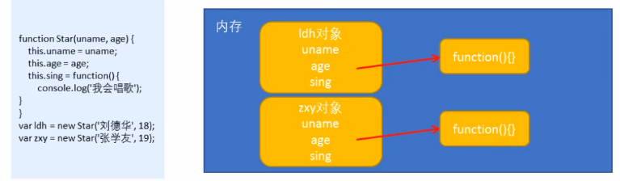
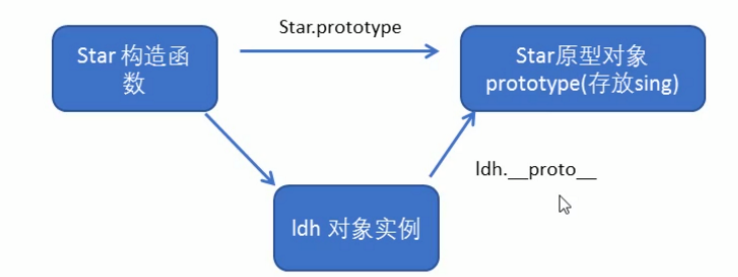
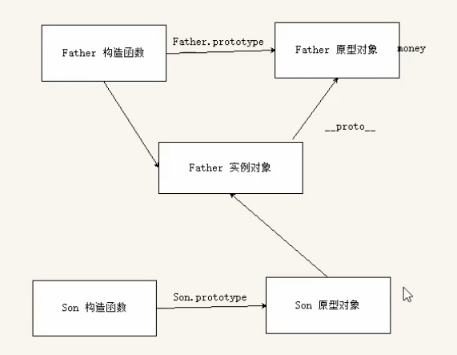

## 1. 两大编程思想

### 1.1 面向过程编程 POP (Process-oriented Programming)

面向过程就是分析出解央问题所需要的步骤，然后用函数把这些步骤步步实现，使用的时候再一个一个的依次调用就可以了。举个栗子：将大象装进冰箱，面向过程做法——1.打开冰箱门；2.大象装进去；3.关上冰箱门。

### 1.2 面向对象编程 OOP (Object Oriented Programming)

向对象是以对象功能来划分问题，而不是步骤

面向对象是把事务分解成为一个个对象，然后由对象之间分工与合作。举个栗子：将大象装进冰箱，面向对象做法——1.大象对象：进去；2.冰箱对象：打开、关闭；3.使用大象和冰箱的功能。

### 1.3 面向过程编程与面向对象编程的对比

面向过程：

- 优点：性能比面向对象高，适合跟硬件联系很紧密的东西，例如单片机就采用的面向过程编程。
- 缺点：没有面向对象易维护、易复用、易扩展

面向对象：

- 优点：易维护、易复用、易扩展，由于面向对象有封装性、继承性、多态性的特性，可以设计出低耦合的系统，使系统更加灵活、更加易于维护
- 缺点：性能比面向过程低

> 用面向过程的方法写出来的程序是一份蛋炒饭，而用面向对象写出来的程序是一份盖浇饭

### 工厂模式

工厂模式是软件工程领域一种广为人知的设计模式，这种模式抽象了创建具体对象的过程。考虑到在 ECMAScript 中无法创建类，开发人员就发明了一种函数，用函数来封装以特定接口创建对象的细节

```js
function createPerson(name, age, job){
    var o = new Object();
    o.name = name;
    o.age = age;
    o.job = job;
    o.sayName = function(){
        alert(this.name);
    };
    return o;
}

var person1 = createPerson("Nicholas", 29, "Software Engineer");
var person2 = createPerson("Greg", 27, "Doctor");

函数createPerson()能够根据接受的参数来构建一个包含所有必要信息的Person对象。
可以无数次地调用这个函数，而每次它都会返回一个包含三个属性一个方法的对象。
工厂模式虽然解决了创建多个相似对象的问题，但却没有解决对象识别的问题（即怎样知道一个对象的类型）。
```

## 2. 构造函数和原型

### 2.1 构造函数

    构造函数是一种特殊的函数，主要用来初始化对象，即为对象成员变量赋初始值，它总与new一起使用。
    我们可以把对象中一些公共的属性和方法抽取出来，然后封装到这个函数里面。

    在JS中，使用构造函数时要注意以下两点：
    1.构造函数用于创建某一类对象，其首字母要大写
    2.构造函数要和new一起使用才有意义

#### **new 在执行时会做四件事情**：

    ①在内存中创建一个新的空对象。
    ②让this指向这个新的对象。
    ③执行构造函数里面的代码，给这个新对象添加属性和方法
    ④返回这个新对象（所以构造函数里面不需要 return）

如果我们在调用一个构造器函数时忽略了 new 操作符，尽管代码不会出错，但它的行为可能会令人出乎预料:

```js
var h = Hero('Leonardo');
typeof h; // "undefined"

由于这里没有使用new操作符，因此我们不是在创建一个新的对象。
这个函数调用与其他函数并没有区别，这里的h值应该就是该函数的返回值。
而由于该函数没有显式返回值（它没有使用关键字 return），所以它实际上返回的是undefined值，并将该值赋值给了h。

在这种情况下this引用的是全局对象。
```

```js
对比工厂模式
function Person(name, age, job){
    this.name = name;
    this.age = age;
    this.job = job;
    this.sayName = function(){
        alert(this.name);
    };
}

var person1 = new Person("Nicholas", 29, "Software Engineer");
var person2 = new Person("Greg", 27, "Doctor");

在这个例子中，Person()函数取代了createPerson()函数。我们注意到，Person()中的代码除了与createPerson()中相同的部分外，还存在以下不同之处：

	没有显式地创建对象；
	直接将属性和方法赋给了this对象；
	没有return语句。

此外，还应该注意到函数名Person使用的是大写字母P。按照惯例，构造函数始终都应该以一个大写字母开头，而非构造函数则应该以一个小写字母开头。这个做法借鉴自其他OO语言，主要是为了区别于ECMAScript中的其他函数；因为构造函数本身也是函数，只不过可以用来创建对象而已。


要创建Person的新实例，必须使用new操作符。以这种方式调用构造函数实际上会经历以下4个步骤：

	创建一个新对象；
	将构造函数的作用域赋给新对象（因此this就指向了这个新对象）；
	执行构造函数中的代码（为这个新对象添加属性）；
	返回新对象。

在前面例子的最后，person1和person2分别保存着Person的一个不同的实例。这两个对象都有一个constructor（构造函数）属性，该属性指向Person，如下所示。

alert(person1.constructor == Person);  //true
alert(person2.constructor == Person);  //true
对象的constructor属性最初是用来标识对象类型的。但是，提到检测对象类型，还是instanceof操作符要更可靠一些。我们在这个例子中创建的所有对象既是Object的实例，同时也是Person的实例，这一点通过instanceof操作符可以得到验证。

alert(person1 instanceof Object);  //true
alert(person1 instanceof Person);  //true
alert(person2 instanceof Object);  //true
alert(person2 instanceof Person);  //true
创建自定义的构造函数意味着将来可以将它的实例标识为一种特定的类型；而这正是构造函数模式胜过工厂模式的地方。在这个例子中，person1和person2之所以同时是Object的实例，是因为所有对象均继承自Object（详细内容稍后讨论）。

 以这种方式定义的构造函数是定义在Global对象（在浏览器中是window对象）中的。
```

#### `instanceof`

通过 `instanceof` 操作符，我们可以测试一个对象是不是由某个指定的构造器函数所创建的

```js
function Hero() {}
var h = new Hero();

h instanceof Hero; // true
h instanceof Object; // true
```

#### 静态成员与实例成员

    JavaScript的构造函数中可以添加些成员，可以在构造函数本身上添加，也可以在构造函数内部的this上添加。通过这两种方式涿加的成员，就分别称为静态成员和实例成员

    **静态成员**：在构造函数本上添加的成员称为静态成员，只能由构造函数本身来访问

    **实例成员**：在构造函数内部创建的对象成员称为实例成员，只能由实例化的对象来访问

```JS
function Star(uname,uage) {
    this.name = uname; // 实例成员name
    this.age = uage; // 实例成员age
    this.sing = function () { // 实例成员sing
        console.log('我会唱歌')
    }
}
let ldh = new Star('刘德华',18)
Star.sex = '男' // 静态成员sex

console.log(ldh.name)
console.log(Star.name) // undefined 不能通过构造函数访问实例成员

console.log(Star.sex)
console.log(ldh.sex) // undefined 不能通过对象来访问
```

#### 构造函数当作函数

构造函数与其他函数的唯一区别，就在于调用它们的方式不同。不过，构造函数毕竟也是函数，不存在定义构造函数的特殊语法。任何函数，只要通过 new 操作符来调用，那它就可以作为构造函数；而任何函数，如果不通过 new 操作符来调用，那它跟普通函数也不会有什么两样。例如，前面例子中定义的 Person()函数可以通过下列任何一种方式来调用。

```js
// 当作构造函数使用
var person = new Person("Nicholas", 29, "Software Engineer");
person.sayName(); //"Nicholas"

// 作为普通函数调用
Person("Greg", 27, "Doctor"); // 添加到window
window.sayName(); //"Greg"

// 在另一个对象的作用域中调用
var o = new Object();
Person.call(o, "Kristen", 25, "Nurse");
o.sayName(); //"Kristen"

这个例子中的前两行代码展示了构造函数的典型用法，即使用new操作符来创建一个新对象。接下来的两行代码展示了不使用new操作符调用Person()会出现什么结果：属性和方法都被添加给window对象了。当在全局作用域中调用一个函数时，this对象总是指向Global对象（在浏览器中就是window对象）。因此，在调用完函数之后，可以通过window对象来调用sayName()方法，并且还返回了"Greg"。最后，也可以使用call()（或者apply()）在某个特殊对象的作用域中调用Person()函数。这里是在对象o的作用域中调用的，因此调用后o就拥有了所有属性和sayName()方法。
```

#### 构造函数的问题

构造函数模式虽然好用，但也并非没有缺点。使用构造函数的主要问题，就是每个方法都要在每个实例上重新创建一遍。在前面的例子中，person1 和 person2 都有一个名为 sayName()的方法，但那两个方法不是同一个 Function 的实例。不要忘了——ECMAScript 中的函数是对象，因此每定义一个函数，也就是实例化了一个对象。从逻辑角度讲，此时的构造函数也可以这样定义。

```js
function Person(name, age, job) {
  this.name = name;
  this.age = age;
  this.job = job;
  this.sayName = new Function('alert(this.name)'); // 与声明函数在逻辑上是等价的
}
```

从这个角度上来看构造函数，更容易明白每个 Person 实例都包含一个不同的 Function 实例（以显示 name 属性）的本质。说明白些，以这种方式创建函数，会导致不同的作用域链和标识符解析，但创建 Function 新实例的机制仍然是相同的。因此，不同实例上的同名函数是不相等的，以下代码可以证明这一点。

```js
alert(person1.sayName == person2.sayName); //false
```

然而，创建两个完成同样任务的 Function 实例的确没有必要；况且有 this 对象在，根本不用在执行代码前就把函数绑定到特定对象上面。因此，大可像下面这样，通过把函数定义转移到构造函数外部来解决这个问题。

```js
function Person(name, age, job){
    this.name = name;
    this.age = age;
    this.job = job;
    this.sayName = sayName;
}

function sayName(){
    alert(this.name);
}

var person1 = new Person("Nicholas", 29, "Software Engineer");
var person2 = new Person("Greg", 27, "Doctor");

在这个例子中，我们把sayName()函数的定义转移到了构造函数外部。
而在构造函数内部，我们将sayName属性设置成等于全局的sayName函数。
这样一来，由于sayName包含的是一个指向函数的指针，因此person1和person2对象就共享了在全局作用域中定义的同一个sayName()函数。
这样做确实解决了两个函数做同一件事的问题，可是新问题又来了：
在全局作用域中定义的函数实际上只能被某个对象调用，这让全局作用域有点名不副实。
而更让人无法接受的是：
如果对象需要定义很多方法，那么就要定义很多个全局函数，于是我们这个自定义的引用类型就丝毫没有封装性可言了。
好在，这些问题可以通过使用原型模式来解决。
```

### 2.2 构造函数原型 `prototype`

#### 构造函数的问题--->why

会浪费内存——当两个不同的实例对象都调用构造函数中的同一方法时，会创建两个不同的变量空间来



```js
let ldh = new Star('刘德华', 18);
let zxy = new Star('张学友', 19);
console.log(ldh.sing === zxy.sing); // false
```

##### 实时（live）性

构造函数通过原型分配的函数是所有对象所共享的。

对于原型来说，最重要的一点是要理解它的“实时”（live）性。由于在 JavaScript 中，几乎所有对象都是通过传引用的方式来传递的，因此我们所创建的每个新对象实体中并没有一份属于自己原型副本。这也就意味着我们可以随时修改 prototype 属性，并且由同一构造器创建的所有对象的 prototype 属性也都会同时改变（甚至还会影响在修改之前就已经创建了的那些对象）

JavaScript 规定，每一个构造函数都有一个 prototype.属性，指向另一个对象。注意这个 prototype 就是个对象，这个对象的所有属性和方法，都会被构造函数所拥有。

我们可以把那些不变的方法，直接定义在 prototype 对象上，这样所有对象的实例就可以共享这些方法。

```js
Star.prototype.sing = function () {
  console.log('我会唱歌');
};
let ldh = new Star('刘德华', 18);
let zxy = new Star('张学友', 19);
console.log(ldh.sing === zxy.sing); // true
```

    原型（prototype）的实质 —— 一个对象，也称为原型对象

    原型的作用 —— 共享方法

> 一般我们把公共属性定义到构造函数里面，公共方法放到原型对象上

- 如何判断一个对象的某个原型属性到底是原型链中的哪个原型的属性呢？答案仍然是使用 `hasOwnProperty()`属性

```js
例如，我们想知道toString属性来自于哪里：

toy.toString();
"[object Object]"
toy.hasOwnProperty('toString'); // false

toy.constructor.hasOwnProperty('toString'); // false

toy.constructor.Protoype.hasOwnProperty('toString'); // false

Object.hasOwnProperty('toString'); // false

Object.prototype.hasOwnProperty('toString'); // true

```

##### isPrototypeOf()

##### getPrototypeOf()

每个对象中都会有一个 `isPrototypeOf()`方法，这个方法会告诉我们当前对象是否是另一个对象的原型。

```js
让我们先来定义一个简单的对象monkey：

var monkey = {
	hair: true,
	feeds: 'bananas',
	breathes: 'air'
};

然后，我们再创建一个叫做 Human()的构造器函数，并将其原型属性设置为指向monkey：

function Human(name) {
	this.name = name;
}

Human.prototype = monkey;

现在，如果我们新建一个叫做george的Human对象，并提问“monkey是george的原型吗？”，答案是true。

var george = new Human('George');
monkey.isPrototypeOf(george); // true

需要注意的是，我们在这里是预先知道了monkey可能是george的原型，才提出了问题“monkey是你的原型吗？”，然后获得一个布尔值作为回应。
那么，是否能在不知道某个对象原型是什么的情况下，获得对象的原型呢？
答案是：大多数浏览器可以。
因为大多数浏览器都实现了ES5的Object.getPrototypeOf()方法。

Object.getPrototypeOf(george).feeds; // "banana"

Object.getPrototypeOf(george) === monkey; // true

而对于另一部分实现了ES5部分功能，却没有实现getPrototypeOf()方法的浏览器，我们可以使用特殊属性__proto__
```

### 2.3 对象原型 `__proto__`

    对象都会有一个属性`__proto__`指向构造函数的 `prototype`原型对象，
    之所以我们对象可以使用构造函数 `prototype`原型对象的属性和方法，
    就是因为对象有 `__proto__`原型的存在

- `__proto__`对象原型和原型对象 `prototype`是等价的
- `__proto__`对象原型的意义就在于为对象的查找机制提供一个方向，或者说一条路线，但是它是一个非标准属性，因此实际开发中，不可以使用这个属性，它只是内部指向原型对象 `prototype`



```js
function Star(uname, uage) {
  this.name = uname; // 实例成员name
  this.age = uage; // 实例成员age
}
Star.prototype.sing = function () {
  console.log('我会唱歌');
};
let ldh = new Star('刘德华', 18);
console.log(ldh.__proto__ === Star.prototype); // true
// __proto__对象原型和原型对象 prototype是等价的
```

### 2.4 `constructor` 构造函数

    对象原型（`__proto__`）和构造函数原型对象（ `prototype`）里面都有一个 `constructor`属性，
    `constructor`我们称为构造函数，因为它指回构造函数本身。
     `constructor`主要用于记录该对象引用于哪个构造函数，它可以让原型对象重新指向原来的构造函数

```js
console.log(ldh.__proto__.constructor === Star.prototype.constructor); // true
```


**如果我们修改了 Star 的原型对象 prototype，则必须手动的利用 constructor 指回原来的构造函数，否则因为重新赋值会覆盖掉 Star.prototype 中的 constructor**

```js
function Star(uname, uage) {
  this.name = uname;
  this.age = uage;
}
Star.prototype = {
  // 给原型对象赋了一个对象形式的值，会将原来的prototype完全改变；
  // 利用prototype.xxx的方法则不会完全覆盖原先的prototype，因为他只是单次增添或修改了单个属性
  sing: function () {
    console.log('i can sing');
  },
  movie: function () {
    console.log('i can act');
  },
  constructor: Star, // 需要重新指回constructor
};
// 或者用Star.prototype.constructor = Star重新指回
// 用new Star().constructor === Star判断是否指回
let ldh = new Star('刘德华', 18);
console.log(ldh.__proto__.constructor); //  如果没有指回constructor则会打印出  ƒ Object() { [native code] }
console.log(Star.prototype.constructor);
console.log(ldh.__proto__.constructor === Star.prototype.constructor); // true
```


### 2.5 原型链


实例对象既然作为对象有一个 `__proto__`属性，指向构造函数的原型对象（`prototype`），那么 构造函数的原型对象（`prototype`）理论上也可以有一个 `__proto__`属性，实际上原型对象的 `prototype`确实有一个 `__proto__`属性，指向 `Object`构造函数的原型对象；`Object`构造函数的原型对象的 `__proto__`为 null

### 2.6 JS 的成员查找机制

    ①当访问一个对象的属性（包括方法）时，首先找这个对象自身有没有该属性;
    ②如果没有就查找它的原型（也就是_ proto_指向的 prototype原型对象）;
    ③如果还没有就查找原型对象的原型（Object的原型对象）;
    ④依此类推一直找到 Object为止（null）

#### **`instanceof`**

`instanceof` 运算符用于检测构造函数的 `prototype` 属性是否出现在某个实例对象的原型链上。

```js
object instanceof constructor

object：某个实例对象     constructor：某个构造函数
用来检测  constructor.prototype 是否存在于参数  object 的原型链上。


// 定义构造函数
function C () {}
function D () {}
var o = new C()
console.log(o instanceof C, o.__proto__ === C.prototype) // true，true C.prototype 在 o 的原型链上
console.log(o instanceof D, o.__proto__ === D.prototype) // false，false D.prototype 不在 o 的原型链上
console.log(o instanceof Object, o.__proto__.__proto__ === Object.prototype) // true true
C.prototype = {}
var o2 = new C()
console.log(o2 instanceof C) // true
console.log(o instanceof C) // false，C.prototype 指向了一个空对象,这个空对象不在 o 的原型链上.
D.prototype = new C() // 继承
var o3 = new D()
console.log(o3 instanceof D) // true
console.log(o3 instanceof C) // true 因为 C.prototype 现在在 o3 的原型链上
```

```js
/ 一些容易出错的点
var simpleStr = "This is a simple string";
var myString  = new String();
var newStr    = new String("String created with constructor");
var myDate    = new Date();
var myObj     = {};
var myNonObj  = Object.create(null);

simpleStr instanceof String; // 返回 false, simpleStr并不是对象
myString  instanceof String; // 返回 true
newStr    instanceof String; // 返回 true
myString  instanceof Object; // 返回 true

myObj instanceof Object;    // 返回 true, 尽管原型没有定义
({})  instanceof Object;    // 返回 true, 同上
myNonObj instanceof Object; // 返回 false, 一种创建非 Object 实例的对象的方法

myString instanceof Date; // 返回 false

myDate instanceof Date;     // 返回 true
myDate instanceof Object;   // 返回 true
myDate instanceof String;   // 返回 false
```

```js
/手动实现一下instanceof的功能
核心: 原型链的向上查找。

function myInstanceof (left, right) {
    // 基本数据类型直接返回false
    if (typeof left !== 'object' || left === null) return false
    // getProtypeOf是Object对象自带的一个方法，能够拿到参数的原型对象
    let proto = Object.getPrototypeOf(left)
    while (true) {
        // 查找到尽头，还没找到
        if (proto == null) return false
        // 找到相同的原型对象
        if (proto == right.prototype) return true
        proto = Object.getPrototypeOf(proto)
    }
}
测试:

console.log(myInstanceof("111", String)); //false
console.log(myInstanceof(new String("111"), String));//true
```

#### `hasOwnProperty()`

使用 hasOwnProperty()方法可以检测一个属性是存在于实例中，还是存在于原型中。这个方法（不要忘了它是从 Object 继承来的）只在给定属性存在于对象实例中时，才会返回 true。

```js
function Person(){
}

Person.prototype.name = "Nicholas";
Person.prototype.age = 29;
Person.prototype.job = "Software Engineer";
Person.prototype.sayName = function(){
    alert(this.name);
};

var person1 = new Person();
var person2 = new Person();

alert(person1.hasOwnProperty("name"));  //false

person1.name = "Greg";
alert(person1.name);     //"Greg"——来自实例
alert(person1.hasOwnProperty("name"));  //true

alert(person2.name);     //"Nicholas"——来自原型
alert(person2.hasOwnProperty("name"));  //false

delete person1.name;
alert(person1.name);     //"Nicholas"——来自原型
alert(person1.hasOwnProperty("name"));  //false

通过使用hasOwnProperty()方法，什么时候访问的是实例属性，什么时候访问的是原型属性就一清二楚了。调用person1.hasOwnProperty( "name")时，只有当person1重写name属性后才会返回true，因为只有这时候name才是一个实例属性，而非原型属性。

// ECMAScript 5的Object.getOwnPropertyDescriptor()方法只能用于实例属性，要取得原型属性的描述符，必须直接在原型对象上调用Object.getOwnPropertyDescriptor()方法。
```

#### 原型与 `in`操作符

有两种方式使用 in 操作符：单独使用和在 for-in 循环中使用。在单独使用时，in 操作符会在通过对象能够访问给定属性时返回 true，无论该属性存在于实例中还是原型中。

```js
function Person(){
}

Person.prototype.name = "Nicholas";
Person.prototype.age = 29;
Person.prototype.job = "Software Engineer";
Person.prototype.sayName = function(){
    alert(this.name);
};

var person1 = new Person();
var person2 = new Person();

alert(person1.hasOwnProperty("name"));  //false
alert("name" in person1);  //true

person1.name = "Greg";
alert(person1.name);   //"Greg" ——来自实例
alert(person1.hasOwnProperty("name"));  //true
alert("name" in person1);  //true

alert(person2.name);   //"Nicholas" ——来自原型
alert(person2.hasOwnProperty("name"));  //false
alert("name" in person2);  //true

delete person1.name;
alert(person1.name);   //"Nicholas" ——来自原型
alert(person1.hasOwnProperty("name"));  //false
alert("name" in person1);  //true

在以上代码执行的整个过程中，name属性要么是直接在对象上访问到的，要么是通过原型访问到的。因此，调用"name" in person1始终都返回true，无论该属性存在于实例中还是存在于原型中。同时使用hasOwnProperty()方法和in操作符，就可以确定该属性到底是存在于对象中，还是存在于原型中
function hasPrototypeProperty(object, name){
    return !object.hasOwnProperty(name) && (name in object);
}
由于in操作符只要通过对象能够访问到属性就返回true，hasOwnProperty()只在属性存在于实例中时才返回true，因此只要in操作符返回true而hasOwnProperty()返回false，就可以确定属性是原型中的属性。下面来看一看上面定义的函数hasPrototypeProperty()的用法。

function Person(){
}

Person.prototype.name = "Nicholas";
Person.prototype.age = 29;
Person.prototype.job = "Software Engineer";
Person.prototype.sayName = function(){
    alert(this.name);
};

var person = new Person();
alert(hasPrototypeProperty(person, "name"));  //true

person.name = "Greg";
alert(hasPrototypeProperty(person, "name"));  //false

在这里，name属性先是存在于原型中，因此hasPrototypeProperty()返回true。当在实例中重写name属性后，该属性就存在于实例中了，因此hasPrototypeProperty()返回false。即使原型中仍然有name属性，但由于现在实例中也有了这个属性，因此原型中的name属性就用不到了。

在使用for-in循环时，返回的是所有能够通过对象访问的、可枚举的（enumerated）属性，其中既包括存在于实例中的属性，也包括存在于原型中的属性。屏蔽了原型中不可枚举属性（即将[[Enumerable]]标记的属性）的实例属性也会在for-in循环中返回，因为根据规定，所有开发人员定义的属性都是可枚举的——只有在IE8及更早版本中例外。

IE早期版本的实现中存在一个bug，即屏蔽不可枚举属性的实例属性不会出现在for-in循环中。例如：


var o = {
    toString : function(){
        return "My Object";
    }
};

for (var prop in o){
    if (prop == "toString"){
        alert("Found toString");    //在IE中不会显示
    }
}
当以上代码运行时，应该会显示一个警告框，表明找到了toString()方法。这里的对象o定义了一个名为toString()的方法，该方法屏蔽了原型中（不可枚举）的toString()方法。在IE中，由于其实现认为原型的toString()方法被打上了[[Enumerable]]标记就应该跳过该属性，结果我们就不会看到警告框。该bug会影响默认不可枚举的所有属性和方法，包括：hasOwnProperty()、propertyIsEnumerable()、toLocaleString()、toString()和valueOf()。ECMAScript 5也将constructor和prototype属性的[[Enumerable]]特性设置为false，但并不是所有浏览器都照此实现。

要取得对象上所有可枚举的实例属性，可以使用ECMAScript 5的Object.keys()方法。这个方法接收一个对象作为参数，返回一个包含所有可枚举属性的字符串数组。例如：


function Person(){
}

Person.prototype.name = "Nicholas";
Person.prototype.age = 29;
Person.prototype.job = "Software Engineer";
Person.prototype.sayName = function(){
    alert(this.name);
};

var keys = Object.keys(Person.prototype);
alert(keys);       //"name,age,job,sayName"

var p1 = new Person();
p1.name = "Rob";
p1.age = 31;
var p1keys = Object.keys(p1);
alert(p1keys);    //"name,age"

这里，变量keys中将保存一个数组，数组中是字符串"name"、"age"、"job"和"sayName"。这个顺序也是它们在for-in循环中出现的顺序。如果是通过Person的实例调用，则Object.keys()返回的数组只包含"name"和"age"这两个实例属性。

如果你想要得到所有实例属性，无论它是否可枚举，都可以使用Object.getOwnPropertyNames()方法。

var keys = Object.getOwnPropertyNames(Person.prototype);
alert(keys);    //"constructor,name,age,job,sayName"
注意结果中包含了不可枚举的constructor属性。Object.keys()和Object.getOwnPropertyNames()方法都可以用来替代for-in循环。支持这两个方法的浏览器有IE9+、Firefox 4+、Safari 5+、Opera 12+和Chrome。

```

#### 更简单的原型语法

前面例子中每添加一个属性和方法就要敲一遍 Person.prototype。为减少不必要的输入，也为了从视觉上更好地封装原型的功能，更常见的做法是用一个包含所有属性和方法的对象字面量来重写整个原型对象，如下面的例子所示。

```js
function Person(){
}

Person.prototype = {
    name : "Nicholas",
    age : 29,
    job: "Software Engineer",
    sayName : function () {
        alert(this.name);
    }
};

在上面的代码中，我们将Person.prototype设置为等于一个以对象字面量形式创建的新对象。最终结果相同，但有一个例外：constructor属性不再指向Person了。
```

前面曾经介绍过，每创建一个函数，就会同时创建它的 prototype 对象，这个对象也会自动获得 constructor 属性。而我们在这里使用的语法，本质上完全重写了默认的 prototype 对象，因此 constructor 属性也就变成了新对象的 constructor 属性（指向 Object 构造函数），不再指向 Person 函数。此时，尽管 instanceof 操作符还能返回正确的结果，但通过 constructor 已经无法确定对象的类型了

```js
var friend = new Person();

alert(friend instanceof Object);        //true
alert(friend instanceof Person);        //true
alert(friend.constructor == Person);    //false
alert(friend.constructor == Object);    //true

在此，用instanceof操作符测试Object和Person仍然返回true，但constructor属性则等于Object而不等于Person了。如果constructor的值真的很重要，可以像下面这样特意将它设置回适当的值。
function Person(){
}

Person.prototype = {
    constructor : Person,
    name : "Nicholas",
    age : 29,
    job: "Software Engineer",
    sayName : function () {
        alert(this.name);
    }
};

以上代码特意包含了一个constructor属性，并将它的值设置为Person，从而确保了通过该属性能够访问到适当的值。

注意，以这种方式重设constructor属性会导致它的[[Enumerable]]特性被设置为true。默认情况下，原生的constructor属性是不可枚举的，因此如果你使用兼容ECMAScript 5的JavaScript引擎，可以试一试Object.defineProperty()。
function Person(){
}

Person.prototype = {
    name : "Nicholas",
    age : 29,
    job : "Software Engineer",
    sayName : function () {
        alert(this.name);
    }
};
//重设构造函数，只适用于ECMAScript 5兼容的浏览器
Object.defineProperty(Person.prototype, "constructor", {
    enumerable: false,
    value: Person
});

```

#### 原型的动态性

由于在原型中查找值的过程是一次搜索，因此我们对原型对象所做的任何修改都能够立即从实例上反映出来——即使是先创建了实例后修改原型也照样如此。

```js
var friend = new Person();

Person.prototype.sayHi = function(){
    alert("hi");
};

friend.sayHi();   //"hi"（没有问题！）

以上代码先创建了Person的一个实例，并将其保存在person中。然后，下一条语句在Person.prototype中添加了一个方法sayHi()。即使person实例是在添加新方法之前创建的，但它仍然可以访问这个新方法。其原因可以归结为实例与原型之间的松散连接关系。当我们调用person.sayHi()时，首先会在实例中搜索名为sayHi的属性，在没找到的情况下，会继续搜索原型。因为实例与原型之间的连接只不过是一个指针，而非一个副本，因此就可以在原型中找到新的sayHi属性并返回保存在那里的函数。

尽管可以随时为原型添加属性和方法，并且修改能够立即在所有对象实例中反映出来，但如果是重写整个原型对象，那么情况就不一样了。我们知道，调用构造函数时会为实例添加一个指向最初原型的[[Prototype]]指针，而把原型修改为另外一个对象就等于切断了构造函数与最初原型之间的联系。请记住：实例中的指针仅指向原型，而不指向构造函数。看下面的例子。


function Person(){
}

var friend = new Person();

Person.prototype = {
    constructor: Person,
    name : "Nicholas",
    age : 29,
    job : "Software Engineer",
    sayName : function () {
        alert(this.name);
    }
};

friend.sayName();   //error

在这个例子中，我们先创建了Person的一个实例，然后又重写了其原型对象。然后在调用friend.sayName()时发生了错误，因为friend指向的原型中不包含以该名字命名的属性。
/
/ 重写原型对象切断了现有原型与任何之前已经存在的对象实例之间的联系；它们引用的仍然是最初的原型。
```

#### 原生对象的原型

原型模式的重要性不仅体现在创建自定义类型方面，就连所有原生的引用类型，都是采用这种模式创建的。所有原生引用类型（`Object、Array、String`，等等）都在其构造函数的原型上定义了方法。例如，在 `Array.prototype`中可以找到 `sort()`方法，而在 `String.prototype`中可以找到 `substring()`方法

```js
alert(typeof Array.prototype.sort); //"function"
alert(typeof String.prototype.substring); //"function"
```

通过原生对象的原型，不仅可以取得所有默认方法的引用，而且也可以定义新方法。可以像修改自定义对象的原型一样修改原生对象的原型，因此可以随时添加方法。

```js
String.prototype.startsWith = function (text) {
    return this.indexOf(text) == 0;
};

var msg = "Hello world!";
alert(msg.startsWith("Hello"));   //true
上面的代码就给基本包装类型String添加了一个名为startsWith()的方法。

尽管可以这样做，但我们不推荐在产品化的程序中修改原生对象的原型。如果因某个实现中缺少某个方法，就在原生对象的原型中添加这个方法，那么当在另一个支持该方法的实现中运行代码时，就可能会导致命名冲突。而且，这样做也可能会意外地重写原生方法。
```

#### 原型对象的问题

原型模式也不是没有缺点。首先，它省略了为构造函数传递初始化参数这一环节，结果所有实例在默认情况下都将取得相同的属性值。虽然这会在某种程度上带来一些不方便，但还不是原型的最大问题。原型模式的最大问题是由其共享的本性所导致的。

原型中所有属性是被很多实例共享的，这种共享对于函数非常合适。对于那些包含基本值的属性倒也说得过去，毕竟（如前面的例子所示），通过在实例上添加一个同名属性，可以隐藏原型中的对应属性。然而，对于包含引用类型值的属性来说，问题就比较突出了。

```js
function Person(){
}

Person.prototype = {
    constructor: Person,
    name : "Nicholas",
    age : 29,
    job : "Software Engineer",
    friends : ["Shelby", "Court"],
    sayName : function () {
        alert(this.name);
    }
};

var person1 = new Person();
var person2 = new Person();

person1.friends.push("Van");

alert(person1.friends);    //"Shelby,Court,Van"
alert(person2.friends);    //"Shelby,Court,Van"
alert(person1.friends === person2.friends);  //true

在此，Person.prototype 对象有一个名为friends的属性，该属性包含一个字符串数组。然后，创建了Person的两个实例。接着，修改了person1.friends 引用的数组，向数组中添加了一个字符串。由于friends数组存在于Person.prototype 而非person1中，所以刚刚提到的修改也会通过person2.friends （与person1.friends 指向同一个数组） 反映出来。
假如我们的初衷就是像这样在所有实例中共享一个数组，那么对这个结果没有问题。可是，实例一般都是要有属于自己的全部属性的。而这个问题正是我们很少看到有人单独使用原型模式的原因所在。
```

#### 组合使用构造函数模式和原型模式

创建自定义类型的最常见方式，就是组合使用构造函数模式与原型模式。构造函数模式用于定义实例属性，而原型模式用于定义方法和共享的属性。结果，每个实例都会有自己的一份实例属性的副本，但同时又共享着对方法的引用，最大限度地节省了内存。另外，这种混成模式还支持向构造函数传递参数；可谓是集两种模式之长。

```js
下面的代码重写了前面的例子。

function Person(name, age, job){
    this.name = name;
    this.age = age;
    this.job = job;
    this.friends = ["Shelby", "Court"];
}

Person.prototype = {
    constructor : Person,
    sayName : function(){
        alert(this.name);
    }
}

var person1 = new Person("Nicholas", 29, "Software Engineer");
var person2 = new Person("Greg", 27, "Doctor");

person1.friends.push("Van");
alert(person1.friends);    //"Shelby,Count,Van"
alert(person2.friends);    //"Shelby,Count"
alert(person1.friends === person2.friends);    //false
alert(person1.sayName === person2.sayName);    //true

在这个例子中，实例属性都是在构造函数中定义的，而由所有实例共享的属性constructor和方法sayName()则是在原型中定义的。而修改了person1.friends（向其中添加一个新字符串），并不会影响到person2.friends，因为它们分别引用了不同的数组。

这种构造函数与原型混成的模式，是目前在ECMAScript中使用最广泛、认同度最高的一种创建自定义类型的方法。可以说，这是用来定义引用类型的一种默认模式。
```

#### 动态原型模式

有其他 OO 语言经验的开发人员在看到独立的构造函数和原型时，很可能会感到非常困惑。动态原型模式正是致力于解决这个问题的一个方案，它把所有信息都封装在了构造函数中，而通过在构造函数中初始化原型（仅在必要的情况下），又保持了同时使用构造函数和原型的优点。换句话说，可以通过检查某个应该存在的方法是否有效，来决定是否需要初始化原型，如果新增的方法不是原生的（或者说未被添加过），就可以被添加进去。

```js
function Person(name, age, job){

    //属性
    this.name = name;
    this.age = age;
    this.job = job;

    //方法
    if (typeof this.sayName != "function"){
        Person.prototype.sayName = function(){
            alert(this.name);
        };
    }
}

var friend = new Person("Nicholas", 29, "Software Engineer");
friend.sayName();

注意构造函数代码中方法的部分。这里只在sayName()方法不存在的情况下，才会将它添加到原型中。这段代码只会在初次调用构造函数时才会执行。此后，原型已经完成初始化，不需要再做什么修改了。不过要记住，这里对原型所做的修改，能够立即在所有实例中得到反映。因此，这种方法确实可以说非常完美。其中，if语句检查的可以是初始化之后应该存在的任何属性或方法——不必用一大堆if语句检查每个属性和每个方法；只要检查其中一个即可。对于采用这种模式创建的对象，还可以使用instanceof操作符确定它的类型。

使用动态原型模式时，不能使用对象字面量重写原型。前面已经解释过了，如果在已经创建了实例的情况下重写原型，那么就会切断现有实例与新原型之间的联系。
```

#### 寄生构造函数模式

通常，在前述的几种模式都不适用的情况下，可以使用寄生（parasitic）构造函数模式。这种模式的基本思想是创建一个函数，该函数的作用仅仅是封装创建对象的代码，然后再返回新创建的对象；但从表面上看，这个函数又很像是典型的构造函数。

```js
function Person(name, age, job){
    var o = new Object();
    o.name = name;
    o.age = age;
    o.job = job;
    o.sayName = function(){
        alert(this.name);
    };
    return o;
}

var friend = new Person("Nicholas", 29, "Software Engineer");
friend.sayName();  //"Nicholas"
在这个例子中，Person函数创建了一个新对象，并以相应的属性和方法初始化该对象，然后又返回了这个对象。除了使用new操作符并把使用的包装函数叫做构造函数之外，这个模式跟工厂模式其实是一模一样的。构造函数在不返回值的情况下，默认会返回新对象实例。而通过在构造函数的末尾添加一个return语句，可以重写调用构造函数时返回的值。
```

这个模式可以在特殊的情况下用来为对象创建构造函数。假设我们想创建一个具有额外方法的特殊数组。由于不能直接修改 Array 构造函数，因此可以使用这个模式。

```js
function SpecialArray(){

    //创建数组
    var values = new Array();

    //添加值
    values.push.apply(values, arguments);

    //添加方法
    values.toPipedString = function(){
        return this.join("|");
    };

    //返回数组
    return values;
}

var colors = new SpecialArray("red", "blue", "green");
alert(colors.toPipedString()); //"red|blue|green"

在这个例子中，我们创建了一个名叫SpecialArray的构造函数。在这个函数内部，首先创建了一个数组，然后push()方法（用构造函数接收到的所有参数）初始化了数组的值。随后，又给数组实例添加了一个toPipedString()方法，该方法返回以竖线分割的数组值。最后，将数组以函数值的形式返回。接着，我们调用了SpecialArray构造函数，向其中传入了用于初始化数组的值，此后又调用了toPipedString()方法。

关于寄生构造函数模式，有一点需要说明：首先，返回的对象与构造函数或者与构造函数的原型属性之间没有关系；也就是说，构造函数返回的对象与在构造函数外部创建的对象没有什么不同。为此，不能依赖instanceof操作符来确定对象类型。由于存在上述问题，我们建议在可以使用其他模式的情况下，不要使用这种模式。
```

#### 稳妥构造函数模式

道格拉斯·克罗克福德（Douglas Crockford）发明了 JavaScript 中的稳妥对象（durable objects）这个概念。所谓稳妥对象，指的是没有公共属性，而且其方法也不引用 this 的对象。稳妥对象最适合在一些安全的环境中（这些环境中会禁止使用 this 和 new），或者在防止数据被其他应用程序（如 Mashup 程序）改动时使用。稳妥构造函数遵循与寄生构造函数类似的模式，但有两点不同：一是新创建对象的实例方法不引用 this；二是不使用 new 操作符调用构造函数。按照稳妥构造函数的要求，可以将前面的 Person 构造函数重写如下。

```js
function Person(name, age, job){

    //创建要返回的对象
    var o = new Object();

    //可以在这里定义私有变量和函数

    //添加方法
    o.sayName = function(){
        alert(name);
    };

    //返回对象
    return o;
}

注意，在以这种模式创建的对象中，除了使用sayName()方法之外，没有其他办法访问name的值。可以像下面使用稳妥的Person构造函数。
var friend = Person("Nicholas", 29, "Software Engineer");
friend.sayName();  //"Nicholas"

这样，变量person中保存的是一个稳妥对象，而除了调用sayName()方法外，没有别的方式可以访问其数据成员。即使有其他代码会给这个对象添加方法或数据成员，但也不可能有别的办法访问传入到构造函数中的原始数据。稳妥构造函数模式提供的这种安全性，使得它非常适合在某些安全执行环境——例如，ADsafe（www.adsafe.org）和Caja（http://code.google.com/p/google-caja/）提供的环境——下使用。

与寄生构造函数模式类似，使用稳妥构造函数模式创建的对象与构造函数之间也没有什么关系，因此instanceof操作符对这种对象也没有意义。
```

### 2.7 扩展内建对象

可以通过原型对象，对原来的内置对象进行扩展自定义的方法。

```js
比如给数组增加自定义求偶数和的功能。

Array.prototype.sum = function(){
    var sum 0;
    for（var i = 0; i < this.length; i++）{
        sum += this[i];
    }
    return sum;
    var arr=[1,2,3]
    console.log(arr.sum); // 6
    console.log(Array.prototype);

    var arr1= new Array(11,22,33);
    console.log(arr1.sum()) // 66
```

如果要通过原型为某个对象添加一个新属性，务必先检查一下该属性是否已经存在

```js
在下面的例子中，我们为String对象添加trim()方法。该方法是ES5标准的一部分，但其在老式浏览器中并没有得到支持：

if (typeof String.prototype.trim !=== 'function'){
	String.prototype.trim = function () {
		return this.replace(/^\s+|\s+&/g, '' );
    };
}
" hello ".trim();
"hello"
```

### 2.8 构造函数和原型对象中的 this 指向

构造函数和原型对象里的 this 都是指向实例对象

```JS
function Star(uname, uage) {
    this.name = uname; // this 指向实例对象
    this.age = uage; // this 指向实例对象
}
var that;
Star.prototype.sing = function () {
    console.log('I can sing')
    that = this; // this指向实例对象
}
var ldh = new Star('刘德华', 18);
console.log(that === ldh) // true
```

## 3. ES5 中的继承

### 3.1 **组合继承**

ES6 之前，并没有给我们提供 extends 继承。我们可以通过 **构造函数+原型对象** 模拟实现继承，被称为**组合继承**

#### `call`调用这个函数并且修改函数运行时的 ths 指向

```js
fun.call(thisArg,arg1,arg2,...)

// thisArg：当前调用函数this的指向对象
// arg1，arg2：传递的其他参数

function fn(x,y) {
    console.log('haha')
    console.log(this) // 指向的是window
    console.log(x + y)
}
var o = {
    name: 'Jack'
};
// fn() // 直接调用
fn.call(); // call可以调用函数
fn.call(o,x,y) // call 可以改变改变这个函数的this指向   此时这个函数的this就指向了o这个对象
```

#### 继承父类型属性——借用构造函数

```js
// 1. 父构造函数
function Father(uname, age) {
  // 父构造函数内的this指向父构造函数的对象实例
  this.uname = uname;
  this.age = age;
}
// 2 .子构造函数
function Son(uname, age, score) {
  // 子构造函数内的this指向子构造函数的对象实例
  Father.call(this, uname, age); // 调用了父构造函数，并把父构造函数中的指向改为了子构造函数中的this
  this.score = score;
}
var son = new Son('刘德华', 18, 100); // 这样子构造函数就能获得父构造函数中的uname和age属性了
console.log(son);
```

#### 继承方法——借用父构造函数+原型

```js
// 1. 父构造函数
function Father(uname, age) {
    this.uname = uname;
    this.age = age;
}
Father.prototype.money = function () {
    console.log(100000);
};
// 2 .子构造函数
function Son(uname, age, score) {
    Father.call(this, uname, age);
    this.score = score;
}

// Son.prototype = Father.prototype;  这样直接赋值会有问题,如果修改了子原型对象,父原型对象也会跟着一起变化
/关键步骤
Son.prototype = new Father();
// 如果利用对象的形式修改了原型对象,别忘了利用constructor 指回原来的构造函数
Son.prototype.constructor = Son;
// 否则会导致console.log(Son.prototype.constructor)的结果为Father构造函数

// 这个是子构造函数专门的方法
Son.prototype.exam = function () { // 修改子原型对象
    console.log('孩子要考试');
}
var son = new Son('刘德华', 18, 100);
console.log(son);
console.log(Father.prototype);
console.log(Son.prototype.constructor);


/ 如果采用了 Son.prototype = Father.prototype;
由于这里所采用的都是引用传递而不是值传递
由于子对象与父对象指向的是同一个对象，所以一旦子对象对其原型进行了修改，父对象也会随即被改变，甚至所有的继承关系也都是如此。
我们可以用一个临时构造器函数来充当中介。即我们创建一个空函数F()，并将其原型设置为父级构造器。然后，我们既可以用new F()来创建一些不包含父对象属性的对象，同时又可以从父对象prototype属性中继承一切了。
```



```js
由于原型中的所有代码都是可重用的，这意味着继承自`Father.prototype`比继承自new Father()所创建的实体要好得多。毕竟，new Father()方式会将Father 的属性设定为对象自身属性，这样的代码是不可重用的（因而要将其设置在原型中）

```

### 3.2 uber—子对象访问父对象的方式

在传统的面向对象语言中，通常都会提供一种用于子类访问父类（有时也叫超类）的特殊语法，因为我们在实现子类方法往往需要其父类方法的额外辅助。在这种情况下，子类通常就要去调用父类中的同名方法，以便最终完成工作。

```js
function Father(){}
// 添加属性和方法到原型
Father.prototype.name = 'father';
Father.prototype.toString = function(){ // 给Father原型上添加一个toString的方法
	var cons = this.constructor; // Father的构造函数
	return cons.uber ? cons.uber.toString() + ', ' + this.name : this.name;
};

function Son(){}
// 借用Mother函数继承Father函数的prototype
var Mother = function(){};
Mother.prototype = Father.prototype; // Mother继承Father的原型

Son.prototype = new Mother(); // Son继承Mother
Son.prototype.constructor = Son;
Son.uber = Father.prototype; // 将uber属性设置成指向其父级原型的引用
Son.prototype.name = "son"; // Son原型添加name属性

function Sister(side, height) {
	this.side = side;
	this.height = height;
}
// 借用Mother函数继承Son函数的prototype
var Mother = function(){};
Mother.prototype = Son.prototype;

Sister.prototype = new Mother();
Sister.prototype.constructor = Sister;
Sister.uber = Son.prototype;
Sister.prototype.name = "sister"; // Sister 原型添加name属性

Sister.prototype.getArea = function(){ // // Triangle 原型添加getArea方法
	return this.side * this.height / 2;
};

在这里，我们主要新增了以下内容：
	将uber属性设置成指向其父级原型的引用。
	对默认的toString()方法进行了更新。

默认的toString()所做的仅仅是返回 this.name 的内容而已。现在我们为它新增了一项额外任务，即检查对象中是否存在this.constructor.uber属性，如果存在，就先调用该属性的toString方法。由于this.constructor本身是一个函数，而this.constructor.uber 则是指向当前对象父级原型的引用，所以当我们调用Sister实体的toString()方法时，其原型链上所有的toString()都会被调用：

var my = new Sister(5, 10);
my.toString(); // "father, son, sister"

另外，uber属性的名字原本应该是“superclass”，但这样一来好像显得JavaScript中有了类的概念，或许应该叫做“super”（就像Java那样），但super一词在JavaScript中属于保留字。因而，Douglass Crockford 建议采用德语中与“super”同义的词“über”

参考《JavaScript面向对象编程指南》
```

### 3.3 继承部分的封装 `extend`

我们可以将这些实现继承关系的代码提炼出来，并迁入一个叫做 extend() 的可重用函数中

```js
function extend(Child, Parent) {
	var F = function(){};
	F.prototype = Parent.prototype;
	Child.prototype = new F();
	Child.prototype.constructor = Child;
	Child.uber = Parent.prototype;
}

这种方式让我们能通过以下简单的调用来实现继承：
extend(Son, Father);
以及：
extend(Sister, Son);
```

### 3.4 属性拷贝

在构建可重用的继承代码时，我们也可以简单地将父对象的属性拷贝给子对象，参照之前的 `extend()`接口，我们可以创建一个 `extend2()`函数，该函数也接受两个构造器函数为参数，并将 `Parent` 的原型的所有属性全部拷贝给 `Child`的原型，其中包括方法，因为方法本身也是一种函数类型的属性。

```js
function extend2(Child, Parent) {
	var p = Parent.prototype;
	var c = Child.prototype;
	for (var i in p) { // 通过循环遍历，Child接受Parent函数所的所有属性。
		c[i] = p[i];
	}
	c.uber = p;
}

在之前的示例中，如果子对象需要访问父对象的方法，我们可以通过设置 uber 属性来实现。
这里是对Child的原型进行扩展，它不会再被完全覆盖了，constructor属性所指向没变，不需要再去重置Child. prototype.constructor 属性。

这里执行的是子对象原型的逐一拷贝，而非简单的原型链查询。
这种方式仅适用于只包含基本数据类型的对象，所有的对象类型（包括函数与数组）都是不可复制的，因为它们只支持引用传递。
```

```js
下面我们来看看具体的应用示例，以下有两个构造器函数Shape()和TwoDShape()。其中，Shape()的原型中包含了一个基本类型属性 name，和一个非基本类型属性——toString()方法：

var Shape = function(){};
var TwoDShape = function(){};
Shape.prototype.name = 'shape';
Shape.prototype.toString = function(){
	return this.uber ? this.uber.toString() + ', ' + this.name : this.name;
};

如果我们通过extend()方法来实现继承，那么name属性既不会是TwoDShape()实例的属性，也不会成为其原型对象的属性，但是子对象依然可以通过继承方式来访问该属性。

extend(TwoDShape, Shape);
var td = new TwoDShape();
td.name; // "shape"

TwoDShape.prototype.name; // "shape"
td.__proto__.name; // "shape"
td.hasOwnProperty('name'); // false
td.__proto__.hasOwnProperty('name'); // false

而如果继承是通过extend2()方法来实现的，TwoDShape()的原型中就会拷贝获得属于自己的name属性。同样的，其中也会拷贝属于自己的toString()方法，但这只是一个函数引用，函数本身并没有被再次创建。

extend2(TwoDShape, Shape);
var td = new TwoDShape();
td.__proto__.hasOwnProperty('name'); // true
td.__proto__.hasOwnProperty('toString'); // true
td.__proto__.toString === Shape.prototype.toString; //tbrue

如您所见，上面两个toString()方法实际是同一个函数对象。之所以这样做，也是因为这样的方法重建其实是完全没有必要的。

所以，之所以说extend2()方法的效率要低于extend()方法，主要是前者对部分原型属性进行了重建。当然了，这对于只包含基本数据类型的对象来说，未必真的就如此糟糕。而且，这样做还能使属性查找操作更多地停留在对象本身，从而可减少原型链上的查找
```

### 3.5 引用拷贝

对象类型（包括函数与数组）通常都是以引用形式来进行拷贝的，这有时会导致一些与预期不同的结果。

```js
下面，我们来创建两个构造器函数，并在第一个构造器的原型中添加一些属性：

function Papa() {}
function Wee() {}
Papa.prototype.name = 'Bear';
Papa.prototype.owns = ["porridge", "chair", "bed"];

现在，我们让Wee继承Papa（通过extend()或extend2()来实现）：
extend2(Wee, Papa); // 这里使用的是 extend2()，即 Wee的原型继承了 Papa 的原型属性，并将其变成了自身属性。

Wee.prototype.hasOwnProperty('name'); // true
Wee.prototype.hasOwnProperty('owns'); // true

其中，name属于基本类型属性，创建的是一份全新的拷贝。而owns属性是一个数组对象，它所执行的是引用拷贝：
Wee.prototype.owns; // ["porridge", "chair", "bed"]
Wee.prototype.owns === Papa.prototype.owns; // true

如果改变Wee中的name属性，不会对Papa产生影响：
Wee.prototype.name += ', Little Bear'; // "Bear, Little Bear"
Papa.prototype.name; // "Bear"

但如果改变的是Wee的owns属性，Papa就会受到影响了，因为这两个属性在内存中引用的是同一个数组：
Wee.prototype.owns.pop(); // "bed"
Papa.prototype.owns; // ["porridge", "chair"]

如果我们用另一个对象对Wee的owns属性进行完全重写（而不是修改现有属性），事情就完全不一样了。在这种情况下，Papa的owns属性会继续引用原有对象，而Wee的owns属性则指向了新的对象。

Wee.prototype.owns = ["empty bowl", "broken chair"];
Wee.prototype.owns.push('table'); // 不会添加到Papa的owns中
Papa.prototype.owns.push('bed');
Papa.prototype.owns; // ["porridge", "chair", "bed"]

这里的主要思想是，当某些东西被创建为一个对象时，它们就被存储在内存中的某个物理位置，相关的变量和属性就会指向这些位置。而当我们将一个新对象赋值给Wee.prototype.owns时，就相当于告诉它：“喂，忘了那个旧对象吧，快将指针转移到现在这个新对象上来”。
```

### 3.6 对象之间的继承

之前所有的示例都是以构造器创建对象为前提的，并且，我们在这些用于创建对象的构造器中引入了从其他构造器中继承而来的属性。但直接通过对象标识法来创建的对象是如何实现继承的呢？

```js
在Java或PHP中，我们是通过类定义来构建不同类之间的继承关系的。所谓传统意义上的面向对象是依靠类来完成的。但 JavaScript 中没有类的概念，因此，那些具有传统编程背景的程序员自然而然地会将构造器函数当做类，因为两者在使用方式上是最为接近的。此外，JavaScript中也提供了new操作符，这使得JavaScript与Java的相似程度更为接近。无论如何，所有的一切最终都要回到对象层面上来。例如：

Child.prototype = new Parent();

尽管这里的Child构造器（也可以将其视为类）是从Parent继承而来的，但对象本身则是通过new Parent()调用来创建的。这就是为什么我们说这是一种仿传统的继承模式，它尽管很像传统继承，但终究不是（因为这里不存在任何类的调用）。

那么，我们为什么不能拿掉这个中间人（即构造器/类），直接在对象之间构建继承关系呢？在 extend2()方法中，父原型对象的属性被逐一拷贝给了子原型对象，而这两个原型本质上也都是对象。接下来，让我们将原型和构造器忘了，尝试在对象之间进行直接属性拷贝吧。

首先，我们用var o ={}语句创建一个没有任何私有属性的“空”对象作为“画板”，然后再逐步为其添加属性。但这次我们不通过 this 来实现，而是直接将现有对象的属性全部拷贝过来。例如在下面的实现中，函数将接受一个对象并返回它的副本。

function extendCopy(p) {
	var c = {};
	for (var i in p) {
		c[i] = p[i];
	}
	c.uber = p;
	return c;
}

单纯的属性全拷贝是一种非常简单直接的模式，但适用范围很广。下面来看看extendCopy()的实际应用。首先，我们需要一个基本对象：
var shape = {
	name: 'Shape',
	toString: function() {
		return this.name;
	}
};

接着我们就可以根据这个旧对象来创建一个新的对象了，只需调用 extendCopy()函数，该函数会返回一个新对象。然后，我们可以继续对这个新对象进行扩展，添加额外的功能。
var twoDee = extendCopy(shape);
twoDee.name = '2D shape';
twoDee.toString = function(){
	return this.uber.toString() + ', ' + this.name;
};

下面，我们让triangle对象继承一个2D图形对象：
var triangle = extendCopy(twoDee);
triangle.name = 'Triangle';
triangle.getArea = function(){
	return this.side * this.height / 2;
};

使用该triangle:
triangle.side = 5;
triangle.height = 10;
triangle.getArea(); // 25
triangle.toString(); // "shape, 2D shape, Triangle"


对于这种方法而言，可能的问题就在于初始化一个新triangle对象的过程过于繁琐。因为我们必须要对该对象的side和height值进行手动设置，这与之前直接将相关的值作为参数传递给构造器函数是不一样的。但这方面的问题只需要调用一个函数就能轻易解决，例如与构造器函数类似的init()方法（如果使用PHP5，可调用__construct()函数），我们只需要在调用时将这两个值以参数形式传递给它即可。又或者，我们可以将extendCopy()函数设计为接收两个参数：第一个参数不变，第二个参数是包含我们需要的额外属性的对象，然后我们就可以在函数体中，使用这些额外属性对所返回的拷贝进行扩展，或者换一种说法，将第一个参数的拷贝与第二个参数合并。
```

### 3.7 深拷贝

在之前的讨论中，extendCopy()函数以及再之前的 extend2()函数所用的创建方式叫做浅拷贝（shallow copy）。与之相对的，当然就是所谓的深拷贝（deep copy）了。当对象被拷贝时，实际上拷贝的只是该对象在内存中的位置指针，这一过程就是所谓的浅拷贝，在这种情况下，如果我们修改了拷贝对象，就等同于修改了原对象。而深拷贝则可以帮助我们避免这方面的问题。

深拷贝的实现方式与浅拷贝基本相同，也需要通过遍历对象的属性来进行拷贝操作。只是在遇到一个对象引用性的属性时，我们需要再次对其调用深拷贝函数：

#### (1) 丐版深拷贝

```js
newObj = JSON.parse(JSON.stringify(oldObj));
```

问题

1. 性能问题，stringify 再解析其实需要耗费较多时间，特别是数据量大的时候。
2. 一些类型无法拷贝，例如函数(不输出)，正则(输出空对象)，时间对象(输出时间字符串)，Undefiend(不输出)等等问题

#### (2) 一层结构深拷贝 `Object.assign(target, source)`

```js
var obj = {};
var o1 = { a: 1 };
var o2 = { b: 2 };

var obj = Object.assign(obj, o1, o2);
console.log(obj); // { a: 1, b: 2 }
```

对于一层对象来说是没有任何问题的，但是如果对象的属性对应的是其它的引用类型的话，还是只拷贝了引用，修改的话还是会有问题

#### (3) 递归深拷贝

```js
function deepCopy(newObj, oldObj) {
	newObj = newObj || {};
	for (var i in oldObj) {
		if (oldObj.hasOwnProperty(i)) {
            // 判断是复杂数据类型还是简单数据类型
			if (typeof oldObj[i] === 'object') {
                // 判断是数组还是对象
				newObj[i] = Array.isArray(oldObj[i]) ? [] : {};
                // 递归调用
				deepCopy(newObj[i], oldObj[i]);
			} else {
                // 属于简单数据类型 直接赋值
				newObj[i] = oldObj[i];
			}
		}
	}
	return newObj;
}

现在我们来创建一个对象，该对象包含数组和子对象：
var parent = {
	numbers: [1, 2, 3],
	letters: ['a', 'b', 'c'],
	obj: {
		prop: 1
	},
	bool: true
};

下面，我们分别用深拷贝和浅拷贝测试一下，就会发现两者的不同。在深拷贝中，对拷贝对象的 numbers 属性进行更新不会对原对象产生影响。

var mydeep = deepCopy(parent);
var myshallow = extendCopy(parent);
mydeep.numbers.push(4,5,6); // 6
mydeep.numbers; // [1, 2, 3, 4, 5, 6]
parent.numbers; // [1, 2, 3]
myshallow.numbers.push(10); // 4
myshallow.numbers; // [1, 2, 3, 10]
parent.numbers; // [1, 2, 3, 10];
mydeep.numbers; [1, 2, 3, 4, 5, 6]

使用deepCopy()函数要注意两点。

◆ 在拷贝每个属性之前，建议使用 hasOwnProperty()来确认不会误拷贝不需要的继承属性。
◆ 由于区分 Array 对象和普通 Object 对象相当繁琐，所以 ES5 标准中实现了Array.isArray()函数。这个跨浏览器的最佳解决方案（换句话说，为仅支持ES3的环境提供isArray()函数）虽然看起来有点取巧，但却是有效的。

if (Array.isArray !== "function") {
	Array.isArray = function (candidate) {
		return
		Object.prototype.toString.call(candidate) === '[object Array]';
	};
}
```

### 3.8 原型继承

```js
基于这种在对象之间直接构建继承关系的理念，可以用object()函数来接收父对象，并返回一个以该对象为原型的新对象。

function object(o) {
	function F() {}
	F.prototype = o;
	return new F();
}

如果我们需要访问uber属性，可以继续object()函数，具体如下：
function object(o) {
	var n;
	function F() {}
	F.prototype = o;
	n = new F();
	n.uber = o;
	return n;
}

这个函数的使用与extendCopy()基本相同：我们只需要将某个对象（例如twoDee）传递给它，并由此创建一个新对象。然后再对新对象进行后续的扩展处理。
var triangle = object(twoDee);
triangle.name = 'Triangle';
triangle.getArea = function(){
	return this.side * this.height / 2;
};

新triangle对象的行为依然不变：
triangle.toString() // "shape, 2D shape, Triangle"

这种模式也被称为原型继承，因为在这里，我们将父对象设置成了子对象的原型。这个object()函数被ES5所采纳，并且更名为Object.create()。
例如：
var square = Object.create(triangle);
```

```js
原型继承与属性拷贝的混合应用:

对于继承来说，主要目标就是将一些现有的功能归为己有。也就是说，我们在新建一个对象时，通常首先应该继承于现有对象，然后再为其添加额外的方法与属性。对此，我们可以通过一个函数调用来完成，并且在其中混合使用我们刚才所讨论的两种方式。

具体而言就是：

使用原型继承的方式，将一个已有对象设置为新对象的原型。
新建一个对象后，将另一个已有对象的所有属性拷贝过来。

function objectPlus(o, stuff) {
	var n;
	function F() {}
	F.prototype = o;
	n = new F();
	n.uber = o;
	for (var i in stuff) {
		n[i] = stuff[i];
	}
	return n;
}
这个函数接受两个参数，其中对象o用于继承，而另一个对象stuff则用于拷贝方法与属性。下面我们来看看实际应用。
首先，需要一个基本对象shape：
var shape = {
	name: 'shape',
	toString: function() {
		return this.name;
	}
};
接着再创建一个继承于shape的2D对象，并为其添加更多的属性。这些额外的属性由一个用文本标识法所创建的匿名对象提供。
var twoDee = objectPlus(shape, {
	name: '2D shape',
	toString: function(){
		return this.uber.toString() + ', ' + this.name;
	}
});

现在，我们来创建一个继承于2D对象的triangle对象，并为其添加一些额外的属性。
var triangle = objectPlus(twoDee, {
	name: 'Triangle',
	getArea: function(){
		return this.side * this.height / 2;
	},
	side: 0,
	height: 0
});

下面我们来测试一下：创建一个具体的 triangle 对象 my，并自定义其 side 和height属性。
var my = objectPlus(triangle, {
	side: 4, height: 4
});
my.getArea(); // 8
my.toString(); // "shape, 2D shape, Triangle, Triangle"

这里的不同之处在于，当toString()函数被执行时，Triangle的name属性会被重复两次。这是因为我们在具现化实例时是继承于triangle对象的，所以这里多了一层继承关系。我们也可以给该实例一个新的name属性。例如：
objectPlus(triangle, {
	side: 4,
	height: 4,
	name: 'My 4x4'
}).toString(); // "Shape, 2D shape, Triangle, My 4x4"

```

### 3.9 多重继承

所谓的多重继承，通常指的是一个子对象中有不止一个父对象的继承模式。对于这种模式，有些面向对象程序语言支持，有些则不支持。多重继承实现是极其简单的，我们只需要延续属性拷贝法的继承思路依次扩展对象即可，而对参数中所继承的对象的数量没有限制。

```js
我们来创建一个multi()函数，它可以接受任意数量的输入性对象。然后，我们在其中实现了一个双重循环，内层循环用于拷贝属性，而外层循环则用于遍历函数参数中所传递进来的所有对象。

function multi() {
	var n = {}, stuff, j = 0, len = arguments.length;
	for (j = 0; j < len; j++) {
		stuff = arguments[j];
		for (var i in stuff) {
			if(stuff has Own Property(1) ){
				n[i] = stuff[i];
			}
        }
	}
	return n;
}


测试：首先，我们需要创建shape、twoDee以及一个匿名对象。然后调用multi()函数，将这三个对象作为参数传递，该函数会返回新建的triangle对象。

var shape = {
	name: 'shape',
	toString: function() {
		return this.name;
	}
};

var twoDee = {
	name: '2D shape',
	dimensions: 2
};

var triangle = multi(shape, twoDee, {
	name: 'Triangle',
	getArea: function(){
		return this.side * this.height / 2;
	},
	side: 5,
	height: 10
});

然后，让我们来看看它是否可以工作。getArea()方法应该是独有属性，dimensions则应该是自twoDee而来的继承属性，toString()则是从shape继承而来的：

triangle.getArea(); // 25
triangle.dimensions; // 2
triangle.toString(); // "Triangle"

要注意的是，multi()中的循环是按照对象的输入顺序来进行遍历的。如果其中两个对象拥有相同的属性，前一个就会被后一个覆盖。

`混合插入`

在这里，我们需要了解一种叫做混合插入（mixins）的技术。我们可以将其看做一种为对象提供某些实用功能的技术，只不过，它并不是通过子对象的继承与扩展来完成的。我们之前所讨论的多重继承实际上正是基于这种技术理念来实现的。也就是说，每当我们新建一个对象时，可以选择将其他对象的内容混合到我们的新对象中去，只要将它们全部传递给multi()函数，我们就可以在不建立相关继承关系树的情况下获得这些对象的功能。
```

### 3.10 寄生式继承

我们可以在创建对象的函数中直接吸收其他对象的功能，然后对其进行扩展并返回

```js
下面，我们用对象标识法定义了一个普通对象，这时它还看不出有任何被寄生的可能性：

var twoD = {
	name: '2D shape',
	dimensions: 2
};

然后编写用于创建triangle对象的函数。

function triangle(s, h) {
    // 将 twoD 对象克隆进一个叫做 A 的对象
	var A = object(twoD); // 这一步可以使用我们之前所讨论过的任何方法，例如使用object()函数或者执行全属性拷贝
	A.name ='Triangle'; // 扩展A 对象，添加更多的属性
	A.getArea = function(){
		return this.side * this.height / 2;
	};
	A.side = s;
	A.height = h;
	return A; // 返回A 对象
}

由于 triangle()只是个一般函数，不属于构造器，所以调用它通常是不需要 new操作符的。但由于该函数返回的是一个对象，所以即便我们在函数调用时错误地使用了new操作符，它也会按照预定的方式工作。
var t = triangle(5, 10);
t.dimensions // 2
var t2 = new triangle(5,5);
t2.getArea(); // 12.5
```

### 3.11 构造器借用

不直接使用对象,从构造器函数入手。在这种继承模式中，子对象构造器可以通过 call()或 apply()方法来调用父对象的构造器，因而，它通常被称为构造器盗用法（stealing a constructor），或者构造器借用法（borrowing a constructor）

```js
尽管call()和apply()这两个方法在第4章：对象中均已经讨论过，但这里我们要更进一步。正如您所知，这两个方法都允许我们将某个指定对象的 this 值与一个函数的调用绑定起来。这对于继承而言，就意味着子对象的构造器在调用父对象构造器时，也可以将子对象中新建的this对象与父对象的this值绑定起来。

下面，我们来构建一个父类构造器Shape()：

function Shape(id) {
	this.id = id;
}
Shape.prototype.name = 'shape';
Shape.prototype.toString = function(){
	return this.name;
};

现在我们来定义Triangle()构造器，在其中通过apply()方法来调用Shape()构造器，并将相关的this值（即new Triangle()所创建的示例）和其他一些参数传递该方法。

function Triangle() {
	Shape.apply(this, arguments);
}
Triangle.prototype.name = 'Triangle';

注意，这里无论是 Triangle()还是 Shape()都在其各自的原型中添加些额外的属性。

下面，我们来测试一下，先新建一个triangle对象：

var t = new Triangle(101);
t.name; // "Triangle"

在这里，新的triangle 对象继承了其父对象的id属性，但它并没有继承父对象原型中的其他任何东西：

t.id; // 101;
t.toString(); // "[object Object]"

之所以triangle对象中不包含Shape的原型属性，是因为我们从来没有调用new Shape()创建任何一个实例，自然其原型也从来没有被用到。这很容易做到，例如在本章最初的那个示例中，我们可以对Triangle()构造器进行如下重定义：

function Triangle() {
	Shape.apply(this, arguments);
}

Triangle.prototype = new Shape();
Triangle.prototype.name = 'Triangle';

在这种继承模式中，父对象的属性是以子对象自身属性的身份来重建的。这也体现了构造器借用法的一大优势：当我们创建一个继承于数组或者其他对象类型的子对象时，将获得一个完完全全的新值（不是一个引用），对它做任何修改都不会影响其父对象。

但这种模式也是有缺点的，因为这种情况下父对象的构造器往往会被调用两次：一次发生在通过 apply()方法继承其自身属性时，而另一次则发生在通过 new 操作符继承其原型时。这样一来，父对象的自身属性事实上被继承了两次。下面让我们来做一个简单的演示：

function Shape(id) {
	this.id = id;
}

function Triangle() {
	Shape.apply(this, arguments);
}

Triangle.prototype = new Shape(101);

然后我们新建一个实例：
var t = new Triangle(202);
t.id; // 202

如您所见，对象中有一个自身属性id，但它并非来自原型链中，我们可以执行如下验证：
t.__proto__.id; // 101
delete t.id; // true
t.id; // 101

借用构造器与原型复制

对于这种由于构造器的双重调用而带来的重复执行问题，实际上是很容易更正的。我们可以在父对象构造器上调用 apply()方法，以获得其全部的自身属性，然后再用一个简单的迭代器对其原型属性执行逐项拷贝（这也可以使用之前讨论的extend2()方法来完成）。例如：

function Shape(id) {
	this.id = id;
}

Shape.prototype.name = 'Shape';
Shape.prototype.toString = function(){
	return this.name;
};

function Triangle() {
	Shape.apply(this, arguments);
}

extend2(Triangle, Shape);
Triangle.prototype.name = 'Triangle';

下面测试一下：
var t = new Triangle(101);
t.toString(); // "Triangle"
t.id; // 101

这样一来，双重继承就不见了：
typeof t.__proto__.id; // "undefined"
如果必要的话，extend2()还可以访问对象的uber属性：
t.uber.name; // "Shape"
```

### 3.12 小结

本节罗列了一系列用于实现继承的方法（模式），它们大致上可以分为两类：

- 基于构造器工作的模式
- 基于对象工作的模式

此外，我们也可以基于以下条件对这些模式进行分类：

- 是否使用原型
- 是否执行属性拷贝
- 两者都有（即执行原型属性拷贝）

| 方法编号 | 方法名称 | 代码示例 | 所属模式 | 技术注解 |
| :-- | --- | :-- | --- | --- |
| 1 | 原型链法 | Child.prototype = new Parent (); | 构造器；原型链 | 默认继承机制；``提示：我们可以将方法与属性集中可重用的部分迁移到原型链中，而将不可重用的那部分设置为对象的自身属性 |
| 2 | 仅从原型继承法 | Child. prototype=Parent.prototype; | 构造器;``原型拷贝模式（不存在原型链，所有的对象共享一个原型对象） | ·由于该模式在构建继承关系时不需要新建对象实例,效率上会有较好的表现 `·原型链上的查询也会比较快，因为这里根本不存在链`·缺点: 对子对象的修改会影响其父对象 |
| 3 | 临时构造器法 | function extend （ Child, Parent）{`var F= function（）{};`F.prototype = Parent.prototype ；`Child.prototype=new F ();`Child.prototype.constructor=Child；``Child.uber =Parent.prototype；} | 构造器；原型链 | 此模式不同于 1 号方法，它只继承父对象的原型属性，而对于其自身属性（也就是被构造器添加到 this 值中的属性）则不予继承另外，该模式还为我们访问父对象提供了便利的方式（即通过 uber 属性） |
| 4 | 原型属性拷贝法 | function extend（Child, Parent）{`var p= Parent.prototyper ;`var c= child.prototype；`for （var i in p）{ `c[i] = p [i]; `}`c.uber = p;``} | 构造器；拷贝属性；使用原型 | 将父对象原型中的内容全部转换成子对象原型属性；`无须为继承单独创建对象实例；`原型链本身也更短 |
| 5 | 全属性拷贝法（即浅拷贝法） | function extendCopy（p）{`var c {}；`for （var i in p）{` c[i] = p[i];`c.uber = p；`return c；`} | 基于对象；属性拷贝 | 没有使用原型属性 |
| 6 | 深拷贝法 | 同上，只需在遇到对象类型时重复调用上述函数即可 | 基于对象；属性拷贝 | 与方法 5 基本相同，但所有对象执行的都是值传递 |
| 7 | 原型继承法 | function object(o) {`function F () {`F.prototype = o;`return new F();`}``} | 基于对象；原型链 | 丢开仿类机制，直接在对象之间构建继承关系；``发挥原型固有优势 |
| 8 | 扩展与增强模式 | function objectPlus（o, stuff）{`var n；`function F（）{}`F.prototype= o;`n = new F();`n.uber = o；`for （var i in stuff）{` n[i] = stuff[i]；`}`return n;`} | 基于对象；原型链；属性拷贝 | ·该方法实际上是原型继承法（方法 7）和属性拷贝法（方法 5）的混合应用；``.它通过一个函数一次性完成对象的继承与扩展 |
| 9 | 多重继承法 | function multi（）{`var n ={}, stuff, j=0，`len = arguments.length；`for （j=0；j < len； j++）{`stuff = arguments[j];`for （var i in stuff）{`n[i] = stuff[i];`}`}`return n；`} | 基于对象；属性拷贝 | .一种混合插入式（ mixin-style）继承实现``·它会按照父对象的出现顺序依次对它们执行属性全拷贝 |
| 10 | 寄生继承法 | function parasite（victim）{` var that = object（victim）;`that more =1；`return that；`} | 基于对象；原型链 | ·该方法通过一个类似构造器的函数来创建对象；``.该函数会执行相应的对象拷贝，并对其进行扩展，然后返回该拷贝 |
| 11 | 构造器借用法 | function Child（） {` Parent. apply（this, arguments）;`} | 构造器 | .该方法可以只继承父对象的自身属性；`·可以与方法1结合使用，以便从原型中继承相关内容；`.它便于我们的子对象继承某个对象的具体属性（并且还有可能是引用类属性）时选择最简单的处理方式 |
| 12 | 构造器借用与属性拷贝法 | function Child（）{` Parent.apply（this, arguments）;`}``extend2（Child, Parent）； | 构造器；原型链；属性拷贝 | ·该方法是方法 11 与方法 4 的结合体；``它允许我们在不重复调用父对象构造器的情况下同时继承其自身属性和原型属性 |

## 4. ES6 中的类、对象、继承

### 4.1 对象

现实生活中，万物皆象，对象是一个具体的事物，看得见摸得着的实物。例如，一本书、一辆汽车一个人可以是“对象”，—个数据库、一张网页、一个与远程服务器的连接也可以是“对象”。

在 JavaScript 中，对象是一组无序的相关属性和方法的集合，所有的事物都是对象，例如字符串、数值、数组、函数等。

对象是由属性和方法组成的：

- 属性：事物的特征，在对象中用属性来表示（常用名词）
- 方法：事物的行为，在对象中用方法来表示（常用动词）

### 4.2 类 class

在 ES6 中新增了类的概念，可以使用 `class`关键字声明一个类，之后以这个类来实例化对象类抽象了对象的公共部分，它泛指某一大类（ class）；

对象特指某一个，通过类实例化一个具体的对象。

面向对象的思维特点： 1.抽取（抽象）对象共用的属性和行为组织（封装）成一个类模板 2.对类进行实例化获取类的对象

#### 4.2.1 创建类

```JS
class name {
    // class body
}

var xx = new name(); // 类必须用new关键字实例化对象
```

#### 4.2.2 类的 `constructor`构造函数

`constructor()`方法是类的构造函数默认方法），用于传递参数,返回实例对象，通过 new 命令生成对象实例时自动调用该方法。如果没有显示定义,类内部会自动给我们创建一个 `constructor()`

类里面定要至少包含一个 `constructor`的构造函数，这个 `constructor`构造函数可以空着不填

```js
class Father {
  constructor() {
    // 构造函数不需要加 function
    // constructor函数只要new生成实例时，就会自动调用这个函数，如果我们不写这个函数，类也会自动生成这个函数
  }
}
```

```js
// 1. 创建类 class 创建一个明星类
class Star {
  // 类名习惯性首字母大写,创建类类名后面不要加小括号
  constructor(uname, age) {
    // uname和age是形参
    this.name = uname;
    this.age = age;
  }
}

// 2. 利用类创建对象 new
let ldh = new Star('刘德华', 18); // 生成实例类名后面加小括号
let zxy = new Star('张学友', 20);
```

#### 4.2.3 类中添加方法

```js
class Star {
  // 类名习惯性首字母大写
  constructor(uname, age) {
    // uname和age是形参
    this.name = uname;
    this.age = age;
  }

  sing(song) {
    // 我们类里面所有的函数不需要写 function
    console.log(this.uname + song);
  } // 多个函数方法之间不需要添加逗号分隔
  act(movie) {
    console.log(this.uname + movie);
  }
}
let ldh = new Star('刘德华', 18);
ldh.sing('冰雨');
ldh.act('无间道');
```

### 4.3 类的继承 extends

子类可以继承父类的一些属性和方法

```js
class Father {
  // 父类
}
class Son extends Father {
  // 子类继承父类
}
```

```js
class Father {
  // 父类
  constructor() {}
  money() {
    console.log(100);
  }
}
class Son extends Father {
  // 子类继承父类
}
var son = new Son();
son.money(); // 打印出了100
```

#### super 关键字

- `super` 可以调用父类的构造函数

```js
class Father {
  // 父类
  constructor(x, y) {
    this.x = x;
    this.y = y;
  }
  sum() {
    console.log(this.x + this.y);
  }
}
class Son extends Father {
  // 子类继承父类
  constructor(x, y) {
    //super类似于call的继承：在这里super相当于把Father的constructor给执行了，并且让方法中的this是Son的实例，super当中传递的实参都是在给Father的constructor传递
    super(x, y); // 调用父类中的构造函数，不能直接写this.x = x;this.y = y;
    // super必须在子类this之前调用
    this.x = x;
    this.y = y;
  }
  sub() {
    // 子代自己增加一个方法
    console.log(this.x - this.y);
  }
}
let son = new Son(2, 1);
son.sum(); // 3
son.sub(); // 1

/*由于子类中的方法如果与继承的父类出现重名的话，会导致方法重写，即继承的父类的同名方法会被子类的同名方法替换掉；
 * 构造函数 constructor 会因为重写而无法继承到父类的 constructor，所以需要使用 super 来调用，实现继承。
 */
```

- `super` 可以调用父类的普通函数

```js
class Father {
  say() {
    return 'I am father';
  }
  play() {
    return 'play basketball';
  }
}
class Son extends Father {
  say() {
    // super不能应用在方法之外,必须写在方法中
    super.say(); // 调用父类中的say()方法
  }
  play() {
    return 'play games'; // 调用子类的play方法
  }
}
// 继承中的属性或者方法查找原则：就近原则
// 继承中，如果实例化子类输出一个方法，先看子类有没有这个方法，如果有就先执行子类的
// 如果子类里面没有，就去查找父类有没有这个方法，如果有，就执行父类的这个方法
```

> 在 ES6 中类没有变量提升，所以必须先定义类，才能通过类实例化对象

#### 类里面的 `this`指向问题

类里面的共有属性和方法定要加 `this`使用

`constructor`里面的 `this`指向 `实例对象`，方法里面的 `this`指向 `这个方法的调用者`

```js
var that; // constructor里面的this
var _that; // dance里面的this

class Star {
    constructor(uname, age) {
	that = this;
 	console.log(this); // constructor里面的this 指向的是创建的实例对象
	this.uname = uname;
	this.age = age;
	// this.sing(); // 类里面的共有的属性和方法一定要加this
	this.btn = document.querySelector('button');
	this.btn.onclick = this.sing; // sing不加括号，否则还没点击直接就调用了函数了
    }
    sing() {
		console.log(this); // 这个sing方法里面的this 指向的是 btn 这个按钮,因为这个按钮调用了这个函数
		console.log(this.uname); // 这里this指代的是btn，但是btn没有uname的属性，所以为undefined
    }
	dance() {
		_that = this;
		console.log(this); // 这个dance里面的this 指向的是实例对象ldh， 因为ldh调用了这个函数
    }
}
var ldh = new Star('刘德华');
console.log(that === ldh); // true
ldh.dance();
console.log(_that === ); // true
```
