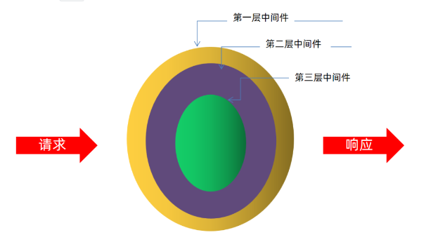

## KOA2 的使用

### 1.KOA2 的介绍

- 基于 Node.js 平台的 Web 服务器框架
- 由 `Express`原班人马打造

ExpressKoa,Koa2 都是 Web 服务器的框架,他们之间的差别和关系可以通过下面这个表格表示出

| 框架名  | 作用     | 异步处理        |
| ------- | -------- | --------------- |
| Express | web 框架 | 回调函数        |
| Koa     | web 框架 | Generator+yield |
| Koa2    | web 框架 | async/await     |

- 环境依赖 Nodev7.6.0 及以上

  由于 Koa2 它是支持`async`和 `await`，所以它对 Node 的版本是有要求的，它要求 Node 的版本至少是在 7.6 级以上,因为语法糖 async 和 await 是在 Node7.6 版本之后出现才支持。

#### 洋葱模型的中间件

如下图所示, 对于服务器而言，它其实就是来处理一个又一个的请求，Web 服务器接收由浏览器发过来的一个又一个请求之后，它形成一个又一个的响应返回给浏览器. 而请求到达我们的服务器是需要经过程序处理的,程序处理完之后才会形成响应，返回给浏览器，我们服务器处理请求的这一块程序，在 Koa2 的世界当中就把它称之为中间件



这种中间件可能还不仅仅只有一个，可能会存在多个，比如上图所示, 它就存在三层中间件，这三层中间件在处理请求的过程以及它调用的顺序为:

> 当一个请求到达咱们的服务器，最先最先处理这个请求的是第一层中间件;
>
> 第一层的中间件在处理这个请求之后，它会把这个请求给第二层的中间件;
>
> 第二层的中间件在处理这个请求之后，它会把这个请求给第三层的中间件;
>
> 第三层中间件内部并没有中间件了, 所以第三层中间件在处理完所有的代码之后，这个请求又会到了第二层的中间件，所以第二层中间件对这个请求经过了两次的处处理;
>
> 第二层的中间件在处理完这个请求之后，又到了第一层的中间件, 所以第一层的中间件也对这个请求经过了两次的处理

这个调用顺序就是洋葱模型, 中间件对请求的处理有一种先进后出的感觉，请求最先到达第一层中间件，而最后也是第一层中间件对请求再次处理了一下。

### 2.KOA2 的快速上手

#### 2.1 安装

（1）检查 Node 的版本

node -v 的命令可以帮助我们检查 Node 的版本, Koa2 的使用要求 Node 版本在 7.6 及以上；

（2）安装 Koa2

`npm init -y`

这个命令可以快速的创建出 package.json 的文件, 这个文件可以维护项目中第三方包的信息;

`npm install koa`

这个命令可以在线的联网下载最新版本 koa 到当前项目中, 由于线上最新版本的 koa 就是 koa2, 所以我们并不需要执行 `npm install koa2`

如果下载特别慢的话, 需要将 npm 的下载源换成国内的下载源, 命令如下

`npmset registry https://registry.npm.taobao.org/`

#### 2.2 编写入口文件 app.js

(1) 创建 Koa 的实例对象

```js
// 1.创建koa对象
constKoa = require('koa'); // 导入构造方法
constapp = newKoa(); // 通过构造方法, 创建实例对象
```

(2) 编写响应函数(中间件)

响应函数是通过 use 的方式才能产生效果, 这个函数有两个参数, 一个是 `ctx`,一个是 `next`

- ctx: 上下文, 指的是请求所处于的 Web 容器,我们可以通过 ctx.request 拿到请求对象, 也可以通过 ctx.response 拿到响应对象;
- next: 内层中间件执行的入口

```js
// 2.编写响应函数(中间件)
app.use((ctx, next) => {
  console.log(ctx.request.url);
  ctx.response.body = 'hello world';
});
```

(3) 指明端口号

通过 app.listen 就可以指明一个端口号

```js
// 3.绑定端口号
3000app.listen(3000)
```

(4) 启动服务器

通过 `node app.js`就可以启动服务器了随即打开浏览器, 在浏览器中输入 `127.0.0.1:3000/`你将会看到浏览器中出现 hello world 的字符串, 并且在服务器的终端中, 也能看到请求的 url。

### 3.KOA2 中间件的特点
