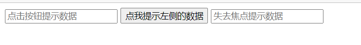

## 1、函数式组件

```js
<script type="text/babel">
		//1.创建函数式组件
		function MyComponent(){
			console.log(this); //此处的this是undefined，因为babel编译后开启了严格模式
			return <h2>我是用函数定义的组件(适用于【简单组件】的定义)</h2>
		}
		//2.渲染组件到页面
		ReactDOM.render(<MyComponent/>,document.getElementById('test'))
		/*
			执行了ReactDOM.render(<MyComponent/>.......之后，发生了什么？
					1.React解析组件标签，找到了MyComponent组件。
					2.发现组件是使用函数定义的，随后调用该函数，将返回的虚拟DOM转为真实DOM，随后呈现在页面中。
		*/
</script>
```

## 2、类式组件

```js
<script type="text/babel">
		//1.创建类式组件
		class MyComponent extends React.Component {
			render(){
				//render是放在哪里的？—— MyComponent的原型对象上，供实例使用。
				//render中的this是谁？—— MyComponent的实例对象 <=> MyComponent组件实例对象。
				console.log('render中的this:',this);
				return <h2>我是用类定义的组件(适用于【复杂组件】的定义)</h2>
			}
		}
		//2.渲染组件到页面
		ReactDOM.render(<MyComponent/>,document.getElementById('test'))
		/*
			执行了ReactDOM.render(<MyComponent/>.......之后，发生了什么？
					1.React解析组件标签，找到了MyComponent组件。
					2.发现组件是使用类定义的，随后new出来该类的实例，并通过该实例调用到原型上的render方法。
					3.将render返回的虚拟DOM转为真实DOM，随后呈现在页面中。
		*/
</script>
```

注：

组件名必须首字母大写

虚拟 DOM 元素只能有一个根元素

虚拟 DOM 元素必须有结束标签

## 3、组件实例三大核心属性

### 3.1 state

```js
<script type="text/babel">
		//1.创建组件
		class Weather extends React.Component{

			//构造器调用几次？ ———— 1次
			constructor(props){
				console.log('constructor');
				super(props)
				//初始化状态
				this.state = {isHot:false,wind:'微风'}
				//解决changeWeather中this指向问题
				this.changeWeather = this.changeWeather.bind(this)
			}

			//render调用几次？ ———— 1+n次 1是初始化的那次 n是状态更新的次数
			render(){
				console.log('render');
				//读取状态
				const {isHot,wind} = this.state
				return <h1 onClick={this.changeWeather}>今天天气很{isHot ? '炎热' : '凉爽'}，{wind}</h1>
			}

			//changeWeather调用几次？ ———— 点几次调几次
			changeWeather(){
				//changeWeather放在哪里？ ———— Weather的原型对象上，供实例使用
				//由于changeWeather是作为onClick的回调，所以不是通过实例调用的，是直接调用
				//类中的方法默认开启了局部的严格模式，所以changeWeather中的this为undefined

				console.log('changeWeather');
				//获取原来的isHot值
				const isHot = this.state.isHot
				//严重注意：状态必须通过setState进行更新,且更新是一种合并，不是替换。
				this.setState({isHot:!isHot})
				console.log(this);

				//严重注意：状态(state)不可直接更改，下面这行就是直接更改！！！
				//this.state.isHot = !isHot //这是错误的写法
			}
		}
		//2.渲染组件到页面
		ReactDOM.render(<Weather/>,document.getElementById('test'))

	</script>
```

state 的简写方式(开发中一般这么写)

```js
<script type="text/babel">
		//1.创建组件
		class Weather extends React.Component{
			//初始化状态
			state = {isHot:false,wind:'微风'}

			render(){
				const {isHot,wind} = this.state
				return <h1 onClick={this.changeWeather}>今天天气很{isHot ? '炎热' : '凉爽'}，{wind}</h1>
			}

			//自定义方法————要用赋值语句的形式+箭头函数
            // 这种方式定义的方法不在原型上，在实例对象本身上
			changeWeather = () => {
				const isHot = this.state.isHot
				this.setState({isHot:!isHot})
			}
		}
		//2.渲染组件到页面
		ReactDOM.render(<Weather/>,document.getElementById('test'))

	</script>
```

##### 3.2 props

每个组件对象都会有 props(properties 的简写)属性;

组件标签的所有属性都保存在 props 中

作用： 通过标签属性从组件外向组件内传递变化的数据

注意: 组件内部不要修改 props 数据

#### 1、基本使用

```js
<script type="text/babel">
		//创建组件
		class Person extends React.Component{
			render(){
				// console.log(this);
				const {name,age,sex} = this.props
				return (
					<ul>
						<li>姓名：{name}</li>
						<li>性别：{sex}</li>
						<li>年龄：{age+1}</li>
					</ul>
				)
			}
		}
		//渲染组件到页面
		ReactDOM.render(<Person name="jerry" age={19}  sex="男"/>,document.getElementById('test1'))
		ReactDOM.render(<Person name="tom" age={18} sex="女"/>,document.getElementById('test2'))

		const p = {name:'老刘',age:18,sex:'女'}
		// console.log('@',...p);
		// ReactDOM.render(<Person name={p.name} age={p.age} sex={p.sex}/>,document.getElementById('test3'))
		ReactDOM.render(<Person {...p}/>,document.getElementById('test3'))
	</script>
```

#### 2、对 `props`进行限制

```js
<!-- 引入prop-types，用于对组件标签属性进行限制 -->
<script type="text/javascript" src="../js/prop-types.js"></script>

	<script type="text/babel">
		//创建组件
		class Person extends React.Component{
			render(){
				// console.log(this);
				const {name,age,sex} = this.props
				//props是只读的
				//this.props.name = 'jack' //此行代码会报错，因为props是只读的
				return (
					<ul>
						<li>姓名：{name}</li>
						<li>性别：{sex}</li>
						<li>年龄：{age+1}</li>
					</ul>
				)
			}
		}
		//对标签属性进行类型、必要性的限制
		Person.propTypes = {
			name:PropTypes.string.isRequired, //限制name必传，且为字符串
			sex:PropTypes.string,//限制sex为字符串
			age:PropTypes.number,//限制age为数值
			speak:PropTypes.func,//限制speak为函数
		}
		//指定默认标签属性值
		Person.defaultProps = {
			sex:'男',//sex默认值为男
			age:18 //age默认值为18
		}
		//渲染组件到页面
		ReactDOM.render(<Person name={100} speak={speak}/>,document.getElementById('test1'))
		ReactDOM.render(<Person name="tom" age={18} sex="女"/>,document.getElementById('test2'))

		const p = {name:'老刘',age:18,sex:'女'}
		// console.log('@',...p);
		// ReactDOM.render(<Person name={p.name} age={p.age} sex={p.sex}/>,document.getElementById('test3'))
		ReactDOM.render(<Person {...p}/>,document.getElementById('test3'))

		function speak(){
			console.log('我说话了');
		}
	</script>
```

#### 3、对 `props`进行简写

将 propTypes 、defaultProps 写到类中，加上 static 修饰

```js
<!-- 引入prop-types，用于对组件标签属性进行限制 -->
	<script type="text/javascript" src="../js/prop-types.js"></script>

	<script type="text/babel">
		//创建组件
		class Person extends React.Component{
			// 类中的constructor 并非必要，可以通过其他方式实现其中功能
			constructor(props){
				//构造器是否接收props，是否传递给super，取决于：是否希望在构造器中通过this访问props
				// console.log(props);
				super(props)
				console.log('constructor',this.props);
			}

			//对标签属性进行类型、必要性的限制
			static propTypes = {
				name:PropTypes.string.isRequired, //限制name必传，且为字符串
				sex:PropTypes.string,//限制sex为字符串
				age:PropTypes.number,//限制age为数值
			}

			//指定默认标签属性值
			static defaultProps = {
				sex:'男',//sex默认值为男
				age:18 //age默认值为18
			}

			render(){
				// console.log(this);
				const {name,age,sex} = this.props
				//props是只读的
				//this.props.name = 'jack' //此行代码会报错，因为props是只读的
				return (
					<ul>
						<li>姓名：{name}</li>
						<li>性别：{sex}</li>
						<li>年龄：{age+1}</li>
					</ul>
				)
			}
		}

		//渲染组件到页面
		ReactDOM.render(<Person name="jerry"/>,document.getElementById('test1'))
	</script>
```

#### 4、函数组件如何使用 `props`

```js
<!-- 引入prop-types，用于对组件标签属性进行限制 -->
	<script type="text/javascript" src="../js/prop-types.js"></script>

	<script type="text/babel">
		//创建组件
		function Person (props){
			const {name,age,sex} = props
			return (
					<ul>
						<li>姓名：{name}</li>
						<li>性别：{sex}</li>
						<li>年龄：{age}</li>
					</ul>
				)
		}
		Person.propTypes = {
			name:PropTypes.string.isRequired, //限制name必传，且为字符串
			sex:PropTypes.string,//限制sex为字符串
			age:PropTypes.number,//限制age为数值
		}

		//指定默认标签属性值
		Person.defaultProps = {
			sex:'男',//sex默认值为男
			age:18 //age默认值为18
		}
		//渲染组件到页面
		ReactDOM.render(<Person name="jerry"/>,document.getElementById('test1'))
	</script>
```

### 3.3 refs

组件内的标签可以定义 ref 属性来标识自己

#### 1、字符串形式的 `ref`

`<input ref="input1"/>`

```js
<script type="text/babel">
		//创建组件
		class Demo extends React.Component{
			//展示左侧输入框的数据
			showData = ()=>{
				const {input1} = this.refs
				alert(input1.value)
			}
			//展示右侧输入框的数据
			showData2 = ()=>{
				const {input2} = this.refs
				alert(input2.value)
			}
			render(){
				return(
					<div>
						<input ref="input1" type="text" placeholder="点击按钮提示数据"/> 
						<button onClick={this.showData}>点我提示左侧的数据</button> 
						<input ref="input2" onBlur={this.showData2} type="text" placeholder="失去焦点提示数据"/>
					</div>
				)
			}
		}
		//渲染组件到页面
		ReactDOM.render(<Demo a="1" b="2"/>,document.getElementById('test'))
	</script>
```



#### 2、回调形式的 `ref`

`<input ref={(c)=>{this.input1 = c}}`

ref 的回调函数会被自动执行。

2.1 **内联函数方式定义**

```js
<script type="text/babel">
		//创建组件
		class Demo extends React.Component{
			//展示左侧输入框的数据
			showData = ()=>{
				const {input1} = this
				alert(input1.value)
			}
			//展示右侧输入框的数据
			showData2 = ()=>{
				const {input2} = this
				alert(input2.value)
			}
			render(){
				return(
					<div>
						<input ref={c => this.input1 = c } type="text" placeholder="点击按钮提示数据"/> 
						<button onClick={this.showData}>点我提示左侧的数据</button> 
						<input onBlur={this.showData2} ref={c => this.input2 = c } type="text" placeholder="失去焦点提示数据"/> 
					</div>
				)
			}
		}
		//渲染组件到页面
		ReactDOM.render(<Demo a="1" b="2"/>,document.getElementById('test'))
	</script>
```

2.2 ref 的回调函数定义成 class 的绑定函数的方式

```js
<script type="text/babel">
		//创建组件
		class Demo extends React.Component{

			state = {isHot:false}

			showInfo = ()=>{
				const {input1} = this
				alert(input1.value)
			}

			changeWeather = ()=>{
				//获取原来的状态
				const {isHot} = this.state
				//更新状态
				this.setState({isHot:!isHot})
			}

			saveInput = (c)=>{
				this.input1 = c;
				console.log('@',c);
			}

			render(){
				const {isHot} = this.state
				return(
					<div>
						<h2>今天天气很{isHot ? '炎热':'凉爽'}</h2>
						// render函数里的标签注释需要套个大括号{}当成js来注释
						{/*<input ref={(c)=>{this.input1 = c;console.log('@',c);}} type="text"/><br/><br/>*/}
						<input ref={this.saveInput} type="text"/><br/><br/>
						<button onClick={this.showInfo}>点我提示输入的数据</button>
						<button onClick={this.changeWeather}>点我切换天气</button>
					</div>
				)
			}
		}
		//渲染组件到页面
		ReactDOM.render(<Demo/>,document.getElementById('test'))
	</script>
```

**回调形式 ref 中的回调执行次数**

如果 `ref` 回调函数是以**内联函数**的方式定义的，在更新过程中它会被执行两次，第一次传入参数 `null`，然后第二次会传入参数 DOM 元素。这是因为在每次渲染时会创建一个新的函数实例，所以 React 清空旧的 ref 并且设置新的。通过将 ref 的回调函数定义成 class 的绑定函数的方式可以避免上述问题，但是大多数情况下它是无关紧要的。

React 将在组件挂载时，会调用 `ref` 回调函数并传入 DOM 元素，当卸载时调用它并传入 `null`。在 `componentDidMount` 或 `componentDidUpdate` 触发前，React 会保证 refs 一定是最新的。


#### 3、`createRef`创建 `ref`容器

`myRef = React.createRef() ` `<input ref={this.myRef}/>`

```js
<script type="text/babel">
		//创建组件
		class Demo extends React.Component{
			/*
				React.createRef调用后可以返回一个容器，该容器可以存储被ref所标识的节点,该容器是“专人专用”的，不可重复，否则会被覆盖
			 */
			myRef = React.createRef()
			myRef2 = React.createRef()
			//展示左侧输入框的数据
			showData = ()=>{
				alert(this.myRef.current.value);
			}
			//展示右侧输入框的数据
			showData2 = ()=>{
				alert(this.myRef2.current.value);
			}
			render(){
				return(
					<div>
						<input ref={this.myRef} type="text" placeholder="点击按钮提示数据"/> 
						<button onClick={this.showData}>点我提示左侧的数据</button> 
						<input onBlur={this.showData2} ref={this.myRef2} type="text" placeholder="失去焦点提示数据"/> 
					</div>
				)
			}
		}
		//渲染组件到页面
		ReactDOM.render(<Demo a="1" b="2"/>,document.getElementById('test'))
	</script>
```

## 4、React 中的事件处理

(1). 通过 `onXxx`属性指定事件处理函数(注意大小写)

- React 使用的是自定义(合成)事件, 而不是使用的原生 DOM 事件
- React 中的事件是通过事件委托方式处理的(委托给组件最外层的元素)

(2). 通过 event.target 得到发生事件的 DOM 元素对象——不要过度使用 ref

## 5、组件的生命周期

### 5.1 旧版


```
1. 初始化阶段: 由ReactDOM.render()触发---初次渲染
		1.	constructor()
		2.	componentWillMount()
		3.	render()
		4.	componentDidMount() =====> 常用 一般在这个钩子中做一些初始化的事，例如：开启定时器、发送网络请求、订阅消息

2. 更新阶段: 由组件内部this.setSate()或父组件render触发
		1.	shouldComponentUpdate()
		2.	componentWillUpdate()
		3.	render() =====> 必须使用的一个
		4.	componentDidUpdate()

3. 卸载组件: 由ReactDOM.unmountComponentAtNode()触发
		1.	componentWillUnmount()  =====> 常用 一般在这个钩子中做一些收尾的事，例如：关闭定时器、取消订阅消息
```

```js
	<script type="text/babel">
		//创建组件
		class Count extends React.Component{

			//构造器
			constructor(props){
				console.log('Count---constructor');
				super(props)
				//初始化状态
				this.state = {count:0}
			}

			//加1按钮的回调
			add = ()=>{
				//获取原状态
				const {count} = this.state
				//更新状态
				this.setState({count:count+1})
			}

			//卸载组件按钮的回调
			death = ()=>{
				ReactDOM.unmountComponentAtNode(document.getElementById('test'))
			}

			//强制更新按钮的回调
			force = ()=>{
				this.forceUpdate()
			}

			//组件将要挂载的钩子
			componentWillMount(){
				console.log('Count---componentWillMount');
			}

			//组件挂载完毕的钩子
			componentDidMount(){
				console.log('Count---componentDidMount');
			}

			//组件将要卸载的钩子
			componentWillUnmount(){
				console.log('Count---componentWillUnmount');
			}

			//控制组件更新的“阀门”
			shouldComponentUpdate(){
				console.log('Count---shouldComponentUpdate');
				return true
			}

			//组件将要更新的钩子
			componentWillUpdate(){
				console.log('Count---componentWillUpdate');
			}

			//组件更新完毕的钩子
			componentDidUpdate(){
				console.log('Count---componentDidUpdate');
			}

			render(){
				console.log('Count---render');
				const {count} = this.state
				return(
					<div>
						<h2>当前求和为：{count}</h2>
						<button onClick={this.add}>点我+1</button>
						<button onClick={this.death}>卸载组件</button>
						<button onClick={this.force}>不更改任何状态中的数据，强制更新一下</button>
					</div>
				)
			}
		}

		//父组件A
		class A extends React.Component{
			//初始化状态
			state = {carName:'奔驰'}

			changeCar = ()=>{
				this.setState({carName:'奥拓'})
			}

			render(){
				return(
					<div>
						<div>我是A组件</div>
						<button onClick={this.changeCar}>换车</button>
						<B carName={this.state.carName}/>
					</div>
				)
			}
		}

		//子组件B
		class B extends React.Component{
			//组件将要接收新的props的钩子
			componentWillReceiveProps(props){
				console.log('B---componentWillReceiveProps',props);
			}

			//控制组件更新的“阀门”
			shouldComponentUpdate(){
				console.log('B---shouldComponentUpdate');
				return true
			}
			//组件将要更新的钩子
			componentWillUpdate(){
				console.log('B---componentWillUpdate');
			}

			//组件更新完毕的钩子
			componentDidUpdate(){
				console.log('B---componentDidUpdate');
			}

			render(){
				console.log('B---render');
				return(
					<div>我是B组件，接收到的车是:{this.props.carName}</div>
				)
			}
		}

		//渲染组件
		ReactDOM.render(<Count/>,document.getElementById('test'))
	</script>
```

### 5.2 新版


```
1. 初始化阶段: 由ReactDOM.render()触发---初次渲染
 		1.	constructor()
 		2.	getDerivedStateFromProps
 		3.	render()
 		4.	componentDidMount() =====> 常用  一般在这个钩子中做一些初始化的事，例如：开启定时器、发送网络请求、订阅消息

2. 更新阶段: 由组件内部this.setSate()或父组件重新render触发
		1.	getDerivedStateFromProps
		2.	shouldComponentUpdate()
		3.	render()
		4.	getSnapshotBeforeUpdate
		5.	componentDidUpdate()

3. 卸载组件: 由ReactDOM.unmountComponentAtNode()触发
		1.	componentWillUnmount()  =====> 常用  一般在这个钩子中做一些收尾的事，例如：关闭定时器、取消订阅消息

```

```js
<script type="text/babel">
		//创建组件
		class Count extends React.Component{

			//构造器
			constructor(props){
				console.log('Count---constructor');
				super(props)
				//初始化状态
				this.state = {count:0}
			}

			//加1按钮的回调
			add = ()=>{
				//获取原状态
				const {count} = this.state
				//更新状态
				this.setState({count:count+1})
			}

			//卸载组件按钮的回调
			death = ()=>{
				ReactDOM.unmountComponentAtNode(document.getElementById('test'))
			}

			//强制更新按钮的回调
			force = ()=>{
				this.forceUpdate()
			}

			//若state的值在任何时候都取决于props，那么可以使用getDerivedStateFromProps
			static getDerivedStateFromProps(props,state){
				console.log('getDerivedStateFromProps',props,state);
				return null
			}

			//在更新之前获取快照
			getSnapshotBeforeUpdate(){
				console.log('getSnapshotBeforeUpdate');
				return 'atguigu'
			}

			//组件挂载完毕的钩子
			componentDidMount(){
				console.log('Count---componentDidMount');
			}

			//组件将要卸载的钩子
			componentWillUnmount(){
				console.log('Count---componentWillUnmount');
			}

			//控制组件更新的“阀门”
			shouldComponentUpdate(){
				console.log('Count---shouldComponentUpdate');
				return true
			}

			//组件更新完毕的钩子
			componentDidUpdate(preProps,preState,snapshotValue){
				console.log('Count---componentDidUpdate',preProps,preState,snapshotValue);
			}

			render(){
				console.log('Count---render');
				const {count} = this.state
				return(
					<div>
						<h2>当前求和为：{count}</h2>
						<button onClick={this.add}>点我+1</button>
						<button onClick={this.death}>卸载组件</button>
						<button onClick={this.force}>不更改任何状态中的数据，强制更新一下</button>
					</div>
				)
			}
		}

		//渲染组件
		ReactDOM.render(<Count count={199}/>,document.getElementById('test'))
	</script>
```

#### `getSnapShotBeforeUpdate`的使用场景

```js
<script type="text/babel">
	class NewsList extends React.Component{
		state = {newsArr:[]}
		componentDidMount(){
			setInterval(() => {
				//获取原状态
				const {newsArr} = this.state
				//模拟一条新闻
				const news = '新闻'+ (newsArr.length+1)
				//更新状态
				this.setState({newsArr:[news,...newsArr]})
			}, 1000);
		}
		getSnapshotBeforeUpdate(){
			return this.refs.list.scrollHeight
		}
		componentDidUpdate(preProps,preState,height){
			this.refs.list.scrollTop += this.refs.list.scrollHeight - height
		}
		render(){
			return(
				<div className="list" ref="list">
					{
						this.state.newsArr.map((n,index)=>{
							return <div key={index} className="news">{n}</div>
						})
					}
				</div>
			)
		}
	}
	ReactDOM.render(<NewsList/>,document.getElementById('test'))
</script>
```
