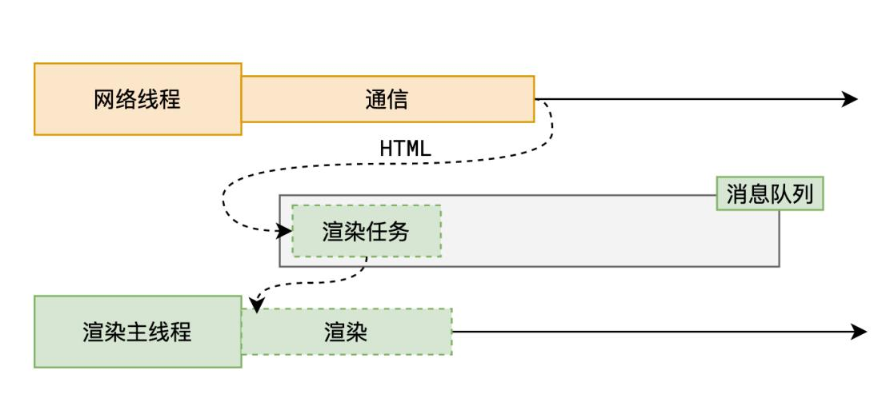
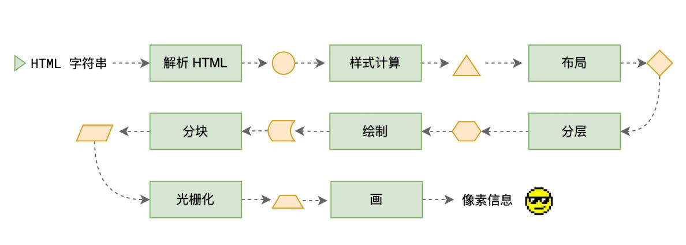

## 渲染

渲染 render html 字符串 --> 像素信息

### 渲染的时间点

### 渲染流水线

### 1、解析 HTML - Parse HTML

### HTML 解析过程中遇到 CSS 代码怎么办？

为了提⾼解析效率，浏览器会启动⼀个预解析器率先下载和解析 CSS

### HTML 解析过程中遇到 JS 代码怎么办？

渲染主线程遇到 JS 时必须暂停⼀切⾏为，等待下载执⾏完后才能继续预解析线程可以分担⼀点下载 JS 的任务

### 2、样式计算

### 3、布局 - Layout

DOM 树和 Layout 树不⼀定是⼀⼀对应的 

### 4、分层 - Layer

发生了什么事？

1、网络； 拿 HTMl 2、渲染；

为什么 div 是块元素？因为浏览器的源码里对 div 的样式修饰是 display：block；是浏览器的默认样式规定的；

### 浏览器是如何渲染页面的？

当浏览器的网络线程收到 HTML 文档后，会产生一个渲染任务，并将其传递给渲染主线程的消息队列。

在事件循环机制的作用下，渲染主线程取出消息队列中的渲染任务，开启渲染流程。

整个渲染流程分为多个阶段，分别是：HTML 解析、样式计算、布局、分层、绘制、分块、光栅化、画

每个阶段都有明确的输入输出，上一个阶段的输出会成为下一个阶段的输入。

这样，整个渲染流程就形成了一套组织严密的生产流水线。

#### 渲染的第一步是解析 HTML。

解析过程中遇到 CSS 解析 CSS，遇到 JS 执行 JS。为了提高解析效率，浏览器在开始解析前，会启动一个预解析的线程，率先下载 HTML 中的外部 CSS 文件和外部的 JS 文件。

如果主线程解析到`Link`位置，此时外部的 CSS 文件还没有下载解析好，主线程不会等待，继续解析后续的 HTML。这是因为下载和解析 CSS 的工作是在预解析线程中进行的。这就是 CSS 不会阻塞 HTML 解析的根本原因。

如果主线程解析到`script`位置，会停止解析 HTML，转而等待 JS 文件下载好，并将全局代码解析执行完成后，才能继续解析 HTML。

这是因为 JS 代码的执行过程可能会修改当前的 D0M 树，所以 D0M 树的生成必须暂停。这就是 JS 会阻塞 HTML 解析的根本原因。

第一步完成后，会得到 DOM 树和 CSSOM 树，浏览器的默认样式、内部样式、外部样式、行内样式均会包含在 CSSOM 树中

渲染的下一步是样式计算。

主线程会遍历得到的 DOM 树，依次为树中的每个节点计算出它最终的样式，称之为 Computed Style。

在这一过程中，很多预设值会变成绝对值，比如 red 会变成 rgb（255,0,0）；相对单位会变成绝对单位，比如`em`会变成`px`。

这一步完成后，会得到一棵带有样式的 DOM 树。

接下来是布局，布局完成后会得到布局树。

布局阶段会依次遍历 DOM 树的每一个节点，计算每个节点的几何信息。例如节点的宽高、相对包含块的位置。
