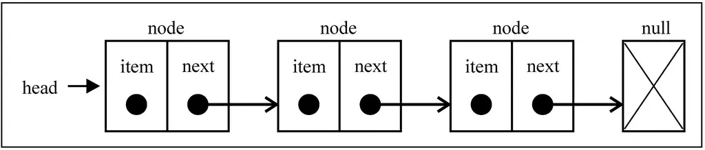

## 链表

### 链表和数组

- 数组:

  - 要存储多个元素，数组（或列表）可能是最常用的数据结构。
  - 我们之前说过, 几乎每一种编程语言都有默认实现数组结构, 这种数据结构非常方便，提供了一个便利的 `[]`语法来访问它的元素。
  - 但是数组也有很多缺点:
    - 数组的创建通常需要申请一段连续的内存空间(一整块的内存), 并且大小是固定的(大多数编程语言数组都是固定的), 所以当当前数组不能满足容量需求时, 需要扩容. (一般情况下是申请一个更大的数组, 比如 2 倍. 然后将原数组中的元素复制过去)
    - 而且在数组开头或中间位置插入数据的成本很高, 需要进行大量元素的位移.（尽管我们已经学过的 JavaScript 的 `Array`类方法可以帮我们做这些事，但背后的原理依然是这样）。

- 链表

  - 要存储多个元素, 另外一个选择就是使用链表.
  - 但不同于数组, 链表中的元素在内存中不必是连续的空间.
  - 链表的每个元素由一个存储元素本身的节点和一个指向下一个元素的引用(有些语言称为指针或者链接)组成.
  - 相对于数组, 链表有一些优点:
    - 内存空间不是比是连续的. 可以充分利用计算机的内存. 实现灵活的内存动态管理.
    - 链表不必在创建时就确定大小, 并且大小可以无限的延伸下去.
    - 链表在插入和删除数据时, 时间复杂度可以达到 O(1). 相对数组效率高很多.
  - 相对于数组, 链表有一些缺点:
    - 链表访问任何一个位置的元素时, 都需要从头开始访问.(无法跳过第一个元素访问任何一个元素).
    - 无法通过下标直接访问元素, 需要从头一个个访问, 直到找到对应的问题.

### 什么是链表

链表类似于火车: 有一个火车头, 火车头会连接一个节点, 节点上有乘客, 并且这个节点会连接下一个节点, 以此类推.




## 链表实现

### 创建链表类

```js
// 封装链表的构造函数
function LinkedList() {
  // 封装一个Node类, 用于保存每个节点信息
  function Node(element) {
    this.element = element;
    this.next = null;
  }

  // 链表中的属性
  this.length = 0; // 链表的长度
  this.head = null; // 链表的第一个节点
  // 链表中的方法
}
```

### 链表常见操作

- `append(element)`：向列表尾部添加一个新的项
- `insert(position, element)`：向列表的特定位置插入一个新的项。
- `remove(element)`：从列表中移除一项。
- `indexOf(element)`：返回元素在列表中的索引。如果列表中没有该元素则返回 `-1`。
- `removeAt(position)`：从列表的特定位置移除一项。
- `isEmpty()`：如果链表中不包含任何元素，返回 `true`，如果链表长度大于 0 则返回 `false`。
- `size()`：返回链表包含的元素个数。与数组的 `length`属性类似。
- `toString()`：由于列表项使用了 `Node`类，就需要重写继承自 JavaScript 对象默认的 `toString`方法，让其只输出元素的值。

#### 尾部追加数据`append`

```js
// 链表尾部追加元素方法
LinkedList.prototype.append = function (element) {
  // 1.根据新元素创建节点
  var newNode = new Node(element);

  // 2.判断原来链表是否为空
  if (this.head === null) {
    // 链表尾空
    this.head = newNode;
  } else {
    // 链表不为空
    // 2.1.定义变量, 保存当前找到的节点
    var current = this.head;
    while (current.next) {
      current = current.next;
    }

    // 2.2.找到最后一项, 将其next赋值为node
    current.next = newNode;
  }

  // 3.链表长度增加1
  this.length++;
};
```

- 场景一: 链表本身是空的, 比如这种情况下我们插入了一个 15 作为元素


- 场景二: 链表中已经有元素了, 需要向最后的节点的 next 中添加节点

  - 这个时候要向链表的尾部添加一个元素, 首先我们需要找到这个尾部元素.
  - 记住: 我们只有第一个元素的引用, 因此需要循环访问链表, 直接找到最后一个项.(见代码 2.1)
  - 找到最后一项后, 最后一项的 next 为 null, 这个时候不让其为 null, 而是指向新创建的节点即可.


最后, 一定不要忘记将链表的 length+1

#### `toString`方法

先来实现一下链表的 toString 方法, 这样会方便测试上面的添加代码

```js
// 链表的toString方法
LinkedList.prototype.toString = function () {
  // 1.定义两个变量
  var current = this.head;
  var listString = '';

  // 2.循环获取链表中所有的元素
  while (current) {
    listString += ',' + current.element;
    current = current.next;
  }

  // 3.返回最终结果
  return listString.slice(1);
};
// 从head开头, 因为获取链表的任何元素都必须从第一个节点开头;循环遍历每一个节点, 并且取出其中的element, 拼接成字符串
```

测试 append 方法

```js
// 测试链表
// 1.创建链表
var list = new LinkedList();

// 2.追加元素
list.append(15);
list.append(10);
list.append(20);

// 3.打印链表的结果
alert(list);
```

#### 任意位置插入

接下来实现另外一个添加数据的方法: 在任意位置插入数据

```js
// 根据下标删除元素
LinkedList.prototype.insert = function (position, element) {
  // 1.检测越界问题: 越界插入失败
  if (position < 0 || position > this.length) return false;

  // 2.找到正确的位置, 并且插入数据
  var newNode = new Node(element);
  var current = this.head;
  var previous = null;
  index = 0;

  // 3.判断是否列表是否在第一个位置插入
  if (position == 0) {
    newNode.next = current;
    this.head = newNode;
  } else {
    while (index++ < position) {
      previous = current;
      current = current.next;
    }
    newNode.next = current;
    previous.next = newNode;
  }
  // 4.length+1
  this.length++;
  return true;
};
```
